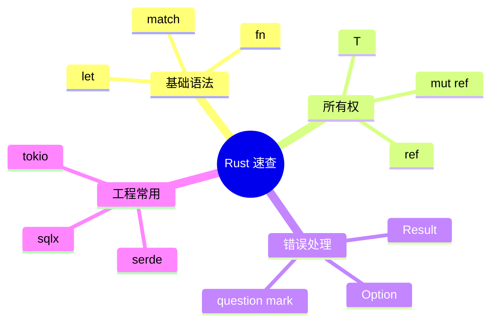

# 附录 A Rust 速查表



## 基础语法

```rust
let name = String::from("Hive");
let count: u32 = 3;
let enabled = true;

fn add(a: i32, b: i32) -> i32 {
    a + b
}
```

## 所有权与借用

| 写法 | 含义 |
|------|------|
| `T` | 拥有值 |
| `&T` | 不可变借用 |
| `&mut T` | 可变借用 |
| `Clone` | 显式复制堆上数据 |
| `Copy` | 按位复制，原值仍可用 |

```rust
fn print_title(title: &str) {
    println!("{title}");
}

fn rename(title: &mut String) {
    title.push_str(" v2");
}
```

## Option 与 Result

```rust
let value: Option<String> = Some("hello".into());
let text = value.unwrap_or_else(|| "default".into());

fn read_config() -> Result<String, std::io::Error> {
    std::fs::read_to_string("config.toml")
}
```

## struct / enum / match

```rust
struct Note {
    id: String,
    title: String,
}

enum Command {
    Create(Note),
    Delete(String),
}

match command {
    Command::Create(note) => println!("{}", note.title),
    Command::Delete(id) => println!("delete {id}"),
}
```

## Trait 与泛型

```rust
trait Repository<T> {
    fn save(&self, value: T) -> anyhow::Result<()>;
}

fn persist<T, R>(repo: &R, value: T) -> anyhow::Result<()>
where
    R: Repository<T>,
{
    repo.save(value)
}
```

## async / await

```rust
async fn fetch(url: &str) -> anyhow::Result<String> {
    let body = reqwest::get(url).await?.text().await?;
    Ok(body)
}
```

## 常用 crate

| crate | 用途 |
|-------|------|
| `serde` | 序列化 / 反序列化 |
| `thiserror` | 定义错误类型 |
| `anyhow` | 应用层错误聚合 |
| `tokio` | 异步运行时 |
| `reqwest` | HTTP 客户端 |
| `sqlx` | 异步 SQL |
| `tracing` | 结构化日志 |
