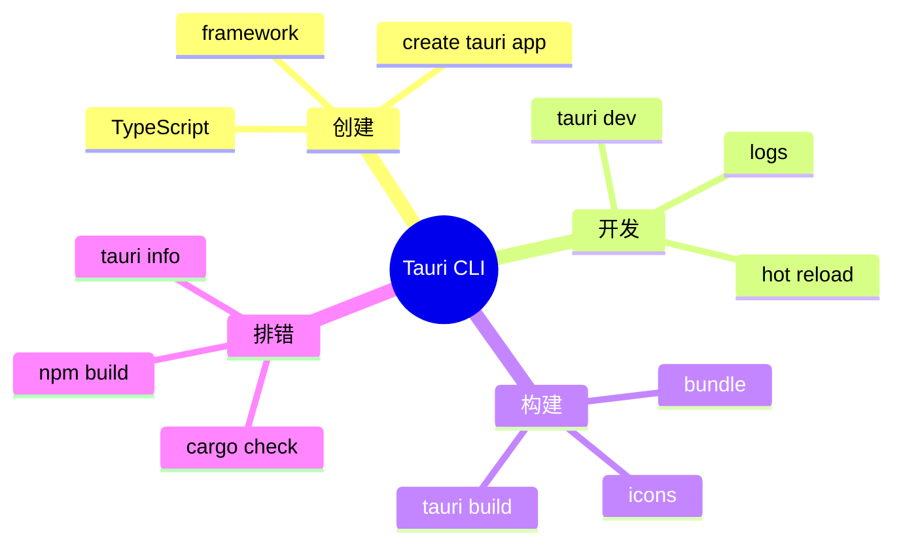

# 附录 B Tauri CLI 参考



## 创建项目

```bash
npm create tauri-app@latest
```

常见选择：

| 选项 | 建议 |
|------|------|
| 前端框架 | Vue / React / Svelte / Vanilla |
| 包管理器 | 跟随团队现有标准 |
| TypeScript | 推荐启用 |

## 开发运行

```bash
npm run tauri dev
```

开发命令会启动前端 dev server，并启动 Tauri 桌面窗口。

## 构建发布包

```bash
npm run tauri build
```

构建产物通常位于：

```text
src-tauri/target/release/bundle/
```

## 添加插件

```bash
npm run tauri add dialog
npm run tauri add fs
npm run tauri add notification
```

添加插件后要检查 capability 文件，确认权限只开放给需要的窗口和命令。

## 常用目录

```text
src/                  前端源码
src-tauri/            Rust 与 Tauri 配置
src-tauri/src/        Rust Core
src-tauri/icons/      应用图标
src-tauri/capabilities/ 权限声明
```

## 排错命令

```bash
cargo check
cargo test
npm run build
npm run tauri info
```

当构建失败时，先区分是前端构建失败、Rust 编译失败，还是平台打包依赖失败。
