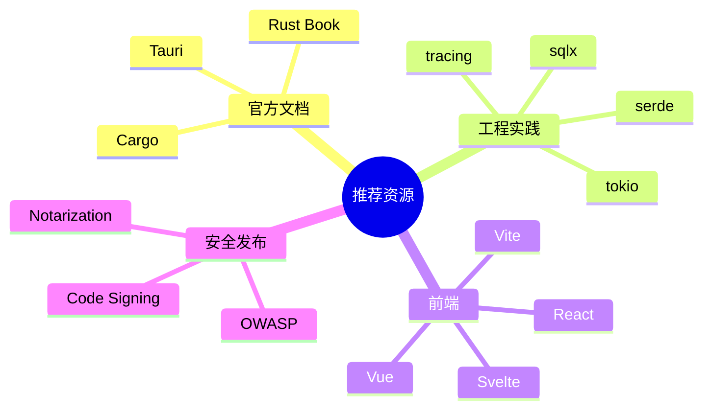

# 附录 C 推荐资源

## 官方文档

- Tauri 文档：https://v2.tauri.app/
- Rust 官方书：https://doc.rust-lang.org/book/
- Rust by Example：https://doc.rust-lang.org/rust-by-example/
- Cargo 文档：https://doc.rust-lang.org/cargo/

## Rust 工程实践

- `serde` 文档：https://serde.rs/
- `tokio` 教程：https://tokio.rs/tokio/tutorial
- `sqlx` 仓库：https://github.com/launchbadge/sqlx
- `tracing` 文档：https://docs.rs/tracing/

## 前端与桌面应用

- Vite 文档：https://vite.dev/
- Vue 文档：https://vuejs.org/
- React 文档：https://react.dev/
- Svelte 文档：https://svelte.dev/

## 安全与发布

- OWASP Cheat Sheet Series：https://cheatsheetseries.owasp.org/
- Apple Notarization 文档：https://developer.apple.com/documentation/security/notarizing_macos_software_before_distribution
- Microsoft Code Signing：https://learn.microsoft.com/windows/msix/package/signing-package-overview

## 建议阅读方式

先通读 Rust 官方书前十章，再结合本书的 Hive 项目写一个小工具。不要试图一次记住所有 API。Rust 和 Tauri 都更适合在小项目中逐步建立肌肉记忆。
