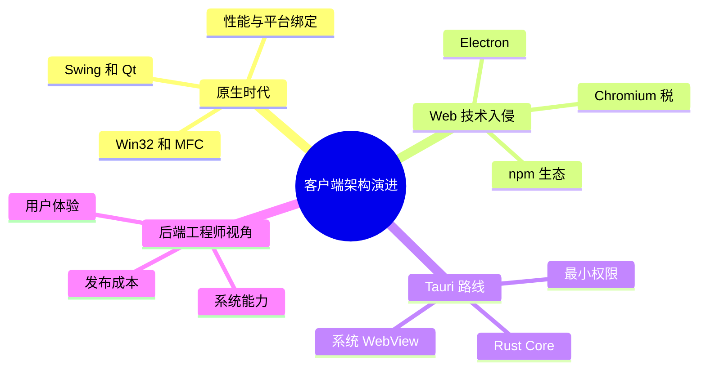

# 第一章 客户端架构的前世今生

> *"Any application that can be written in JavaScript, will eventually be written in JavaScript."*
> — Jeff Atwood, 2007

作为一名 C++ 或 Java 后端工程师，你可能已经习惯了服务器端的世界：高并发、分布式、微服务。但你是否想过，用户每天直接打交道的，其实是客户端？本章将带你回顾桌面客户端架构的演进历程，理解为什么 Tauri + Rust 会成为下一代桌面应用的有力选择。



---

## 1.1 原生时代：性能为王

### 1.1.1 Win32 与 MFC

在 Windows 平台上，最早的桌面应用开发方式是直接调用 Win32 API。每一个窗口、按钮、菜单都需要手动创建和管理消息循环。

```c
// Win32 经典消息循环
MSG msg;
while (GetMessage(&msg, NULL, 0, 0)) {
    TranslateMessage(&msg);
    DispatchMessage(&msg);
}
```

微软后来推出了 MFC（Microsoft Foundation Classes），用 C++ 类封装了 Win32 API，降低了开发门槛。但 MFC 的学习曲线依然陡峭，文档晦涩，代码臃肿。

**优点：**
- 极致的性能和系统集成能力
- 可以访问所有操作系统功能

**缺点：**
- 开发效率低，UI 代码冗长
- 跨平台几乎不可能
- 维护成本高昂

### 1.1.2 Java Swing 与 AWT

Java 试图用"一次编写，到处运行"解决跨平台问题。AWT 使用原生控件，Swing 则完全自绘。

```java
// Swing 示例
JFrame frame = new JFrame("Hello Swing");
JButton button = new JButton("Click me");
button.addActionListener(e -> System.out.println("Clicked!"));
frame.add(button);
frame.setSize(300, 200);
frame.setVisible(true);
```

**优点：**
- 真正的跨平台
- 丰富的组件库

**缺点：**
- 界面风格与原生应用格格不入（"一眼就能认出是 Java 写的"）
- 启动慢，内存占用高
- JVM 依赖

### 1.1.3 Qt：C++ 的跨平台之路

Qt 是 C++ 世界中最成功的跨平台 GUI 框架。它引入了信号与槽（Signals & Slots）机制，用元对象编译器（moc）扩展了 C++ 语法。

```cpp
// Qt 信号与槽
QPushButton *button = new QPushButton("Click me");
connect(button, &QPushButton::clicked, []() {
    qDebug() << "Clicked!";
});
```

**优点：**
- 高性能，接近原生
- 真正跨平台（Windows / macOS / Linux）
- 成熟的生态和工具链（Qt Creator、Qt Designer）

**缺点：**
- 商业许可费用高
- 二进制体积较大
- moc 增加了构建复杂度

```
┌─────────────────────────────────────────────────┐
│              原生时代技术对比                      │
├──────────┬──────────┬───────────┬────────────────┤
│          │ Win32/MFC│ Java Swing│      Qt        │
├──────────┼──────────┼───────────┼────────────────┤
│ 语言     │ C/C++    │ Java      │ C++            │
│ 跨平台   │ ✗        │ ✓         │ ✓              │
│ 性能     │ ★★★★★   │ ★★★       │ ★★★★★          │
│ 开发效率 │ ★★       │ ★★★       │ ★★★★           │
│ 原生感   │ ★★★★★   │ ★★        │ ★★★★           │
│ 包体积   │ 小       │ 大(含JVM) │ 中             │
└──────────┴──────────┴───────────┴────────────────┘
```

---

## 1.2 Web 入侵：Electron 的崛起

### 1.2.1 为什么 Web 技术会入侵桌面？

2010 年代，Web 前端技术飞速发展：HTML5、CSS3、React、Vue……前端工程师的数量也在爆发式增长。一个自然的想法出现了：**能不能用 Web 技术写桌面应用？**

答案是 Electron。

### 1.2.2 Electron 的架构

Electron 的核心思路非常直接：把 Chromium 浏览器和 Node.js 打包在一起，你的应用就是一个"定制浏览器"。

```
┌───────────────────────────────────────┐
│            Electron 应用               │
│                                       │
│  ┌─────────────┐  ┌────────────────┐  │
│  │  Renderer   │  │  Main Process  │  │
│  │  Process    │  │  (Node.js)     │  │
│  │  (Chromium) │  │                │  │
│  │             │◄─┤  文件系统访问    │  │
│  │  HTML/CSS/  │  │  原生菜单       │  │
│  │  JavaScript │  │  系统托盘       │  │
│  │             │  │  子进程管理     │  │
│  └─────────────┘  └────────────────┘  │
│                                       │
│  ┌─────────────────────────────────┐  │
│  │     Chromium + Node.js 运行时    │  │
│  │     (~150MB 基础体积)            │  │
│  └─────────────────────────────────┘  │
└───────────────────────────────────────┘
```

### 1.2.3 Electron 的成功与代价

**成功案例：** VS Code、Slack、Discord、Notion、Figma Desktop……这些都是 Electron 应用。

**优点：**
- Web 技术栈，前端工程师无缝上手
- 庞大的 npm 生态
- 跨平台一致的 UI 体验

**代价：**
- **内存怪兽**：每个 Electron 应用都内嵌一个完整的 Chromium，一个简单的 Hello World 就要占用 100MB+ 内存
- **包体积巨大**：最小的 Electron 应用也有 150MB+
- **启动缓慢**：需要启动整个浏览器引擎
- **安全隐患**：Node.js 拥有完整的系统访问权限

```
一个真实的对比：

                    Electron App    原生 App
Hello World 体积:    ~150 MB        ~2 MB
空闲内存占用:         ~120 MB        ~15 MB
冷启动时间:           ~3 秒          ~0.3 秒
```

这就是著名的 **"Electron 税"**——你为了开发效率付出的性能代价。

---

## 1.3 Tauri：鱼与熊掌兼得？

### 1.3.1 Tauri 的核心理念

Tauri 的设计哲学可以用一句话概括：**用系统自带的 WebView 替代 Chromium，用 Rust 替代 Node.js。**

```
┌───────────────────────────────────────┐
│              Tauri 应用                │
│                                       │
│  ┌─────────────┐  ┌────────────────┐  │
│  │  WebView    │  │  Rust Core     │  │
│  │  (系统自带)  │  │  Process       │  │
│  │             │  │                │  │
│  │  HTML/CSS/  │◄─┤  IPC 桥接      │  │
│  │  JavaScript │  │  文件系统       │  │
│  │             │  │  网络请求       │  │
│  │  你的前端   │  │  系统集成       │  │
│  │  框架       │  │  插件系统       │  │
│  └─────────────┘  └────────────────┘  │
│                                       │
│  ┌─────────────────────────────────┐  │
│  │   系统 WebView (已预装，0 体积)   │  │
│  │   macOS: WebKit  Win: WebView2   │  │
│  │   Linux: WebKitGTK               │  │
│  └─────────────────────────────────┘  │
└───────────────────────────────────────┘
```

### 1.3.2 Tauri vs Electron：全方位对比

| 维度 | Electron | Tauri |
|------|----------|-------|
| **后端语言** | JavaScript (Node.js) | Rust |
| **渲染引擎** | 内嵌 Chromium | 系统 WebView |
| **最小包体积** | ~150 MB | ~2 MB |
| **空闲内存** | ~120 MB | ~20 MB |
| **冷启动** | ~3 秒 | ~0.5 秒 |
| **安全模型** | 宽松（Node.js 全权限） | 严格（最小权限原则） |
| **前端框架** | 任意 | 任意 |
| **跨平台** | Win/Mac/Linux | Win/Mac/Linux + iOS/Android (v2) |
| **生态成熟度** | ★★★★★ | ★★★ |
| **学习曲线** | 低（JS 全栈） | 中（需学 Rust） |

### 1.3.3 为什么选 Rust？

你可能会问：为什么 Tauri 选择 Rust 而不是 Go、C++ 或其他语言？

**1. 内存安全，无 GC**

Rust 通过所有权系统在编译期保证内存安全，既没有 C++ 的悬空指针和内存泄漏之忧，也没有 Java/Go 的垃圾回收停顿。

**2. 零成本抽象**

Rust 的抽象不会带来运行时开销。泛型在编译期单态化，trait 方法可以静态分发——性能与手写 C 代码相当。

**3. 出色的跨平台支持**

Rust 通过 `rustup` 可以轻松交叉编译到多个目标平台，与 Tauri 的跨平台理念完美契合。

**4. 现代化的工具链**

Cargo 包管理器、rustfmt 格式化、clippy 静态分析、docs.rs 文档——Rust 的工具链体验是一流的。

**5. 活跃的社区**

Rust 连续多年被 Stack Overflow 评为"最受喜爱的编程语言"，社区活跃，crate 生态蓬勃发展。

---

## 1.4 为什么后端工程师也该懂客户端？

### 1.4.1 全栈的真正含义

在微服务时代，"全栈"往往被理解为"前端 + 后端 API"。但真正的全栈应该包括：

```
┌─────────────────────────────────────────┐
│              用户触达的完整链路            │
│                                         │
│  桌面客户端 ──► API Gateway ──► 微服务   │
│      │              │             │      │
│      ▼              ▼             ▼      │
│  本地存储       负载均衡        数据库    │
│  系统集成       认证鉴权        消息队列  │
│  离线能力       限流熔断        缓存     │
└─────────────────────────────────────────┘
```

理解客户端，才能设计出更好的 API；理解系统集成，才能提供更好的用户体验。

### 1.4.2 后端工程师的优势

作为 C++/Java 后端工程师，你在学习 Tauri + Rust 时有天然优势：

| 你已有的技能 | 在 Rust/Tauri 中的映射 |
|-------------|----------------------|
| C++ RAII | Rust 所有权系统 |
| Java 接口 | Rust Trait |
| 多线程编程 | async/await + tokio |
| 设计模式 | Rust 的模式匹配 + 枚举 |
| 构建系统 (CMake/Maven) | Cargo |
| 网络编程 | reqwest / tokio-tungstenite |
| 数据库操作 | sqlx / sea-orm |

### 1.4.3 职业发展的新维度

掌握客户端开发能力，你可以：

1. **独立交付完整产品** — 从后端 API 到桌面客户端，一个人就能搞定 MVP
2. **更好地与前端协作** — 理解客户端的约束和需求，设计更合理的 API
3. **开拓新的职业方向** — Rust 工程师的市场需求正在快速增长
4. **构建开发者工具** — 很多优秀的开发者工具（如 VS Code 的替代品）正在用 Tauri 重写

---

## 1.5 本书的学习路线

本书采用渐进式的学习路线，从 Rust 基础到 Tauri 实战，最终构建一个完整的桌面应用：

```
Part 0: 开场
  Ch01 为什么 ──────► Ch02 Hello Tauri
                           │
Part 1: Rust 速成          ▼
  Ch03 基础语法 ──► Ch04 所有权 ──► Ch05 结构体/枚举
                                        │
  Ch06 Trait/泛型 ◄─────────────────────┘
       │
  Ch07 错误处理 ──► Ch08 异步编程 ──► Ch09 CLI 聊天室
                                        │
Part 2: Tauri 深度                      ▼
  Ch10 架构 ──► Ch11 IPC ──► Ch12 前端集成
       │
  Ch13 持久化 ──► Ch14 网络 ──► Ch15 WebSocket
       │
  Ch16 原生能力 ──► Ch17 安全
                      │
Part 3: 高级实践       ▼
  Ch18 插件 ──► Ch19 测试 ──► Ch20 性能
       │
  Ch21 打包发布 ──► Ch22 架构模式
                      │
Part 4: 结语           ▼
  Ch23 未来展望
```

### 贯穿全书的实战项目：Hive

我们将从零开始构建一个名为 **Hive**（蜂巢）的团队协作桌面客户端。它会随着章节的推进逐步迭代：

| 版本 | 功能 | 对应章节 |
|------|------|---------|
| v0.1 | Hello Tauri + Markdown 编辑器 | Ch02, Ch10 |
| v0.2 | SQLite 本地持久化 | Ch13 |
| v0.3 | REST API 云同步 | Ch14 |
| v0.4 | 系统托盘 / 通知 / 快捷键 | Ch16 |
| v0.5 | 群聊功能（WebSocket） | Ch15 |
| v0.6 | 插件系统 | Ch18 |
| v1.0 | 自动更新 + 多平台 CI/CD | Ch21 |

---

## 1.6 小结

- **原生开发**（Win32/MFC/Qt/Swing）性能最优，但开发效率低、跨平台困难
- **Electron** 用 Web 技术解决了跨平台和开发效率问题，但付出了巨大的性能代价
- **Tauri** 结合了系统 WebView 和 Rust，在保持 Web 开发体验的同时大幅降低了资源消耗
- 后端工程师学习 Rust + Tauri 有天然优势，且能拓展职业发展空间
- 本书将通过 Hive 项目，带你从零掌握 Tauri 桌面应用开发

下一章，我们将动手搭建开发环境，五分钟跑起第一个 Tauri 应用。

---

> **扩展阅读**
>
> - [Tauri 官方网站](https://tauri.app/)
> - [Electron 官方网站](https://www.electronjs.org/)
> - [Rust 官方网站](https://www.rust-lang.org/)
> - [Stack Overflow 2024 Developer Survey](https://survey.stackoverflow.co/2024/)
> - [Electron 与 Tauri 性能对比基准测试](https://github.com/nicehash/nicehash-tauri-electron-benchmark)
