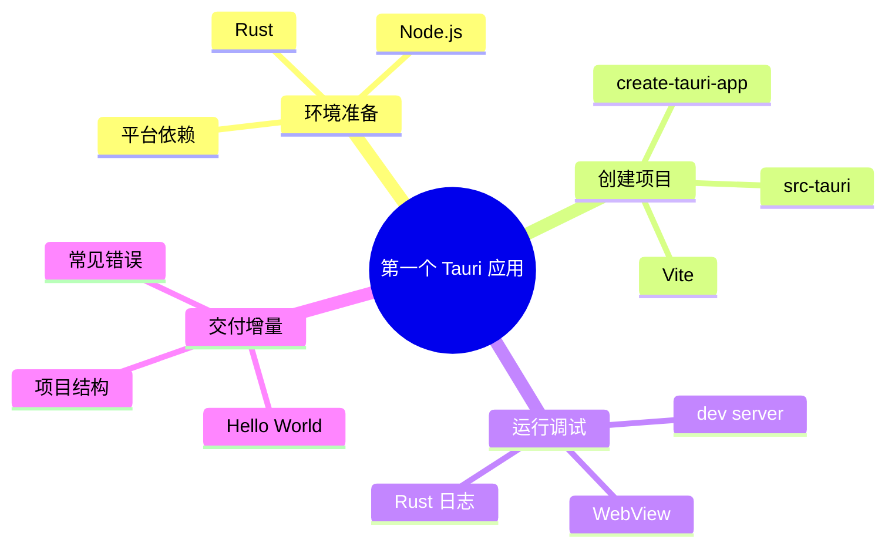

# 第二章 五分钟跑起第一个 Tauri 应用

> *"Talk is cheap. Show me the code."*
> — Linus Torvalds

上一章我们聊了很多"为什么"，现在是时候动手了。本章的目标很简单：**搭建开发环境，用 Tauri 跑起你的第一个桌面应用。** 如果你是 C++/Java 后端工程师，你会发现这个过程比配置 CMake 或 Maven 多模块项目简单得多。



---

## 2.1 环境准备

### 2.1.1 系统要求

Tauri 支持三大桌面平台，每个平台有不同的前置依赖：

```
┌─────────────────────────────────────────────────────────┐
│                    环境依赖一览                           │
├──────────┬──────────────────────────────────────────────┤
│  所有平台 │ Rust (rustup) + Node.js (≥18) + 包管理器     │
├──────────┼──────────────────────────────────────────────┤
│  macOS   │ Xcode Command Line Tools                     │
│          │ (xcode-select --install)                     │
├──────────┼──────────────────────────────────────────────┤
│  Windows │ Microsoft Visual Studio C++ Build Tools      │
│          │ + WebView2 (Win10 1803+ 已预装)              │
├──────────┼──────────────────────────────────────────────┤
│  Linux   │ 系统依赖包 (见下文)                           │
└──────────┴──────────────────────────────────────────────┘
```

### 2.1.2 安装 Rust

如果你还没有安装 Rust，只需要一行命令：

```bash
# macOS / Linux
curl --proto '=https' --tlsv1.2 -sSf https://sh.rustup.rs | sh

# Windows (下载并运行 rustup-init.exe)
# https://rustup.rs
```

安装完成后验证：

```bash
$ rustc --version
rustc 1.82.0 (f6e511eec 2024-10-15)

$ cargo --version
cargo 1.82.0 (8f40fc59f 2024-10-15)
```

> **给 C++ 工程师的提示：** `cargo` 之于 Rust，就像 `cmake + make + conan` 的合体。它同时负责构建、依赖管理、测试和发布。
>
> **给 Java 工程师的提示：** `cargo` 类似于 Maven + Gradle 的结合体，但更快、更简洁。`Cargo.toml` 对应 `pom.xml` / `build.gradle`。

### 2.1.3 安装 Node.js

Tauri 的前端部分需要 Node.js。推荐使用 `nvm`（Node Version Manager）管理版本：

```bash
# 安装 nvm
curl -o- https://raw.githubusercontent.com/nvm-sh/nvm/v0.39.7/install.sh | bash

# 安装并使用 Node.js LTS
nvm install --lts
nvm use --lts

# 验证
$ node --version
v20.18.0

$ npm --version
10.8.2
```

### 2.1.4 平台特定依赖

**macOS：**

```bash
xcode-select --install
```

**Linux（Ubuntu/Debian）：**

```bash
sudo apt update
sudo apt install -y \
  libwebkit2gtk-4.1-dev \
  build-essential \
  curl \
  wget \
  file \
  libxdo-dev \
  libssl-dev \
  libayatana-appindicator3-dev \
  librsvg2-dev
```

**Windows：**

1. 安装 [Visual Studio Build Tools](https://visualstudio.microsoft.com/visual-cpp-build-tools/)，勾选"C++ 桌面开发"
2. WebView2 在 Windows 10 (1803+) 和 Windows 11 中已预装

### 2.1.5 安装 Tauri CLI

```bash
# 通过 Cargo 安装（推荐）
cargo install tauri-cli

# 或通过 npm 安装
npm install -g @tauri-apps/cli
```

---

## 2.2 创建第一个 Tauri 项目

### 2.2.1 使用脚手架

Tauri 提供了交互式脚手架工具：

```bash
# 使用 cargo 创建
cargo create-tauri-app hive

# 或使用 npm 创建
npm create tauri-app@latest hive
```

脚手架会询问你几个问题：

```
✔ Choose which language to use for your frontend · TypeScript / JavaScript
✔ Choose your package manager · npm
✔ Choose your UI template · Vanilla
✔ Choose your UI flavor · TypeScript
```

> **为什么选 Vanilla？** 在学习阶段，我们先用最简单的 Vanilla（原生 HTML/CSS/JS）来理解 Tauri 的工作原理。后续章节会切换到 React/Vue 等框架。

### 2.2.2 项目结构

创建完成后，项目结构如下：

```
hive/
├── src-tauri/                 # Rust 后端
│   ├── Cargo.toml             # Rust 依赖配置（类似 pom.xml）
│   ├── build.rs               # 构建脚本
│   ├── tauri.conf.json        # Tauri 配置文件
│   ├── capabilities/          # 安全权限配置
│   │   └── default.json
│   ├── icons/                 # 应用图标
│   │   ├── icon.ico
│   │   ├── icon.png
│   │   └── ...
│   └── src/
│       ├── main.rs            # Rust 入口
│       └── lib.rs             # Rust 库代码
│
├── src/                       # 前端代码
│   ├── index.html             # 主页面
│   ├── main.ts                # 前端入口
│   └── styles.css             # 样式
│
├── package.json               # Node.js 依赖配置
└── tsconfig.json              # TypeScript 配置
```

让我们用一张图来理解这个结构：

```
┌─────────────────────────────────────────────────┐
│                   hive 项目                      │
│                                                  │
│  ┌──────────────────┐  ┌──────────────────────┐  │
│  │   src/ (前端)     │  │  src-tauri/ (后端)    │  │
│  │                  │  │                      │  │
│  │  index.html      │  │  Cargo.toml          │  │
│  │  main.ts         │  │  tauri.conf.json     │  │
│  │  styles.css      │  │  src/main.rs         │  │
│  │                  │  │  src/lib.rs          │  │
│  │  → 运行在        │  │  → 运行在             │  │
│  │    WebView 中    │  │    原生进程中          │  │
│  └────────┬─────────┘  └──────────┬───────────┘  │
│           │         IPC           │              │
│           └───────────────────────┘              │
└─────────────────────────────────────────────────┘
```

> **C++ 工程师视角：** `src-tauri/` 就像你的 C++ 项目目录，`Cargo.toml` 对应 `CMakeLists.txt`，`src/main.rs` 对应 `main.cpp`。
>
> **Java 工程师视角：** `src-tauri/` 类似 Spring Boot 的 `src/main/java/`，`Cargo.toml` 对应 `pom.xml`。

---

## 2.3 理解核心文件

### 2.3.1 Rust 入口：`src-tauri/src/main.rs`

```rust
// 防止在 release 模式下弹出控制台窗口（仅 Windows）
#![cfg_attr(not(debug_assertions), windows_subsystem = "windows")]

fn main() {
    // 调用 lib.rs 中的 run() 函数
    hive_lib::run()
}
```

### 2.3.2 核心逻辑：`src-tauri/src/lib.rs`

```rust
// 定义一个 Tauri 命令（可以从前端调用）
#[tauri::command]
fn greet(name: &str) -> String {
    format!("Hello, {}! You've been greeted from Rust!", name)
}

// 构建并运行 Tauri 应用
pub fn run() {
    tauri::Builder::default()
        .invoke_handler(tauri::generate_handler![greet])  // 注册命令
        .run(tauri::generate_context!())                   // 运行
        .expect("error while running tauri application");
}
```

**逐行解析：**

| 代码 | 含义 | C++/Java 类比 |
|------|------|---------------|
| `#[tauri::command]` | 属性宏，标记为可从前端调用的命令 | Java `@RequestMapping` |
| `fn greet(name: &str) -> String` | 接收字符串引用，返回 String | `String greet(String name)` |
| `tauri::Builder::default()` | 构建器模式，配置应用 | Spring Boot `SpringApplication` |
| `.invoke_handler(...)` | 注册命令处理器 | 注册 Controller |
| `.run(...)` | 启动应用 | `SpringApplication.run()` |

### 2.3.3 前端页面：`src/index.html`

```html
<!doctype html>
<html lang="en">
<head>
    <meta charset="UTF-8" />
    <link rel="stylesheet" href="styles.css" />
    <meta name="viewport" content="width=device-width, initial-scale=1.0" />
    <title>Hive</title>
    <script type="module" src="/main.ts" defer></script>
</head>
<body>
    <main class="container">
        <h1>Welcome to Hive!</h1>
        <div class="row">
            <input id="greet-input" placeholder="Enter a name..." />
            <button type="button" id="greet-btn">Greet</button>
        </div>
        <p id="greet-msg"></p>
    </main>
</body>
</html>
```

### 2.3.4 前端逻辑：`src/main.ts`

```typescript
const { invoke } = window.__TAURI__.core;

let greetInputEl: HTMLInputElement | null;
let greetMsgEl: HTMLElement | null;

async function greet() {
  if (greetInputEl && greetMsgEl) {
    // 调用 Rust 后端的 greet 命令
    greetMsgEl.textContent = await invoke("greet", {
      name: greetInputEl.value,
    });
  }
}

window.addEventListener("DOMContentLoaded", () => {
  greetInputEl = document.querySelector("#greet-input");
  greetMsgEl = document.querySelector("#greet-msg");
  document.querySelector("#greet-btn")?.addEventListener("click", () => greet());
});
```

**关键点：** `invoke("greet", { name: "Walter" })` 就是前端调用 Rust 后端的方式。这就是 Tauri 的 IPC（进程间通信）机制，我们会在第 11 章深入探讨。

```
┌──────────────────────────────────────────────┐
│              IPC 调用流程                      │
│                                              │
│  前端 (WebView)          Rust (Core)         │
│                                              │
│  invoke("greet",  ──────►  #[tauri::command] │
│    {name:"Walter"})        fn greet(name)    │
│                                              │
│  "Hello, Walter!" ◄──────  return String     │
│                                              │
└──────────────────────────────────────────────┘
```

### 2.3.5 Tauri 配置：`src-tauri/tauri.conf.json`

```json
{
  "productName": "hive",
  "version": "0.1.0",
  "identifier": "com.hive.app",
  "build": {
    "frontendDist": "../src",
    "devUrl": "http://localhost:1420",
    "beforeDevCommand": "npm run dev",
    "beforeBuildCommand": "npm run build"
  },
  "app": {
    "windows": [
      {
        "title": "Hive",
        "width": 800,
        "height": 600
      }
    ],
    "security": {
      "csp": null
    }
  },
  "bundle": {
    "active": true,
    "targets": "all",
    "icon": [
      "icons/32x32.png",
      "icons/128x128.png",
      "icons/128x128@2x.png",
      "icons/icon.icns",
      "icons/icon.ico"
    ]
  }
}
```

**重要配置项说明：**

| 配置项 | 含义 | 类比 |
|--------|------|------|
| `productName` | 应用名称 | Maven `artifactId` |
| `identifier` | 唯一标识符（反向域名） | Java 包名 |
| `build.devUrl` | 开发模式下的前端地址 | webpack-dev-server |
| `app.windows` | 窗口配置 | Qt `QMainWindow` 设置 |
| `bundle` | 打包配置 | Maven Assembly Plugin |

---

## 2.4 运行与调试

### 2.4.1 开发模式

```bash
cd hive

# 安装前端依赖
npm install

# 以开发模式运行
cargo tauri dev
```

第一次运行会比较慢（需要编译 Rust 依赖），后续增量编译会快很多。

```
   Compiling hive v0.1.0
   ...
   Finished `dev` profile [unoptimized + debuginfo] target(s) in 45.32s

        Info Watching /Users/you/hive/src-tauri for changes...
        Info Running `target/debug/hive`
```

你会看到一个桌面窗口弹出，输入名字点击 "Greet"，就能看到 Rust 返回的问候语！

```
┌──────────────────────────────────┐
│  Hive                    — □ ✕   │
├──────────────────────────────────┤
│                                  │
│       Welcome to Hive!           │
│                                  │
│  ┌──────────────┐  ┌───────┐    │
│  │ Walter       │  │ Greet │    │
│  └──────────────┘  └───────┘    │
│                                  │
│  Hello, Walter! You've been      │
│  greeted from Rust!              │
│                                  │
└──────────────────────────────────┘
```

### 2.4.2 热重载

Tauri 开发模式支持双向热重载：

- **前端热重载**：修改 HTML/CSS/JS 后自动刷新 WebView
- **Rust 热重载**：修改 Rust 代码后自动重新编译并重启应用

### 2.4.3 调试技巧

**前端调试：** 右键点击应用窗口 → "检查元素"，会打开 DevTools（和浏览器开发者工具一样）。

**Rust 调试：**

```bash
# 使用 println! 宏（最简单）
println!("Debug: name = {}", name);

# 使用 log 库（推荐）
# 在 Cargo.toml 中添加 log 和 env_logger
log::info!("Processing greet for: {}", name);
```

**VS Code 调试配置：**

在 `.vscode/launch.json` 中添加：

```json
{
  "version": "0.2.0",
  "configurations": [
    {
      "type": "lldb",
      "request": "launch",
      "name": "Tauri Development Debug",
      "cargo": {
        "args": [
          "build",
          "--manifest-path=./src-tauri/Cargo.toml",
          "--no-default-features"
        ]
      },
      "preLaunchTask": "ui:dev"
    }
  ]
}
```

---

## 2.5 构建发布版本

### 2.5.1 生产构建

```bash
cargo tauri build
```

构建完成后，安装包位于 `src-tauri/target/release/bundle/` 目录：

```
src-tauri/target/release/bundle/
├── macos/          # macOS .app 和 .dmg
├── msi/            # Windows .msi 安装包
├── nsis/           # Windows .exe 安装包
└── deb/            # Linux .deb 包
```

### 2.5.2 体积对比

让我们来看看构建产物的体积：

```
┌────────────────────────────────────────────┐
│          Hello World 应用体积对比            │
├────────────────┬───────────┬───────────────┤
│                │ Electron  │    Tauri      │
├────────────────┼───────────┼───────────────┤
│ macOS .dmg     │  ~160 MB  │    ~4 MB      │
│ Windows .msi   │  ~155 MB  │    ~3 MB      │
│ Linux .deb     │  ~150 MB  │    ~3 MB      │
├────────────────┼───────────┼───────────────┤
│ 体积缩减       │  基准     │  ~97% ↓       │
└────────────────┴───────────┴───────────────┘
```

没错，**Tauri 应用只有 Electron 的 3% 大小**。这就是使用系统 WebView 的威力。

---

## 2.6 动手练习：定制你的 Hive

在进入 Rust 学习之前，让我们做一些小练习来熟悉 Tauri 的开发流程。

### 练习 1：修改问候语

修改 `src-tauri/src/lib.rs` 中的 `greet` 函数，让它返回中文问候：

```rust
#[tauri::command]
fn greet(name: &str) -> String {
    format!("你好，{}！欢迎来到 Hive 蜂巢！", name)
}
```

### 练习 2：添加新命令

在 `lib.rs` 中添加一个获取系统信息的命令：

```rust
#[tauri::command]
fn get_system_info() -> String {
    format!(
        "OS: {} {}\nArch: {}",
        std::env::consts::OS,
        std::env::consts::FAMILY,
        std::env::consts::ARCH
    )
}

pub fn run() {
    tauri::Builder::default()
        .invoke_handler(tauri::generate_handler![greet, get_system_info])
        .run(tauri::generate_context!())
        .expect("error while running tauri application");
}
```

然后在前端调用它：

```typescript
const sysInfo = await invoke("get_system_info");
console.log(sysInfo);
// 输出: OS: macos unix\nArch: aarch64
```

### 练习 3：修改窗口配置

编辑 `tauri.conf.json`，尝试修改窗口大小、标题，或添加第二个窗口：

```json
"windows": [
  {
    "title": "Hive - 蜂巢协作",
    "width": 1024,
    "height": 768,
    "resizable": true,
    "fullscreen": false
  }
]
```

---

## 2.7 常见问题排查

| 问题 | 可能原因 | 解决方案 |
|------|---------|---------|
| `cargo tauri dev` 编译失败 | Rust 工具链未安装或版本过旧 | `rustup update` |
| WebView 空白 | 前端未正确启动 | 检查 `devUrl` 和前端 dev server |
| Linux 编译报错缺少库 | 系统依赖未安装 | 运行 2.1.4 中的 apt install 命令 |
| Windows 找不到 WebView2 | 系统版本过旧 | 手动安装 [WebView2 Runtime](https://developer.microsoft.com/en-us/microsoft-edge/webview2/) |
| 第一次编译太慢 | 正常现象，需下载和编译依赖 | 耐心等待，后续增量编译会很快 |
| 端口 1420 被占用 | 其他进程占用了端口 | 修改 `tauri.conf.json` 中的端口或关闭占用进程 |

---

## 2.8 小结

- Tauri 开发环境需要 **Rust + Node.js + 平台特定依赖**
- `cargo create-tauri-app` 可以快速创建项目脚手架
- 项目分为 **前端（`src/`）** 和 **Rust 后端（`src-tauri/`）** 两部分
- 前后端通过 **IPC（`invoke`）** 通信
- `cargo tauri dev` 开发模式支持热重载
- `cargo tauri build` 生成的安装包只有 Electron 的 **3%** 大小
- Tauri 的配置文件 `tauri.conf.json` 控制窗口、构建和打包行为

下一章，我们将正式开始 Rust 语言的学习之旅。如果你是 C++ 工程师，你会觉得很多概念似曾相识；如果你是 Java 工程师，你会发现 Rust 在很多设计上做了更激进的取舍。

---

> **扩展阅读**
>
> - [Tauri v2 官方文档 - 快速开始](https://v2.tauri.app/start/)
> - [Tauri v2 配置参考](https://v2.tauri.app/reference/config/)
> - [Rust 安装指南](https://www.rust-lang.org/tools/install)
> - [Tauri vs Electron 基准测试](https://github.com/nicehash/nicehash-tauri-electron-benchmark)
