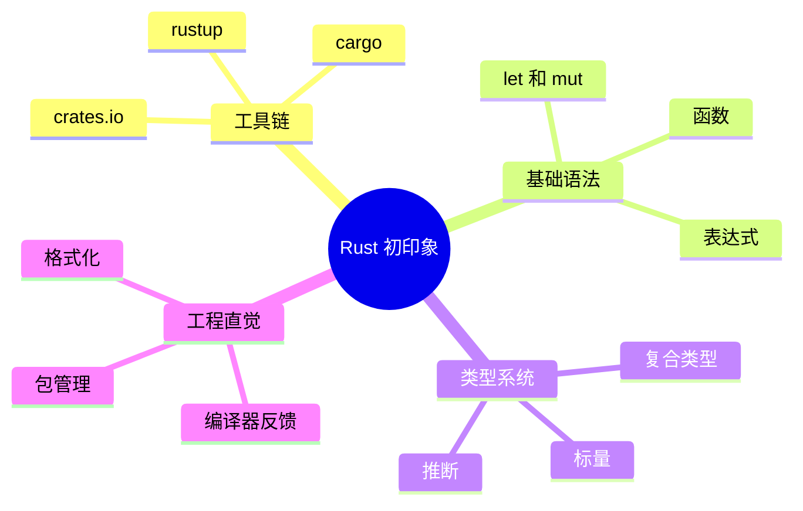

# 第三章 Rust 基础语法速览

> *"A language that doesn't affect the way you think about programming is not worth knowing."*
> — Alan Perlis

本章将带你快速掌握 Rust 的基础语法。如果你有 C++ 或 Java 背景，你会发现很多概念似曾相识，但 Rust 在细节上做了许多独到的设计。我们会在每个知识点上与 C++/Java 做对照，帮助你快速建立映射关系。



---

## 3.1 变量与可变性

### 3.1.1 默认不可变

Rust 中的变量默认是**不可变**的（immutable）。这与 C++ 的 `const` 和 Java 的 `final` 不同——在 Rust 中，不可变是默认行为。

```rust
fn main() {
    let x = 5;       // 不可变变量
    // x = 6;         // ❌ 编译错误！cannot assign twice to immutable variable
    
    let mut y = 5;   // 可变变量（需要显式声明 mut）
    y = 6;           // ✓ OK
    println!("x = {}, y = {}", x, y);
}
```

**三语对照：**

| 概念 | Rust | C++ | Java |
|------|------|-----|------|
| 不可变变量 | `let x = 5;` | `const int x = 5;` | `final int x = 5;` |
| 可变变量 | `let mut x = 5;` | `int x = 5;` | `int x = 5;` |

> **设计哲学：** Rust 选择"默认不可变"是因为不可变数据更容易推理、更安全（尤其在并发场景下）。如果你需要可变，必须显式声明 `mut`——这迫使你思考"这个变量真的需要被修改吗？"

### 3.1.2 变量遮蔽（Shadowing）

Rust 允许用 `let` 重新声明同名变量，这叫做**遮蔽**（shadowing）。被遮蔽的变量不会被销毁，只是在当前作用域中不可访问。

```rust
fn main() {
    let x = 5;
    let x = x + 1;       // 遮蔽：x 现在是 6
    let x = x * 2;       // 再次遮蔽：x 现在是 12
    println!("x = {}", x); // 输出: x = 12

    // 遮蔽甚至可以改变类型！
    let spaces = "   ";          // &str 类型
    let spaces = spaces.len();   // usize 类型
    println!("spaces = {}", spaces); // 输出: spaces = 3
}
```

**遮蔽 vs mut 的区别：**

```rust
// 遮蔽：可以改变类型
let x = "hello";
let x = x.len();    // ✓ OK，x 从 &str 变成 usize

// mut：不能改变类型
let mut y = "hello";
// y = y.len();      // ❌ 编译错误！类型不匹配
```

> **C++ 工程师注意：** C++ 中在同一作用域内不能重新声明同名变量，但 Rust 可以。这在需要对同一个值做多步转换时非常方便。

### 3.1.3 常量

常量（`const`）与不可变变量不同：常量在编译期求值，必须标注类型，且命名约定为全大写蛇形。

```rust
const MAX_CONNECTIONS: u32 = 10_000;  // 编译期常量
const PI: f64 = 3.141_592_653_589_793;

fn main() {
    println!("最大连接数: {}", MAX_CONNECTIONS);
}
```

| 特性 | `let` 变量 | `const` 常量 | `static` 静态变量 |
|------|-----------|-------------|------------------|
| 可变性 | 默认不可变，可 `mut` | 永远不可变 | 可 `mut`（需 unsafe） |
| 类型推导 | 支持 | 不支持（必须标注） | 不支持（必须标注） |
| 求值时机 | 运行时 | 编译期 | 运行时（程序启动时） |
| 内存 | 栈上 | 内联到使用处 | 固定地址（'static 生命周期） |

---

## 3.2 数据类型

### 3.2.1 标量类型

Rust 有四种标量类型：整数、浮点数、布尔值和字符。

**整数类型：**

```
┌──────────┬─────────┬──────────┬──────────────────────────┐
│  长度     │ 有符号   │ 无符号   │ 范围                      │
├──────────┼─────────┼──────────┼──────────────────────────┤
│  8-bit   │ i8      │ u8       │ -128~127 / 0~255         │
│  16-bit  │ i16     │ u16      │ -32768~32767 / 0~65535   │
│  32-bit  │ i32     │ u32      │ -2³¹~2³¹-1 / 0~2³²-1    │
│  64-bit  │ i64     │ u64      │ -2⁶³~2⁶³-1 / 0~2⁶⁴-1    │
│  128-bit │ i128    │ u128     │ 非常大                    │
│  arch    │ isize   │ usize    │ 取决于平台 (32/64位)      │
└──────────┴─────────┴──────────┴──────────────────────────┘
```

```rust
fn main() {
    let a: i32 = 42;          // 默认整数类型
    let b: u8 = 255;          // 无符号 8 位
    let c: isize = -100;      // 平台相关大小
    let d = 1_000_000;        // 下划线分隔，提高可读性
    let e = 0xff;             // 十六进制
    let f = 0o77;             // 八进制
    let g = 0b1111_0000;      // 二进制
    let h = b'A';             // 字节字面量（u8）
    
    println!("a={}, b={}, c={}, d={}", a, b, c, d);
}
```

> **与 C++ 对比：** C++ 的 `int` 大小取决于平台（通常 32 位），Rust 的 `i32` 永远是 32 位。Rust 没有隐式整数转换——你必须显式使用 `as` 进行类型转换。

**浮点数类型：**

```rust
fn main() {
    let x = 2.0;      // f64（默认）
    let y: f32 = 3.0;  // f32
    
    // 基本运算
    let sum = 5.0 + 10.0;
    let difference = 95.5 - 4.3;
    let product = 4.0 * 30.0;
    let quotient = 56.7 / 32.2;
    let remainder = 43.0 % 5.0;
    
    println!("{} {} {} {} {}", sum, difference, product, quotient, remainder);
}
```

**布尔类型：**

```rust
fn main() {
    let t = true;
    let f: bool = false;
    println!("t={}, f={}", t, f);
}
```

**字符类型：**

```rust
fn main() {
    let c = 'z';
    let z: char = 'ℤ';
    let heart_eyed_cat = '😻';
    
    // Rust 的 char 是 4 字节的 Unicode 标量值！
    println!("字符大小: {} 字节", std::mem::size_of::<char>()); // 输出: 4
}
```

> **重要区别：** Rust 的 `char` 是 4 字节 Unicode 标量值，不是 C++ 的 1 字节 `char`，也不是 Java 的 2 字节 UTF-16 `char`。

### 3.2.2 复合类型

**元组（Tuple）：**

```rust
fn main() {
    // 元组：固定长度，可以包含不同类型
    let tup: (i32, f64, u8) = (500, 6.4, 1);
    
    // 解构
    let (x, y, z) = tup;
    println!("x={}, y={}, z={}", x, y, z);
    
    // 索引访问
    let five_hundred = tup.0;
    let six_point_four = tup.1;
    let one = tup.2;
    println!("{} {} {}", five_hundred, six_point_four, one);
    
    // 单元元组（unit type）
    let unit: () = ();  // 类似 C++ 的 void
}
```

**数组（Array）：**

```rust
fn main() {
    // 数组：固定长度，相同类型，栈上分配
    let a = [1, 2, 3, 4, 5];
    let b: [i32; 5] = [1, 2, 3, 4, 5];   // 显式类型标注
    let c = [3; 5];                        // [3, 3, 3, 3, 3]
    
    // 索引访问
    let first = a[0];
    let second = a[1];
    println!("first={}, second={}", first, second);
    
    // ⚠️ 越界访问会 panic（不是未定义行为！）
    // let oob = a[10]; // 运行时 panic: index out of bounds
}
```

**三语对照 — 复合类型：**

| 概念 | Rust | C++ | Java |
|------|------|-----|------|
| 固定数组 | `[i32; 5]` | `int[5]` / `std::array<int,5>` | `int[]` |
| 动态数组 | `Vec<i32>` | `std::vector<int>` | `ArrayList<Integer>` |
| 元组 | `(i32, f64)` | `std::tuple<int, double>` | 无（需自定义类） |
| 字符串（拥有） | `String` | `std::string` | `String` |
| 字符串（借用） | `&str` | `std::string_view` | 无直接对应 |

---

## 3.3 函数

### 3.3.1 函数定义

Rust 使用 `fn` 关键字定义函数，参数必须标注类型：

```rust
fn add(a: i32, b: i32) -> i32 {
    a + b  // 注意：没有分号！这是一个表达式，作为返回值
}

fn greet(name: &str) {
    println!("Hello, {}!", name);
}

fn main() {
    let result = add(3, 5);
    println!("3 + 5 = {}", result);
    greet("Walter");
}
```

### 3.3.2 语句与表达式

Rust 是一门**表达式导向**的语言。理解语句（statement）和表达式（expression）的区别至关重要：

```rust
fn main() {
    // 语句（statement）：执行操作，不返回值
    let x = 5;           // let 绑定是语句
    // let y = (let z = 6); // ❌ 编译错误！语句不返回值

    // 表达式（expression）：求值并返回结果
    let y = {
        let x = 3;
        x + 1        // 没有分号 → 这是表达式，值为 4
    };
    println!("y = {}", y); // 输出: y = 4

    // 加了分号就变成语句，返回 ()
    let z = {
        let x = 3;
        x + 1;       // 有分号 → 这是语句，块返回 ()
    };
    // z 的类型是 ()
}
```

> **关键规则：** 函数体最后一个表达式（没有分号）就是返回值。加了分号就变成语句，返回 `()`。这是 Rust 新手最常犯的错误之一。

```rust
// ✓ 正确：最后一个表达式作为返回值
fn add_v1(a: i32, b: i32) -> i32 {
    a + b
}

// ✓ 正确：使用 return 关键字（通常用于提前返回）
fn add_v2(a: i32, b: i32) -> i32 {
    return a + b;
}

// ❌ 错误：加了分号，返回 () 而不是 i32
// fn add_v3(a: i32, b: i32) -> i32 {
//     a + b;  // 编译错误！expected `i32`, found `()`
// }
```

### 3.3.3 闭包（Closure）

闭包是可以捕获环境变量的匿名函数：

```rust
fn main() {
    // 基本闭包
    let add = |a, b| a + b;
    println!("3 + 5 = {}", add(3, 5));

    // 带类型标注的闭包
    let multiply = |a: i32, b: i32| -> i32 { a * b };
    println!("3 * 5 = {}", multiply(3, 5));

    // 捕获环境变量
    let name = String::from("Walter");
    let greet = || println!("Hello, {}!", name);  // 借用 name
    greet();
    println!("name is still: {}", name);  // name 仍然可用

    // move 闭包：获取所有权
    let name2 = String::from("Rust");
    let greet2 = move || println!("Hello, {}!", name2);  // 移动 name2
    greet2();
    // println!("{}", name2); // ❌ 编译错误！name2 已被移动
}
```

**三语对照 — 闭包/Lambda：**

| 语言 | 语法 | 捕获方式 |
|------|------|---------|
| Rust | `\|a, b\| a + b` | 自动推导（借用/可变借用/移动） |
| C++ | `[&](int a, int b) { return a + b; }` | 显式指定 `[=]`/`[&]`/`[x]` |
| Java | `(a, b) -> a + b` | 只能捕获 effectively final 变量 |

---

## 3.4 控制流

### 3.4.1 if 表达式

在 Rust 中，`if` 是一个**表达式**，可以返回值：

```rust
fn main() {
    let number = 7;

    // 基本 if-else
    if number < 5 {
        println!("小于 5");
    } else if number < 10 {
        println!("小于 10");
    } else {
        println!("大于等于 10");
    }

    // if 作为表达式（类似三元运算符）
    let condition = true;
    let x = if condition { 5 } else { 6 };
    println!("x = {}", x); // 输出: x = 5

    // ⚠️ 条件不需要括号，且必须是 bool 类型
    // if number { ... }  // ❌ 编译错误！Rust 没有"truthy"值
    if number != 0 {
        println!("number is not zero");
    }
}
```

> **与 C++/Java 的区别：** Rust 的 `if` 条件**不需要括号**，且**必须是 `bool` 类型**。不存在 C++ 中 `if (ptr)` 或 Java 中 `if (obj != null)` 的隐式转换。

### 3.4.2 循环

Rust 有三种循环：`loop`、`while` 和 `for`。

**loop — 无限循环：**

```rust
fn main() {
    let mut counter = 0;

    // loop 可以返回值！
    let result = loop {
        counter += 1;
        if counter == 10 {
            break counter * 2;  // break 带返回值
        }
    };
    println!("result = {}", result); // 输出: result = 20

    // 循环标签（用于嵌套循环的 break/continue）
    let mut count = 0;
    'outer: loop {
        let mut remaining = 10;
        loop {
            if remaining == 9 {
                break;           // 只退出内层循环
            }
            if count == 2 {
                break 'outer;   // 退出外层循环
            }
            remaining -= 1;
        }
        count += 1;
    }
    println!("count = {}", count); // 输出: count = 2
}
```

**while 循环：**

```rust
fn main() {
    let mut number = 3;
    while number != 0 {
        println!("{}!", number);
        number -= 1;
    }
    println!("发射！");
}
```

**for 循环（最常用）：**

```rust
fn main() {
    // 遍历数组
    let a = [10, 20, 30, 40, 50];
    for element in a {
        println!("值: {}", element);
    }

    // 带索引遍历
    for (i, element) in a.iter().enumerate() {
        println!("a[{}] = {}", i, element);
    }

    // 范围（Range）
    for number in 1..=5 {       // 1, 2, 3, 4, 5（包含终点）
        println!("{}", number);
    }

    for number in (1..4).rev() { // 3, 2, 1（反转，不包含终点）
        println!("{}", number);
    }
}
```

**三语对照 — 循环：**

| 概念 | Rust | C++ | Java |
|------|------|-----|------|
| 无限循环 | `loop { }` | `while(true) { }` | `while(true) { }` |
| 条件循环 | `while cond { }` | `while(cond) { }` | `while(cond) { }` |
| 范围遍历 | `for i in 0..n { }` | `for(int i=0;i<n;i++)` | `for(int i=0;i<n;i++)` |
| 容器遍历 | `for x in vec { }` | `for(auto& x : vec)` | `for(var x : list)` |
| 带索引遍历 | `for (i,x) in v.iter().enumerate()` | 需手动计数 | 需手动计数 |

---

## 3.5 模式匹配

模式匹配是 Rust 最强大的特性之一。`match` 表达式类似于 C/C++ 的 `switch`，但功能远远更强。

### 3.5.1 基本 match

```rust
fn main() {
    let number = 13;

    match number {
        1 => println!("一"),
        2 => println!("二"),
        3..=12 => println!("三到十二"),  // 范围匹配
        13 | 14 => println!("十三或十四"), // 多值匹配
        _ => println!("其他"),            // 通配符（类似 default）
    }
}
```

### 3.5.2 match 是表达式

```rust
fn describe_number(n: i32) -> &'static str {
    match n {
        0 => "零",
        1..=9 => "个位数",
        10..=99 => "两位数",
        100..=999 => "三位数",
        _ => "大数",
    }
}

fn main() {
    println!("{} 是{}", 42, describe_number(42));
    // 输出: 42 是两位数
}
```

### 3.5.3 解构匹配

```rust
fn main() {
    // 解构元组
    let point = (3, -5);
    match point {
        (0, 0) => println!("原点"),
        (x, 0) => println!("x 轴上，x={}", x),
        (0, y) => println!("y 轴上，y={}", y),
        (x, y) => println!("({}, {})", x, y),
    }

    // 解构结构体
    struct Point { x: i32, y: i32 }
    let p = Point { x: 0, y: 7 };
    match p {
        Point { x: 0, y } => println!("在 y 轴上，y={}", y),
        Point { x, y: 0 } => println!("在 x 轴上，x={}", x),
        Point { x, y } => println!("({}, {})", x, y),
    }
}
```

### 3.5.4 守卫条件（Match Guard）

```rust
fn main() {
    let num = Some(4);

    match num {
        Some(x) if x < 5 => println!("小于 5: {}", x),
        Some(x) => println!("大于等于 5: {}", x),
        None => println!("无值"),
    }
}
```

### 3.5.5 if let 和 while let

当你只关心一种模式时，`if let` 比 `match` 更简洁：

```rust
fn main() {
    let config_max = Some(3u8);

    // 使用 match（有点啰嗦）
    match config_max {
        Some(max) => println!("最大值: {}", max),
        _ => (),
    }

    // 使用 if let（更简洁）
    if let Some(max) = config_max {
        println!("最大值: {}", max);
    }

    // while let
    let mut stack = vec![1, 2, 3];
    while let Some(top) = stack.pop() {
        println!("{}", top); // 输出: 3, 2, 1
    }
}
```

**三语对照 — 模式匹配：**

| 特性 | Rust `match` | C++ `switch` | Java `switch` |
|------|-------------|-------------|---------------|
| 穷尽性检查 | ✓（编译器强制） | ✗ | 部分（sealed class） |
| 范围匹配 | `3..=12` | 不支持 | 不支持 |
| 解构 | ✓（元组/结构体/枚举） | ✗ | 部分（Java 21+） |
| 守卫条件 | `if x > 5` | 不支持 | `when`（Java 21+） |
| 返回值 | ✓（表达式） | ✗ | ✓（Java 14+ switch 表达式） |
| Fall-through | ✗（安全） | ✓（需 break） | ✓（需 break） |

---

## 3.6 字符串

字符串是 Rust 中最让新手困惑的部分之一。Rust 有两种主要的字符串类型：

### 3.6.1 String vs &str

```rust
fn main() {
    // &str：字符串切片，不可变引用，通常指向静态内存或 String 内部
    let s1: &str = "hello";  // 字符串字面量，类型是 &str

    // String：堆分配的、可增长的字符串
    let s2: String = String::from("hello");
    let s3: String = "hello".to_string();  // 另一种创建方式
    let s4: String = format!("hello {}", "world");

    // String → &str（自动解引用）
    let s5: &str = &s2;

    // &str → String（需要显式转换）
    let s6: String = s1.to_string();
    let s7: String = String::from(s1);
}
```

```
┌─────────────────────────────────────────────┐
│              String vs &str                  │
│                                             │
│  &str "hello"                               │
│  ┌─────────┐                                │
│  │ ptr  ────┼──► [h][e][l][l][o]  (只读)    │
│  │ len: 5   │    (可能在静态内存/栈/堆)      │
│  └─────────┘                                │
│                                             │
│  String::from("hello")                      │
│  ┌─────────┐                                │
│  │ ptr  ────┼──► [h][e][l][l][o][  ][  ]    │
│  │ len: 5   │    (堆内存，可增长)            │
│  │ cap: 7   │                               │
│  └─────────┘                                │
└─────────────────────────────────────────────┘
```

### 3.6.2 字符串操作

```rust
fn main() {
    let mut s = String::from("Hello");

    // 追加
    s.push(' ');           // 追加单个字符
    s.push_str("World");   // 追加字符串切片
    println!("{}", s);     // Hello World

    // 拼接
    let s1 = String::from("Hello, ");
    let s2 = String::from("World!");
    let s3 = s1 + &s2;    // 注意：s1 被移动了，s2 被借用
    // println!("{}", s1);  // ❌ s1 已被移动
    println!("{}", s3);    // Hello, World!

    // format! 宏（不会移动任何变量）
    let s4 = String::from("tic");
    let s5 = String::from("tac");
    let s6 = String::from("toe");
    let result = format!("{}-{}-{}", s4, s5, s6);
    println!("{}", result); // tic-tac-toe
    // s4, s5, s6 仍然可用

    // 遍历字符
    for c in "你好世界".chars() {
        println!("{}", c);
    }

    // 遍历字节
    for b in "hello".bytes() {
        println!("{}", b);
    }

    // ⚠️ 不能用索引访问！
    let s = String::from("hello");
    // let h = s[0]; // ❌ 编译错误！String 不支持索引
    let h = &s[0..1]; // ✓ 可以用切片（但要小心 UTF-8 边界）
    println!("第一个字节: {}", h);
}
```

> **为什么不能索引？** Rust 的字符串是 UTF-8 编码的。一个中文字符占 3 个字节，`s[0]` 的语义不明确（是第一个字节还是第一个字符？）。Rust 选择不支持索引来避免这种歧义。

**三语对照 — 字符串：**

| 操作 | Rust | C++ | Java |
|------|------|-----|------|
| 创建 | `String::from("hi")` | `std::string s("hi")` | `new String("hi")` |
| 不可变引用 | `&str` | `std::string_view` | `String`（本身不可变） |
| 拼接 | `format!` / `+` | `s1 + s2` / `+=` | `s1 + s2` / `StringBuilder` |
| 长度（字节） | `s.len()` | `s.length()` | `s.getBytes().length` |
| 长度（字符） | `s.chars().count()` | — | `s.length()` |
| 索引访问 | 不支持 | `s[0]` | `s.charAt(0)` |

### 3.6.3 `format!` 与宏的第一印象

Rust 中以 `!` 结尾的调用通常是**宏（macro）**，例如 `format!`、`println!`、`vec!`。宏不是普通函数：它在编译期展开成 Rust 代码，再参与类型检查和编译。

```rust
fn main() {
    let name = "Walter";
    let message = format!("Hello, {}!", name);

    println!("{}", message); // 输出: Hello, Walter!
}
```

`format!("Hello, {}!", name)` 做了三件事：

1. 在编译期解析格式字符串里的 `{}` 占位符。
2. 检查后面的参数数量和格式化能力是否匹配。
3. 在运行时生成一个新的 `String`。

这就是它比普通函数更适合做格式化的原因：普通函数无法接收“可变数量、可变类型”的参数列表，也无法在编译期理解格式字符串。

```rust
let user = "alice";
let count = 3;

let s1 = format!("user={user}, count={count}");
let s2 = format!("user={}, count={}", user, count);
let s3 = format!("debug={:?}", vec![1, 2, 3]);
```

常见格式化宏的区别：

| 宏 | 返回值 | 用途 |
|----|--------|------|
| `format!` | `String` | 生成字符串，不输出 |
| `println!` | `()` | 输出到标准输出并换行 |
| `eprintln!` | `()` | 输出到标准错误 |
| `write!` / `writeln!` | `fmt::Result` | 写入实现了 `Write` 的目标 |

宏的另一个典型例子是 `vec!`：

```rust
let numbers = vec![1, 2, 3];
```

它展开后大致等价于创建一个 `Vec` 并依次 `push` 元素。你不需要现在就学会写宏，但要先形成两个直觉：

- **看到 `!`，先想到“这是编译期展开的语法工具”。**
- **宏可以提供函数做不到的语法能力，但也要适度使用，业务抽象优先用函数和 trait。**

---

## 3.7 集合类型速览

### 3.7.1 Vec（动态数组）

```rust
fn main() {
    // 创建
    let mut v: Vec<i32> = Vec::new();
    let v2 = vec![1, 2, 3];  // vec! 宏

    // 添加元素
    v.push(1);
    v.push(2);
    v.push(3);

    // 访问
    let third = &v[2];        // 直接索引（越界会 panic）
    let third = v.get(2);     // 返回 Option<&i32>（安全）

    match v.get(2) {
        Some(val) => println!("第三个元素: {}", val),
        None => println!("没有第三个元素"),
    }

    // 遍历
    for i in &v {
        println!("{}", i);
    }

    // 可变遍历
    for i in &mut v {
        *i += 10;
    }
    println!("{:?}", v); // [11, 12, 13]
}
```

### 3.7.2 HashMap

```rust
use std::collections::HashMap;

fn main() {
    let mut scores = HashMap::new();

    // 插入
    scores.insert(String::from("Blue"), 10);
    scores.insert(String::from("Red"), 50);

    // 访问
    let blue_score = scores.get("Blue");
    match blue_score {
        Some(score) => println!("Blue: {}", score),
        None => println!("Blue team not found"),
    }

    // 遍历
    for (key, value) in &scores {
        println!("{}: {}", key, value);
    }

    // 只在键不存在时插入
    scores.entry(String::from("Yellow")).or_insert(30);
    scores.entry(String::from("Blue")).or_insert(25); // 不会覆盖

    println!("{:?}", scores);
}
```

**三语对照 — 集合：**

| 集合 | Rust | C++ | Java |
|------|------|-----|------|
| 动态数组 | `Vec<T>` | `std::vector<T>` | `ArrayList<T>` |
| 哈希表 | `HashMap<K,V>` | `std::unordered_map<K,V>` | `HashMap<K,V>` |
| 有序映射 | `BTreeMap<K,V>` | `std::map<K,V>` | `TreeMap<K,V>` |
| 哈希集合 | `HashSet<T>` | `std::unordered_set<T>` | `HashSet<T>` |
| 双端队列 | `VecDeque<T>` | `std::deque<T>` | `ArrayDeque<T>` |
| 链表 | `LinkedList<T>` | `std::list<T>` | `LinkedList<T>` |

---

## 3.8 类型转换

### 3.8.1 as 关键字

```rust
fn main() {
    // 数值类型转换
    let x: i32 = 42;
    let y: i64 = x as i64;      // 安全：扩大范围
    let z: i8 = x as i8;        // ⚠️ 可能截断！42 → 42（OK）
    let w: u8 = -1_i8 as u8;    // ⚠️ 符号变化！-1 → 255

    // 浮点 ↔ 整数
    let f: f64 = 3.99;
    let i: i32 = f as i32;      // 截断小数部分：3
    let back: f64 = i as f64;   // 3.0

    println!("y={}, z={}, w={}, i={}", y, z, w, i);
}
```

### 3.8.2 From / Into trait

```rust
fn main() {
    // From：显式转换
    let s = String::from("hello");
    let n: i64 = i64::from(42_i32);

    // Into：隐式方向（通常由编译器推导）
    let n: i64 = 42_i32.into();

    // 自定义 From
    struct Celsius(f64);
    struct Fahrenheit(f64);

    impl From<Celsius> for Fahrenheit {
        fn from(c: Celsius) -> Self {
            Fahrenheit(c.0 * 9.0 / 5.0 + 32.0)
        }
    }

    let boiling = Celsius(100.0);
    let f: Fahrenheit = boiling.into();  // 自动获得 Into
    println!("100°C = {}°F", f.0);       // 100°C = 212°F
}
```

---

## 3.9 注释与文档

```rust
// 行注释

/* 块注释 */

/// 文档注释（用于函数/结构体/模块）
/// 支持 Markdown 语法
///
/// # Examples
///
/// ```
/// let result = add(2, 3);
/// assert_eq!(result, 5);
/// ```
fn add(a: i32, b: i32) -> i32 {
    a + b
}

//! 模块级文档注释（放在文件开头）
//! 用于描述整个模块或 crate 的用途
```

> **亮点：** Rust 的文档注释中的代码示例会被 `cargo test` 自动当作测试运行！这确保了文档中的示例永远不会过时。

---

## 3.10 小结

本章我们快速浏览了 Rust 的基础语法，重点包括：

- **变量默认不可变**，需要 `mut` 才能修改——这是 Rust 安全哲学的体现
- **Rust 是表达式导向的语言**，`if`、`match`、`loop` 都可以返回值
- **模式匹配**是 Rust 的核心特性，`match` 比 `switch` 强大得多，且编译器保证穷尽性
- **字符串有两种**：`String`（拥有所有权）和 `&str`（借用），理解它们的区别至关重要
- **没有隐式类型转换**——Rust 要求你对每次转换都心中有数
- **文档注释中的代码会被自动测试**——文档即测试

如果你来自 C++ 背景，你会觉得 Rust 在很多地方更严格但也更安全；如果你来自 Java 背景，你会发现 Rust 给了你更多的底层控制权，同时通过编译器保证了安全性。

下一章，我们将进入 Rust 最核心、最独特的概念——**所有权系统**。这是 Rust 区别于所有其他语言的关键特性，也是理解 Rust 的分水岭。

---

> **扩展阅读**
>
> - [The Rust Programming Language - 第 3 章](https://doc.rust-lang.org/book/ch03-00-common-programming-concepts.html)
> - [Rust by Example](https://doc.rust-lang.org/rust-by-example/)
> - [Rust 参考手册 - 类型系统](https://doc.rust-lang.org/reference/types.html)
> - [Rust 标准库文档](https://doc.rust-lang.org/std/)
