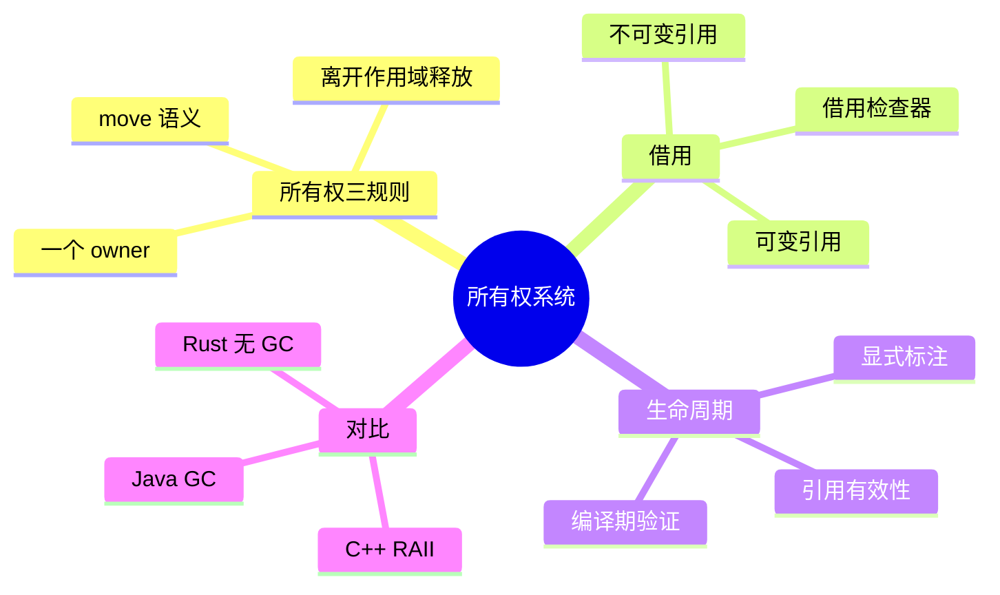

# 第四章 所有权系统：Rust 的灵魂

> *"The ownership system is Rust's most unique and compelling feature."*
> — The Rust Programming Language

如果说 Rust 只能用一个特性来定义自己，那一定是**所有权系统（Ownership System）**。它是 Rust 在不使用垃圾回收器（GC）的前提下保证内存安全的核心机制，也是大多数初学者的第一道"拦路虎"。

本章将系统讲解所有权、移动语义、借用、生命周期四大核心概念，并持续与 C++ 的 RAII/智能指针以及 Java 的 GC 做对比，帮助你从已有经验中建立直觉。



---

## 4.1 为什么需要所有权？

### 4.1.1 内存管理的三条路

在编程语言的历史中，内存管理大致有三种流派：

```
┌─────────────────────────────────────────────────────────┐
│              内存管理的三条路                              │
├──────────────┬──────────────┬───────────────────────────┤
│  手动管理     │  垃圾回收     │  所有权系统               │
│  (C/C++)     │  (Java/Go)   │  (Rust)                   │
├──────────────┼──────────────┼───────────────────────────┤
│ malloc/free  │ GC 自动回收   │ 编译期静态检查             │
│ new/delete   │ 运行时开销    │ 零运行时开销              │
│ 容易出错      │ 暂停(STW)    │ 学习曲线陡峭              │
│ 悬垂指针      │ 无法精确控制  │ 编译期保证安全             │
│ 内存泄漏      │ 内存占用高    │ 无 GC、无泄漏*            │
└──────────────┴──────────────┴───────────────────────────┘
  * 循环引用仍可能导致逻辑上的"泄漏"，但不会有未定义行为
```

C/C++ 给了程序员完全的控制权，但也带来了 use-after-free、double-free、dangling pointer 等经典 bug。Java/Go 通过 GC 解决了这些问题，但引入了运行时开销和不可预测的暂停。

Rust 走了第三条路：**在编译期通过所有权规则检查内存安全，运行时零开销。**

### 4.1.2 C++ 工程师的痛

如果你写过 C++，以下场景一定不陌生：

```cpp
// C++ 经典 bug：use-after-free
std::vector<int>* create_vector() {
    std::vector<int> v = {1, 2, 3};
    return &v;  // ❌ 返回局部变量的指针！
}

// C++ 经典 bug：double-free
void double_free() {
    int* p = new int(42);
    int* q = p;
    delete p;
    delete q;  // ❌ double free!
}

// C++ 经典 bug：悬垂引用
std::string& dangling() {
    std::string s = "hello";
    return s;  // ❌ 返回局部变量的引用！
}
```

这些 bug 在 C++ 中都能编译通过（最多一个 warning），只有在运行时才会暴露。而在 Rust 中，**这些代码根本无法通过编译**。

---

## 4.2 所有权三原则

Rust 的所有权系统建立在三条简单的规则之上：

> **规则一：** Rust 中的每一个值都有一个**所有者（owner）**。
> **规则二：** 值在任一时刻有且仅有**一个**所有者。
> **规则三：** 当所有者离开作用域，值将被**丢弃（drop）**。

这三条规则要一起理解。第一条回答“谁负责释放资源”，第二条回答“谁有权释放资源”，第三条回答“什么时候释放资源”。Rust 不允许两个变量同时拥有同一块堆内存，因为那会让释放责任变得含糊；也不允许没有所有者的值继续存在，因为那会造成泄漏或悬垂访问。

```rust
fn main() {
    {
        let s = String::from("hello");  // s 是 "hello" 的所有者
        println!("{}", s);               // s 在作用域内，可以使用
    }                                    // s 离开作用域，String 被 drop，内存被释放
    // println!("{}", s);               // ❌ 编译错误！s 已不存在
}
```

**与 C++ RAII 的对比：**

```
┌──────────────────────────────────────────────────────┐
│  C++ RAII                    Rust Ownership           │
│  ─────────                   ──────────────           │
│  构造函数获取资源              let 绑定获取所有权        │
│  析构函数释放资源              drop 释放资源             │
│  可以拷贝（浅拷贝/深拷贝）     默认 move，显式 clone     │
│  智能指针辅助管理              所有权规则强制执行         │
│  运行时检查（sanitizer）      编译期检查（borrow checker）│
└──────────────────────────────────────────────────────┘
```

Rust 的所有权本质上是 **RAII 的编译期强制版**。C++ 中 RAII 是一种"最佳实践"，程序员可以绕过它；Rust 中所有权是语言规则，编译器强制执行。

一个实用判断法是：**看到赋值、传参、返回值，就问自己所有权有没有移动。**

```rust
fn consume(name: String) {
    println!("hello, {}", name);
}

fn main() {
    let name = String::from("Tauri");
    let alias = name;       // String 不是 Copy，所有权从 name 移动到 alias
    consume(alias);         // 所有权继续移动到函数参数 name

    // println!("{}", name);  // ❌ name 已经失效
    // println!("{}", alias); // ❌ alias 也已经移动进 consume
}
```

如果你只是“看一眼”数据，不要拿走所有权，改用引用：

```rust
fn inspect(name: &str) {
    println!("hello, {}", name);
}

fn main() {
    let name = String::from("Tauri");
    inspect(&name);          // 借用 name 的内容
    println!("{}", name);    // ✓ 所有权仍在 main 中
}
```

这也是 Rust API 设计的基本原则：**需要长期保存或跨线程/异步边界使用时接收拥有所有权的类型；只需要临时读取时接收引用。**

---

## 4.3 移动语义（Move Semantics）

### 4.3.1 栈上数据 vs 堆上数据

要理解移动语义，首先要区分栈上数据和堆上数据：

```
栈（Stack）                    堆（Heap）
┌──────────┐                  ┌──────────────────┐
│ s1       │                  │                  │
│ ┌──────┐ │    ptr ────────► │ h  e  l  l  o    │
│ │ ptr  │ │                  │                  │
│ │ len:5│ │                  └──────────────────┘
│ │cap:5 │ │
│ └──────┘ │
└──────────┘

  String 的内存布局：
  - 栈上：指针 + 长度 + 容量（3 个 usize，共 24 字节）
  - 堆上：实际的 UTF-8 字节数据
```

### 4.3.2 移动（Move）

当你将一个 `String` 赋值给另一个变量时，Rust 执行的是**移动**，而不是拷贝：

```rust
fn main() {
    let s1 = String::from("hello");
    let s2 = s1;  // s1 的所有权 移动 到 s2
    
    // println!("{}", s1);  // ❌ 编译错误！value borrowed here after move
    println!("{}", s2);     // ✓ OK，s2 是新的所有者
}
```

移动之后的内存状态：

```
  移动前：                        移动后：
  s1 ──► [ptr|len|cap]           s1 （已失效，不可使用）
              │
              ▼                   s2 ──► [ptr|len|cap]
         "hello"                              │
                                              ▼
                                         "hello"
```

**为什么不是拷贝？** 如果 `s2 = s1` 只是浅拷贝（复制栈上的指针），那 `s1` 和 `s2` 会指向同一块堆内存。当两者都离开作用域时，同一块内存会被释放两次——这就是 C++ 中经典的 **double-free** 问题。

Rust 的解决方案很优雅：**移动后，原变量立即失效。** 编译器保证你不会再使用它。

### 4.3.3 与 C++ 移动语义的对比

```cpp
// C++ 移动语义（C++11）
std::string s1 = "hello";
std::string s2 = std::move(s1);  // 显式移动
// s1 仍然有效！只是处于"有效但未指定"状态
// 你可以继续使用 s1，但它的值是不确定的 —— 这是 bug 的温床
```

```rust
// Rust 移动语义
let s1 = String::from("hello");
let s2 = s1;  // 隐式移动
// s1 已失效，编译器禁止你使用它 —— 零 bug 可能
```

**关键区别：**

| 特性 | Rust | C++ |
|------|------|-----|
| 移动后原变量状态 | **编译期失效**，无法使用 | "有效但未指定"，可以使用 |
| 移动是否需要显式标记 | 默认行为（对非 Copy 类型） | 需要 `std::move()` |
| 安全性 | 编译期保证 | 程序员自律 |

### 4.3.4 Copy 类型

并非所有类型都执行移动。对于简单的栈上数据（如整数、浮点数、布尔值），Rust 执行**拷贝**而非移动：

```rust
fn main() {
    let x = 5;
    let y = x;  // 拷贝，不是移动！
    
    println!("x={}, y={}", x, y);  // ✓ 两个都可以使用
}
```

实现了 `Copy` trait 的类型会自动拷贝。以下类型默认实现了 `Copy`：

| 类型 | Copy? | 原因 |
|------|-------|------|
| `i32`, `u64`, `f64` 等 | ✅ | 栈上固定大小，拷贝成本低 |
| `bool` | ✅ | 1 字节 |
| `char` | ✅ | 4 字节 |
| `(i32, i32)` | ✅ | 所有字段都是 Copy |
| `String` | ❌ | 拥有堆内存，拷贝成本高 |
| `Vec<T>` | ❌ | 拥有堆内存 |
| `&T` | ✅ | 引用本身是指针大小，拷贝成本低 |

> **规则：** 如果一个类型的所有字段都实现了 `Copy`，你可以为它派生 `Copy`：
> ```rust
> #[derive(Copy, Clone)]
> struct Point {
>     x: f64,
>     y: f64,
> }
> ```

### 4.3.5 Clone：显式深拷贝

当你确实需要深拷贝一个堆上的值时，使用 `clone()`：

```rust
fn main() {
    let s1 = String::from("hello");
    let s2 = s1.clone();  // 显式深拷贝
    
    println!("s1={}, s2={}", s1, s2);  // ✓ 两个都可以使用
}
```

```
  clone 之后：
  s1 ──► [ptr|len|cap] ──► "hello"  （堆上的第一份）
  s2 ──► [ptr|len|cap] ──► "hello"  （堆上的第二份，独立副本）
```

> **性能提示：** `clone()` 会分配新的堆内存并复制数据，是一个潜在的性能热点。在 Rust 中看到 `.clone()` 就像在 C++ 中看到 `new`——它提醒你这里有堆分配。

---

## 4.4 函数与所有权

### 4.4.1 传参即移动

将值传递给函数时，所有权也会转移：

```rust
fn take_ownership(s: String) {
    println!("我拥有了: {}", s);
}   // s 在这里被 drop

fn make_copy(x: i32) {
    println!("我拷贝了: {}", x);
}   // x 是 Copy 类型，没有特别的事情发生

fn main() {
    let s = String::from("hello");
    take_ownership(s);       // s 的所有权移动到函数内
    // println!("{}", s);    // ❌ 编译错误！s 已被移动

    let x = 5;
    make_copy(x);            // x 被拷贝
    println!("x = {}", x);  // ✓ OK，x 仍然有效
}
```

### 4.4.2 返回值转移所有权

函数也可以通过返回值将所有权转移出去：

```rust
fn create_string() -> String {
    let s = String::from("hello");
    s  // 所有权移动给调用者
}

fn take_and_give_back(s: String) -> String {
    println!("借我看看: {}", s);
    s  // 还回去
}

fn main() {
    let s1 = create_string();           // s1 获得所有权
    let s2 = take_and_give_back(s1);    // s1 移入，s2 接收返回值
    // println!("{}", s1);              // ❌ s1 已被移动
    println!("{}", s2);                 // ✓ OK
}
```

但是，每次调用函数都要"交出再拿回"所有权，实在太麻烦了。这就引出了 Rust 最重要的概念之一——**借用**。

---

## 4.5 借用与引用（Borrowing & References）

### 4.5.1 不可变引用（&T）

**借用**就是"我借你看看，但所有权还是我的"：

```rust
fn calculate_length(s: &String) -> usize {  // s 是 String 的引用
    s.len()
}   // s 离开作用域，但它不拥有所指向的值，所以什么都不会发生

fn main() {
    let s1 = String::from("hello");
    let len = calculate_length(&s1);  // 传递引用，不转移所有权
    println!("'{}' 的长度是 {}", s1, len);  // ✓ s1 仍然有效！
}
```

```
  借用的内存模型：

  main 栈帧               calculate_length 栈帧
  ┌──────────┐            ┌──────────┐
  │ s1       │            │ s (引用)  │
  │ [ptr|5|5]│ ◄───────── │ [ptr]    │
  └──────────┘            └──────────┘
       │
       ▼
  "hello" (堆上)

  s 只是一个指向 s1 的指针，不拥有数据
```

### 4.5.2 可变引用（&mut T）

如果需要通过引用修改数据，使用可变引用：

```rust
fn append_world(s: &mut String) {
    s.push_str(", world!");
}

fn main() {
    let mut s = String::from("hello");  // 变量本身必须是 mut
    append_world(&mut s);               // 传递可变引用
    println!("{}", s);                   // 输出: hello, world!
}
```

### 4.5.3 借用规则

Rust 的借用检查器（borrow checker）执行两条核心规则：

> **规则一：** 在任意给定时刻，你可以拥有**一个可变引用**或**任意数量的不可变引用**（二选一）。
> **规则二：** 引用必须始终有效（不能悬垂）。

```rust
fn main() {
    let mut s = String::from("hello");

    // ✓ 多个不可变引用可以共存
    let r1 = &s;
    let r2 = &s;
    println!("{} and {}", r1, r2);
    // r1 和 r2 在这之后不再使用（NLL: Non-Lexical Lifetimes）

    // ✓ 此时可以创建可变引用（因为 r1, r2 已经"过期"）
    let r3 = &mut s;
    r3.push_str(", world!");
    println!("{}", r3);

    // ❌ 不可变引用和可变引用不能同时存在
    // let r4 = &s;
    // let r5 = &mut s;
    // println!("{} {}", r4, r5);  // 编译错误！
}
```

**为什么要这样？** 这是 Rust 在编译期防止**数据竞争**的核心机制：

```
数据竞争的三个必要条件：
  1. 两个或更多指针同时访问同一数据
  2. 至少有一个指针在写入
  3. 没有同步机制

Rust 的借用规则直接消除了条件 1+2 的组合：
  - 多个读取者（&T）：✓ 安全，没有写入
  - 一个写入者（&mut T）：✓ 安全，没有其他访问者
  - 读取者 + 写入者：✗ 编译器拒绝
```

**三语对照 — 引用/指针：**

| 概念 | Rust | C++ | Java |
|------|------|-----|------|
| 不可变引用 | `&T` | `const T&` / `const T*` | 默认行为（引用语义） |
| 可变引用 | `&mut T` | `T&` / `T*` | 默认行为 |
| 空引用 | **不存在** | `nullptr` | `null` |
| 悬垂引用 | **编译期禁止** | 运行时 UB | GC 防止 |
| 并发安全 | **编译期保证** | 程序员负责 | synchronized |

### 4.5.4 悬垂引用的编译期防护

```rust
// ❌ 这段代码无法编译！
fn dangle() -> &String {
    let s = String::from("hello");
    &s  // s 在函数结束时被 drop，返回的引用将指向无效内存
}
// error[E0106]: missing lifetime specifier
// 实际上编译器会告诉你：这个引用的生命周期不够长

// ✓ 正确做法：返回所有权
fn no_dangle() -> String {
    let s = String::from("hello");
    s  // 所有权移动给调用者，没有悬垂引用
}
```

---

## 4.6 生命周期（Lifetimes）

### 4.6.1 什么是生命周期？

**生命周期**是 Rust 用来追踪引用有效范围的机制。大多数时候，生命周期是隐式的、可以被编译器推断的。但在某些情况下，你需要显式标注。

```rust
// 这个函数接收两个字符串切片，返回较长的那个
// 编译器无法自动推断返回的引用来自 x 还是 y
// 所以我们需要显式标注生命周期

fn longest<'a>(x: &'a str, y: &'a str) -> &'a str {
    if x.len() > y.len() {
        x
    } else {
        y
    }
}

fn main() {
    let string1 = String::from("long string");
    let result;
    {
        let string2 = String::from("xyz");
        result = longest(string1.as_str(), string2.as_str());
        println!("最长的字符串是: {}", result);  // ✓ OK
    }
    // println!("{}", result);  // ❌ 如果 result 引用了 string2，这里就悬垂了
    // 编译器会根据生命周期标注来检查这一点
}
```

### 4.6.2 生命周期标注语法

生命周期标注不改变引用的实际生命周期，它只是告诉编译器多个引用之间的关系：

```rust
&i32        // 一个引用
&'a i32     // 一个带有显式生命周期的引用
&'a mut i32 // 一个带有显式生命周期的可变引用
```

> **类比：** 生命周期标注就像函数签名中的泛型类型参数。`fn foo<T>(x: T)` 不会改变 `T` 是什么类型，只是声明"这里有一个类型参数"。同样，`fn foo<'a>(x: &'a str)` 不会改变引用的生命周期，只是声明"这里有一个生命周期参数"。

### 4.6.3 生命周期省略规则

Rust 编译器有三条**生命周期省略规则（Lifetime Elision Rules）**，让你在大多数情况下不需要显式标注：

```
规则 1：每个引用参数都获得自己的生命周期参数
  fn foo(x: &str)           → fn foo<'a>(x: &'a str)
  fn foo(x: &str, y: &str)  → fn foo<'a, 'b>(x: &'a str, y: &'b str)

规则 2：如果只有一个输入生命周期参数，它被赋给所有输出生命周期
  fn foo(x: &str) -> &str   → fn foo<'a>(x: &'a str) -> &'a str

规则 3：如果有多个输入生命周期参数，但其中一个是 &self 或 &mut self，
        则 self 的生命周期被赋给所有输出生命周期
  fn foo(&self, x: &str) -> &str → 返回值的生命周期 = self 的生命周期
```

这就是为什么大多数函数不需要显式写生命周期——编译器会自动推断。

把三条规则套到具体例子里会更清楚：

```rust
// 规则 1：每个输入引用先各有自己的生命周期
fn first_word(s: &str) -> &str {
    s.split_whitespace().next().unwrap_or("")
}

// 编译器等价理解为：
// fn first_word<'a>(s: &'a str) -> &'a str
```

上面能省略，是因为只有一个输入引用，规则 2 可以明确地说“返回值来自 `s`”。但下面这个函数不能省略：

```rust
// ❌ 编译器不知道返回值到底来自 left 还是 right
// fn longer(left: &str, right: &str) -> &str {
//     if left.len() >= right.len() { left } else { right }
// }

// ✓ 显式标注：返回值的生命周期不能超过 left 和 right 中较短的那个
fn longer<'a>(left: &'a str, right: &'a str) -> &'a str {
    if left.len() >= right.len() { left } else { right }
}
```

`'a` 不是“让引用活得更久”的魔法。它只是告诉编译器：`left`、`right` 和返回值之间存在同一个有效性约束。真正的生命周期仍由调用处的变量作用域决定。

方法里的 `&self` 是最常见的省略场景：

```rust
struct User {
    name: String,
}

impl User {
    // 根据规则 3，返回的 &str 默认绑定到 &self 的生命周期
    fn name(&self) -> &str {
        &self.name
    }
}
```

所以在业务代码里，你通常先写省略版；只有当编译器报 `missing lifetime specifier`，并且返回引用确实可能来自多个输入时，再显式标注。

### 4.6.4 结构体中的生命周期

当结构体持有引用时，必须标注生命周期：

```rust
// 这个结构体持有一个字符串切片的引用
// 'a 表示：ImportantExcerpt 实例的生命周期不能超过它持有的引用
struct ImportantExcerpt<'a> {
    part: &'a str,
}

impl<'a> ImportantExcerpt<'a> {
    // 根据省略规则 3，返回值的生命周期 = &self 的生命周期
    fn level(&self) -> i32 {
        3
    }

    // 根据省略规则 3，返回值的生命周期 = &self 的生命周期
    fn announce_and_return_part(&self, announcement: &str) -> &str {
        println!("注意: {}", announcement);
        self.part
    }
}

fn main() {
    let novel = String::from("Call me Ishmael. Some years ago...");
    let first_sentence;
    {
        let i = novel.as_str().find('.').unwrap_or(novel.len());
        first_sentence = &novel[..i];
    }
    let excerpt = ImportantExcerpt {
        part: first_sentence,
    };
    println!("摘录: {}", excerpt.part);
}
```

### 4.6.5 静态生命周期

`'static` 是一个特殊的生命周期，表示引用在整个程序运行期间都有效：

```rust
// 字符串字面量的类型是 &'static str
let s: &'static str = "我会活到程序结束";

// 泛型约束中的 'static
fn print_it(input: impl std::fmt::Display + 'static) {
    println!("{}", input);
}
```

> **注意：** `'static` 并不意味着"永远存活"，而是"**能够**存活到程序结束"。拥有所有权的类型（如 `String`、`Vec<T>`）自动满足 `'static` 约束，因为它们不依赖任何外部引用。

---

## 4.7 实战：所有权在 Tauri 中的体现

在 Tauri 应用开发中，所有权系统无处不在。以下是几个典型场景：

### 4.7.1 Tauri 命令中的所有权

```rust
use tauri::command;

// ✓ 接收 String（拥有所有权）
#[command]
fn greet(name: String) -> String {
    format!("Hello, {}!", name)
}

// ✓ 接收 &str（借用）—— 更高效，避免不必要的拷贝
#[command]
fn greet_ref(name: &str) -> String {
    format!("Hello, {}!", name)
}
```

### 4.7.2 状态管理中的所有权

```rust
use std::sync::Mutex;
use tauri::State;

struct AppState {
    counter: Mutex<i32>,
}

#[tauri::command]
fn increment(state: State<'_, AppState>) -> i32 {
    // State 是一个借用，不拥有 AppState
    // Mutex 保证内部可变性的线程安全
    let mut count = state.counter.lock().unwrap();
    *count += 1;
    *count
}
```

`State<'_, AppState>` 里的 `'_` 是一个**匿名生命周期**。它表示“这里确实有一个生命周期参数，但请编译器根据调用上下文推断”。完整写法可以想象成：

```rust
fn increment<'a>(state: State<'a, AppState>) -> i32 {
    let mut count = state.counter.lock().unwrap();
    *count += 1;
    *count
}
```

你通常不需要手写 `'a`，因为这个生命周期只是在说明：`State` 借用了由 Tauri 管理的全局应用状态，`increment` 执行期间可以访问它，但不会拥有它、也不能把这个借用随便保存到函数外部。

因此，Tauri 命令参数可以这样选：

| 参数类型 | 适合场景 | 原因 |
|----------|----------|------|
| `String`、`i32`、`bool` | 前端传入的简单请求数据 | 直接反序列化为拥有所有权的值，函数内部可自由移动 |
| `Vec<T>`、自定义 DTO | 一次请求携带的复杂数据 | 请求数据归当前命令所有，异步处理更简单 |
| `State<'_, T>` | 应用级共享状态、连接池、缓存、配置 | 借用 Tauri 托管的状态，不复制、不转移所有权 |
| `&str`、`&T` | 纯 Rust 内部同步函数 | 高效借用；但不适合跨异步边界长期保存 |

### 4.7.3 所有权与异步

```rust
#[tauri::command]
async fn fetch_data(url: String) -> Result<String, String> {
    // url 被移动到异步块中
    // 如果用 &str，生命周期管理会更复杂
    reqwest::get(&url)
        .await
        .map_err(|e| e.to_string())?
        .text()
        .await
        .map_err(|e| e.to_string())
}
```

> **经验法则：** 在 Tauri 命令中，简单数据用值传递（`String`、`i32`），复杂数据用 `State<'_, T>` 借用，异步函数中优先使用拥有所有权的类型以避免生命周期问题。

原因在于 `async fn` 会被编译器转换成一个状态机。遇到 `.await` 时，函数会暂停，局部变量要被保存到状态机里，等未来继续执行。如果状态机里保存的是借用（例如 `&str`），编译器必须证明被借用的数据在整个异步等待期间都有效；这常常会把生命周期问题扩散到调用链上。

```rust
// 推荐：url 是 String，异步状态机拥有它
#[tauri::command]
async fn fetch_owned(url: String) -> Result<String, String> {
    reqwest::get(&url)
        .await
        .map_err(|e| e.to_string())?
        .text()
        .await
        .map_err(|e| e.to_string())
}

// 内部同步 helper 可以用 &str，因为不会跨越 await 保存引用
fn normalize_url(url: &str) -> String {
    url.trim().trim_end_matches('/').to_string()
}
```

简单说：**命令边界和异步边界偏向所有权，函数内部短小同步逻辑偏向借用。**

---

## 4.8 常见所有权错误与解决方案

### 4.8.1 错误清单

| 错误信息 | 原因 | 解决方案 |
|----------|------|----------|
| `value borrowed here after move` | 使用了已移动的值 | 使用 `.clone()` 或改用引用 |
| `cannot borrow as mutable` | 试图可变借用不可变变量 | 给变量加 `mut` |
| `cannot borrow as mutable more than once` | 同时存在多个可变引用 | 缩小借用范围或重构代码 |
| `cannot borrow as immutable because it is also borrowed as mutable` | 可变引用和不可变引用共存 | 分离读写操作 |
| `missing lifetime specifier` | 编译器无法推断生命周期 | 添加显式生命周期标注 |
| `does not live long enough` | 引用超出了被引用值的生命周期 | 延长值的生命周期或改用拥有所有权的类型 |

### 4.8.2 实用技巧

```rust
// 技巧 1：用 block 缩小借用范围
fn tip_1() {
    let mut data = vec![1, 2, 3];
    {
        let first = &data[0];  // 不可变借用在这个 block 内
        println!("first: {}", first);
    }  // first 的借用在这里结束
    data.push(4);  // ✓ 现在可以可变借用了
}

// 技巧 2：用 clone() 打破所有权纠缠（适度使用）
fn tip_2() {
    let s = String::from("hello");
    let s_clone = s.clone();
    
    // 现在两个函数各有自己的 String
    takes_ownership(s);
    takes_ownership(s_clone);
}

fn takes_ownership(s: String) {
    println!("{}", s);
}

// 技巧 3：返回元组传递多个所有权
fn tip_3() -> (String, usize) {
    let s = String::from("hello");
    let len = s.len();
    (s, len)  // 同时返回 String 和长度
}
```

---

## 4.9 小结

```
┌─────────────────────────────────────────────────────────┐
│                  第四章知识地图                            │
├─────────────────────────────────────────────────────────┤
│                                                         │
│  所有权三原则                                             │
│  ├── 每个值有且仅有一个所有者                               │
│  ├── 所有者离开作用域时值被 drop                            │
│  └── 赋值/传参默认移动所有权                                │
│                                                         │
│  移动 vs 拷贝                                             │
│  ├── 堆数据（String, Vec）→ 移动                          │
│  ├── 栈数据（i32, bool）  → 拷贝（Copy trait）            │
│  └── 显式深拷贝           → clone()                      │
│                                                         │
│  借用（引用）                                              │
│  ├── &T   不可变引用：可以有多个                            │
│  ├── &mut T 可变引用：同一时刻只能有一个                     │
│  └── 不可变引用和可变引用不能同时存在                         │
│                                                         │
│  生命周期                                                 │
│  ├── 编译器通常能自动推断（省略规则）                         │
│  ├── 复杂情况需要显式标注 'a                                │
│  └── 'static = 整个程序运行期间有效                         │
│                                                         │
│  核心价值                                                 │
│  ├── 编译期保证内存安全                                     │
│  ├── 零运行时开销（无 GC）                                  │
│  └── 消除数据竞争                                          │
│                                                         │
└─────────────────────────────────────────────────────────┘
```

**与其他语言的终极对比：**

| 维度 | C++ | Java | Rust |
|------|-----|------|------|
| 内存管理 | 手动 (new/delete) + RAII | GC | 所有权系统 |
| 安全保证 | 程序员自律 | 运行时 (GC + NPE) | 编译期 |
| 运行时开销 | 零 | GC 暂停 | 零 |
| 空指针 | 存在 | 存在 (null) | 不存在 (用 Option) |
| 数据竞争 | 可能 | 可能 | 编译期消除 |
| 学习曲线 | 中 | 低 | 高（但一次学会终身受益） |

> **下一章预告：** 第五章我们将学习结构体、枚举与模块系统——Rust 组织代码和建模数据的核心工具。有了所有权的基础，你将看到 Rust 的类型系统如何与所有权完美配合。

---

## 扩展阅读

- [The Rust Programming Language - Understanding Ownership](https://doc.rust-lang.org/book/ch04-00-understanding-ownership.html)
- [Rust By Example - Ownership and Moves](https://doc.rust-lang.org/rust-by-example/scope/move.html)
- [Rust Nomicon - Ownership](https://doc.rust-lang.org/nomicon/ownership.html)
- [C++ 工程师的 Rust 所有权指南](https://google.github.io/comprehensive-rust/ownership.html)
