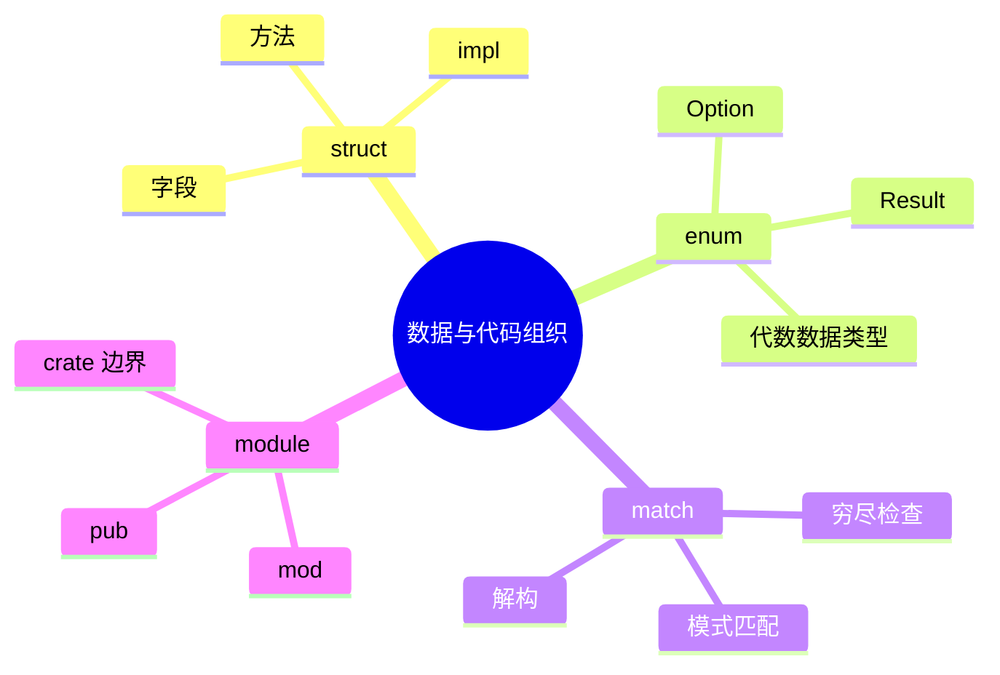

# 第五章 结构体、枚举与模块系统

> *"Rust's type system and module system work together to help you write code that is both expressive and well-organized."*
> — The Rust Programming Language

在前几章中，我们学习了 Rust 的基础语法和所有权系统。本章将介绍 Rust 中组织数据和代码的三大支柱：**结构体（struct）**、**枚举（enum）** 和 **模块系统（mod）**。它们共同构成了 Rust 程序的骨架，也是理解 Tauri 源码的基础。



---

## 5.1 结构体（Struct）

### 5.1.1 定义与实例化

结构体是将多个相关数据组合在一起的自定义类型：

```rust
// 定义结构体
struct User {
    username: String,
    email: String,
    sign_in_count: u64,
    active: bool,
}

fn main() {
    // 实例化
    let user1 = User {
        username: String::from("walter"),
        email: String::from("walter@example.com"),
        sign_in_count: 1,
        active: true,
    };

    println!("用户名: {}", user1.username);
}
```

**与 C++/Java 的对比：**

```
┌─────────────────────────────────────────────────────────┐
│  C++ class/struct        Java class         Rust struct  │
│  ────────────────        ──────────         ──────────── │
│  默认 public(struct)     默认 package       默认私有      │
│  或 private(class)       private 字段       pub 显式公开  │
│  有构造函数               有构造函数         无构造函数     │
│  有继承                   有继承             无继承(用Trait)│
│  有析构函数               有 finalize        有 Drop trait │
│  方法在类内定义            方法在类内定义     方法在 impl 块 │
└─────────────────────────────────────────────────────────┘
```

### 5.1.2 字段简写与结构体更新语法

```rust
fn build_user(username: String, email: String) -> User {
    User {
        username,           // 字段简写：变量名与字段名相同时可省略
        email,              // 等价于 email: email
        sign_in_count: 1,
        active: true,
    }
}

fn main() {
    let user1 = build_user(
        String::from("walter"),
        String::from("walter@example.com"),
    );

    // 结构体更新语法：从已有实例创建新实例
    let user2 = User {
        email: String::from("walter2@example.com"),
        ..user1  // 其余字段从 user1 移动/复制
    };

    // 注意：user1.username 已被移动到 user2，不能再使用
    // println!("{}", user1.username);  // ❌ 编译错误
    println!("{}", user1.sign_in_count); // ✓ u64 实现了 Copy
}
```

> **⚠️ 所有权陷阱：** `..user1` 语法会**移动**非 Copy 字段。上例中 `username: String` 被移动到 `user2`，`user1.username` 失效。但 `u64` 和 `bool` 实现了 `Copy`，所以 `user1.sign_in_count` 和 `user1.active` 仍然可用。

### 5.1.3 元组结构体与单元结构体

```rust
// 元组结构体（Tuple Struct）：有名字的元组
struct Color(u8, u8, u8);
struct Point(f64, f64, f64);

// 即使字段类型相同，Color 和 Point 也是不同类型
let red = Color(255, 0, 0);
let origin = Point(0.0, 0.0, 0.0);

// 单元结构体（Unit Struct）：没有任何字段
struct Marker;

// 常用于实现 Trait 但不需要存储数据的场景
impl std::fmt::Display for Marker {
    fn fmt(&self, f: &mut std::fmt::Formatter) -> std::fmt::Result {
        write!(f, "Marker")
    }
}
```

### 5.1.4 为结构体实现方法（impl 块）

Rust 没有 class 关键字，方法通过 `impl` 块定义：

```rust
#[derive(Debug)]
struct Rectangle {
    width: f64,
    height: f64,
}

impl Rectangle {
    // 关联函数（Associated Function）—— 类似 C++ 的静态方法 / Java 的 static method
    // 没有 self 参数，通过 Rectangle::new() 调用
    fn new(width: f64, height: f64) -> Self {
        Self { width, height }
    }

    // 方法（Method）—— 第一个参数是 &self
    fn area(&self) -> f64 {
        self.width * self.height
    }

    // 可变借用方法
    fn scale(&mut self, factor: f64) {
        self.width *= factor;
        self.height *= factor;
    }

    // 消费 self 的方法（获取所有权）
    fn into_square(self) -> Rectangle {
        let side = self.width.max(self.height);
        Rectangle::new(side, side)
    }

    // 方法可以有多个参数
    fn can_hold(&self, other: &Rectangle) -> bool {
        self.width > other.width && self.height > other.height
    }
}

fn main() {
    let mut rect = Rectangle::new(30.0, 50.0);
    println!("面积: {}", rect.area());        // 1500.0

    rect.scale(2.0);
    println!("缩放后: {:?}", rect);            // Rectangle { width: 60.0, height: 100.0 }

    let small = Rectangle::new(10.0, 20.0);
    println!("能容纳? {}", rect.can_hold(&small)); // true

    let square = rect.into_square();           // rect 被消费，不能再使用
    println!("正方形: {:?}", square);           // Rectangle { width: 100.0, height: 100.0 }
}
```

**self 的三种形式：**

```
┌────────────────┬───────────────────┬──────────────────────────┐
│ 签名            │ 含义               │ 类比                      │
├────────────────┼───────────────────┼──────────────────────────┤
│ &self          │ 不可变借用          │ C++ const method          │
│ &mut self      │ 可变借用            │ C++ non-const method      │
│ self           │ 获取所有权（消费）   │ C++ 右值引用 / move        │
│ (无 self)      │ 关联函数（静态）     │ C++ static / Java static  │
└────────────────┴───────────────────┴──────────────────────────┘
```

### 5.1.5 多个 impl 块

Rust 允许为同一个类型定义多个 `impl` 块，这在实现不同 Trait 时非常有用：

```rust
struct Circle {
    radius: f64,
}

// 基本方法
impl Circle {
    fn new(radius: f64) -> Self {
        Self { radius }
    }

    fn area(&self) -> f64 {
        std::f64::consts::PI * self.radius * self.radius
    }
}

// Display trait 的实现放在单独的 impl 块
impl std::fmt::Display for Circle {
    fn fmt(&self, f: &mut std::fmt::Formatter) -> std::fmt::Result {
        write!(f, "Circle(r={})", self.radius)
    }
}
```

### 5.1.6 derive 宏：自动实现常用 Trait

```rust
#[derive(Debug, Clone, PartialEq)]
struct Config {
    host: String,
    port: u16,
    debug: bool,
}

fn main() {
    let c1 = Config {
        host: String::from("localhost"),
        port: 8080,
        debug: true,
    };

    let c2 = c1.clone();        // Clone
    println!("{:?}", c1);        // Debug
    assert_eq!(c1, c2);          // PartialEq
}
```

**常用 derive 宏一览：**

| Trait | 作用 | 类比 |
|-------|------|------|
| `Debug` | `{:?}` 格式化输出 | Java `toString()` |
| `Clone` | 深拷贝 `.clone()` | Java `clone()` / C++ 拷贝构造 |
| `Copy` | 隐式按位复制 | C++ 平凡拷贝 |
| `PartialEq` / `Eq` | `==` 比较 | Java `equals()` / C++ `operator==` |
| `PartialOrd` / `Ord` | `<` `>` 比较 | Java `Comparable` / C++ `operator<` |
| `Hash` | 哈希值 | Java `hashCode()` |
| `Default` | 默认值 | C++ 默认构造 / Java 默认值 |
| `Serialize` / `Deserialize` | JSON 序列化（serde） | Java Jackson |

---

## 5.2 枚举（Enum）

### 5.2.1 基本枚举

Rust 的枚举远比 C/C++ 和 Java 的枚举强大——每个变体（variant）可以携带不同类型的数据：

```rust
// 简单枚举（类似 C/C++ enum）
enum Direction {
    North,
    South,
    East,
    West,
}

// 携带数据的枚举（这是 Rust 的杀手特性！）
enum Message {
    Quit,                        // 无数据（类似单元结构体）
    Echo(String),                // 携带一个 String（类似元组结构体）
    Move { x: i32, y: i32 },    // 携带命名字段（类似结构体）
    Color(u8, u8, u8),           // 携带多个值（类似元组结构体）
}
```

**与 C++/Java 枚举的对比：**

```
┌──────────────────────────────────────────────────────────────┐
│  C/C++ enum            Java enum            Rust enum        │
│  ──────────            ─────────            ─────────        │
│  整数常量集合           可以有字段和方法     变体可携带不同数据 │
│  不能携带数据           所有实例结构相同     每个变体结构不同   │
│  类型不安全(隐式转int)  类型安全             类型安全+穷尽匹配 │
│  无模式匹配             switch(有限)        match(穷尽)      │
│                                             ≈ C++ std::variant│
│                                              + 模式匹配       │
└──────────────────────────────────────────────────────────────┘
```

### 5.2.2 为枚举实现方法

```rust
impl Message {
    fn process(&self) {
        match self {
            Message::Quit => println!("退出"),
            Message::Echo(text) => println!("回显: {}", text),
            Message::Move { x, y } => println!("移动到 ({}, {})", x, y),
            Message::Color(r, g, b) => println!("颜色: #{:02x}{:02x}{:02x}", r, g, b),
        }
    }
}

fn main() {
    let messages = vec![
        Message::Echo(String::from("hello")),
        Message::Move { x: 10, y: 20 },
        Message::Color(255, 128, 0),
        Message::Quit,
    ];

    for msg in &messages {
        msg.process();
    }
}
```

### 5.2.3 Option 与 Result：最重要的两个枚举

Rust 没有 `null`，取而代之的是标准库中的两个枚举：

```rust
// 标准库定义（简化）
enum Option<T> {
    Some(T),    // 有值
    None,       // 无值
}

enum Result<T, E> {
    Ok(T),      // 成功
    Err(E),     // 失败
}
```

```rust
fn find_user(id: u64) -> Option<String> {
    if id == 1 {
        Some(String::from("Walter"))
    } else {
        None
    }
}

fn divide(a: f64, b: f64) -> Result<f64, String> {
    if b == 0.0 {
        Err(String::from("除数不能为零"))
    } else {
        Ok(a / b)
    }
}

fn main() {
    // Option 的使用
    match find_user(1) {
        Some(name) => println!("找到用户: {}", name),
        None => println!("用户不存在"),
    }

    // if let 简写
    if let Some(name) = find_user(2) {
        println!("找到: {}", name);
    } else {
        println!("未找到");
    }

    // Result 的使用
    match divide(10.0, 3.0) {
        Ok(result) => println!("结果: {:.2}", result),
        Err(e) => println!("错误: {}", e),
    }

    // unwrap_or 提供默认值
    let result = divide(10.0, 0.0).unwrap_or(0.0);
    println!("安全结果: {}", result);
}
```

**为什么 Option 比 null 好？**

```
┌────────────────────────────────────────────────────────┐
│  Java null                      Rust Option<T>          │
│  ─────────                      ────────────────        │
│  任何引用类型都可能是 null        必须显式处理 None       │
│  NullPointerException(运行时)   编译期强制检查           │
│  忘记检查 → 崩溃                 忘记处理 → 编译不通过   │
│  Tony Hoare: "十亿美元的错误"    零成本抽象，无运行时开销 │
└────────────────────────────────────────────────────────┘
```

### 5.2.4 枚举在 Tauri 中的应用

Tauri 大量使用枚举来表示各种状态和消息：

```rust
use serde::{Deserialize, Serialize};

// 前后端通信的命令响应
#[derive(Serialize, Deserialize)]
#[serde(tag = "type", content = "data")]
enum ApiResponse {
    Success { message: String },
    Error { code: u32, detail: String },
    Loading,
}

// Tauri 命令返回枚举
#[tauri::command]
fn api_call(endpoint: String) -> ApiResponse {
    if endpoint.is_empty() {
        ApiResponse::Error {
            code: 400,
            detail: String::from("Endpoint cannot be empty"),
        }
    } else {
        ApiResponse::Success {
            message: format!("Called {}", endpoint),
        }
    }
}
```

---

## 5.3 模块系统（Module System）

Rust 的模块系统由四个核心概念组成：

```
┌─────────────────────────────────────────────────────────┐
│                  Rust 模块系统四要素                      │
├──────────┬──────────────────────────────────────────────┤
│ Crate    │ 编译单元，一个 crate 生成一个库或可执行文件    │
│ Module   │ 代码组织单元，控制作用域和可见性               │
│ Path     │ 引用模块中条目的路径（绝对/相对）              │
│ use      │ 将路径引入当前作用域的快捷方式                 │
└──────────┴──────────────────────────────────────────────┘
```

### 5.3.1 Crate 与 Crate Root

```
┌─────────────────────────────────────────────────┐
│  二进制 Crate (Binary Crate)                     │
│  ─ Crate Root: src/main.rs                       │
│  ─ 生成可执行文件                                 │
│                                                   │
│  库 Crate (Library Crate)                         │
│  ─ Crate Root: src/lib.rs                         │
│  ─ 生成 .rlib，供其他 crate 依赖                  │
│                                                   │
│  一个 Package 可以同时包含：                       │
│  ─ 最多 1 个库 crate                              │
│  ─ 多个二进制 crate（src/bin/*.rs）               │
└─────────────────────────────────────────────────┘
```

**与 C++/Java 的对比：**

| 概念 | Rust | C++ | Java |
|------|------|-----|------|
| 编译单元 | crate | 翻译单元(.cpp) | .java 文件 |
| 代码组织 | mod | namespace | package |
| 可见性 | pub | public/private | public/private/protected/package |
| 依赖管理 | Cargo.toml | CMakeLists.txt | pom.xml / build.gradle |
| 导入 | use | #include / using | import |

### 5.3.2 定义模块

**方式一：在同一文件中定义（内联模块）**

```rust
// src/main.rs
mod audio {
    pub struct Track {
        pub title: String,
        artist: String,  // 私有字段
    }

    impl Track {
        pub fn new(title: &str, artist: &str) -> Self {
            Self {
                title: title.to_string(),
                artist: artist.to_string(),
            }
        }

        pub fn display(&self) {
            println!("{} - {}", self.title, self.artist);
        }
    }

    pub mod playlist {
        use super::Track;  // 引用父模块中的 Track

        pub fn create_default() -> Vec<Track> {
            vec![
                Track::new("Song A", "Artist 1"),
                Track::new("Song B", "Artist 2"),
            ]
        }
    }
}

fn main() {
    let tracks = audio::playlist::create_default();
    for track in &tracks {
        track.display();
    }
}
```

**方式二：拆分到独立文件（推荐用于大型项目）**

```
src/
├── main.rs          # crate root
├── audio.rs         # mod audio 的内容
└── audio/
    └── playlist.rs  # mod audio::playlist 的内容
```

```rust
// src/main.rs
mod audio;  // 告诉编译器去找 src/audio.rs 或 src/audio/mod.rs

fn main() {
    let tracks = audio::playlist::create_default();
    for track in &tracks {
        track.display();
    }
}
```

```rust
// src/audio.rs
pub mod playlist;  // 声明子模块，对应 src/audio/playlist.rs

pub struct Track {
    pub title: String,
    artist: String,
}

impl Track {
    pub fn new(title: &str, artist: &str) -> Self {
        Self {
            title: title.to_string(),
            artist: artist.to_string(),
        }
    }

    pub fn display(&self) {
        println!("{} - {}", self.title, self.artist);
    }
}
```

```rust
// src/audio/playlist.rs
use super::Track;

pub fn create_default() -> Vec<Track> {
    vec![
        Track::new("Song A", "Artist 1"),
        Track::new("Song B", "Artist 2"),
    ]
}
```

### 5.3.3 可见性（pub）

Rust 默认一切私有，需要用 `pub` 显式公开：

```rust
mod outer {
    pub mod inner {
        pub fn public_fn() {}      // 公开
        fn private_fn() {}          // 仅 inner 模块内可见

        pub struct Config {
            pub host: String,       // 公开字段
            port: u16,              // 私有字段（外部无法直接构造）
        }

        impl Config {
            // 必须提供构造函数，因为 port 是私有的
            pub fn new(host: &str, port: u16) -> Self {
                Self {
                    host: host.to_string(),
                    port,
                }
            }

            pub fn port(&self) -> u16 {
                self.port
            }
        }
    }

    // 在 outer 中可以访问 inner 的公开项
    pub fn demo() {
        inner::public_fn();
        // inner::private_fn();  // ❌ 私有
    }
}
```

**pub 的变体：**

```
┌─────────────────┬──────────────────────────────────────┐
│ 语法             │ 含义                                  │
├─────────────────┼──────────────────────────────────────┤
│ (无修饰)         │ 仅当前模块可见                         │
│ pub             │ 完全公开                               │
│ pub(crate)      │ 当前 crate 内可见（类似 Java package）  │
│ pub(super)      │ 父模块可见                             │
│ pub(in path)    │ 指定路径内可见                          │
└─────────────────┴──────────────────────────────────────┘
```

### 5.3.4 use 关键字与路径

```rust
// 绝对路径（从 crate root 开始）
use crate::audio::playlist::create_default;

// 相对路径
use self::audio::Track;
use super::some_parent_item;  // 引用父模块

// 嵌套路径（减少重复）
use std::collections::{HashMap, HashSet, BTreeMap};

// 通配符导入（谨慎使用）
use std::io::prelude::*;

// 重命名（解决命名冲突）
use std::fmt::Result as FmtResult;
use std::io::Result as IoResult;

// 重新导出（pub use）
pub use crate::audio::Track;  // 让外部用户直接通过当前模块访问 Track
```

### 5.3.5 实战：Tauri 项目的典型模块结构

一个中型 Tauri 项目的推荐结构：

```
src-tauri/
├── Cargo.toml
├── tauri.conf.json
└── src/
    ├── main.rs              # 入口，注册命令和插件
    ├── lib.rs               # 库入口（可选）
    ├── commands/             # Tauri 命令模块
    │   ├── mod.rs            # pub mod user; pub mod file; ...
    │   ├── user.rs           # 用户相关命令
    │   └── file.rs           # 文件相关命令
    ├── models/               # 数据模型
    │   ├── mod.rs
    │   └── user.rs
    ├── services/             # 业务逻辑
    │   ├── mod.rs
    │   └── auth.rs
    ├── state.rs              # 应用状态
    └── error.rs              # 统一错误类型
```

```rust
// src/main.rs
mod commands;
mod models;
mod services;
mod state;
mod error;

fn main() {
    tauri::Builder::default()
        .manage(state::AppState::new())
        .invoke_handler(tauri::generate_handler![
            commands::user::get_profile,
            commands::user::update_profile,
            commands::file::read_file,
            commands::file::write_file,
        ])
        .run(tauri::generate_context!())
        .expect("error while running tauri application");
}
```

```rust
// src/commands/mod.rs
pub mod user;
pub mod file;
```

```rust
// src/commands/user.rs
use crate::models::user::UserProfile;
use crate::state::AppState;
use crate::error::AppError;

#[tauri::command]
pub fn get_profile(state: tauri::State<AppState>) -> Result<UserProfile, AppError> {
    state.get_current_user()
}

#[tauri::command]
pub fn update_profile(
    state: tauri::State<AppState>,
    name: String,
    email: String,
) -> Result<UserProfile, AppError> {
    state.update_user(name, email)
}
```

```rust
// src/models/user.rs
use serde::{Serialize, Deserialize};

#[derive(Debug, Clone, Serialize, Deserialize)]
pub struct UserProfile {
    pub id: u64,
    pub name: String,
    pub email: String,
}
```

```rust
// src/error.rs
use serde::Serialize;

#[derive(Debug, Serialize)]
pub enum AppError {
    NotFound(String),
    Unauthorized,
    Internal(String),
}

// 让 AppError 可以作为 Tauri 命令的返回错误
impl std::fmt::Display for AppError {
    fn fmt(&self, f: &mut std::fmt::Formatter) -> std::fmt::Result {
        match self {
            AppError::NotFound(msg) => write!(f, "Not found: {}", msg),
            AppError::Unauthorized => write!(f, "Unauthorized"),
            AppError::Internal(msg) => write!(f, "Internal error: {}", msg),
        }
    }
}
```

---

## 5.4 综合实战：设计一个配置管理模块

让我们综合运用本章知识，设计一个在 Tauri 应用中管理配置的模块：

```rust
// src/config.rs
use serde::{Deserialize, Serialize};
use std::path::PathBuf;

/// 应用主题
#[derive(Debug, Clone, Serialize, Deserialize, PartialEq)]
pub enum Theme {
    Light,
    Dark,
    System,
}

impl Default for Theme {
    fn default() -> Self {
        Theme::System
    }
}

/// 语言设置
#[derive(Debug, Clone, Serialize, Deserialize, PartialEq)]
pub enum Language {
    English,
    Chinese,
    Japanese,
}

impl Default for Language {
    fn default() -> Self {
        Language::English
    }
}

/// 窗口配置
#[derive(Debug, Clone, Serialize, Deserialize)]
pub struct WindowConfig {
    pub width: u32,
    pub height: u32,
    pub fullscreen: bool,
}

impl Default for WindowConfig {
    fn default() -> Self {
        Self {
            width: 1024,
            height: 768,
            fullscreen: false,
        }
    }
}

/// 应用配置（顶层）
#[derive(Debug, Clone, Serialize, Deserialize, Default)]
pub struct AppConfig {
    pub theme: Theme,
    pub language: Language,
    pub window: WindowConfig,
    pub data_dir: Option<PathBuf>,
}

impl AppConfig {
    /// 从文件加载配置
    pub fn load(path: &std::path::Path) -> Result<Self, ConfigError> {
        let content = std::fs::read_to_string(path)
            .map_err(|e| ConfigError::IoError(e.to_string()))?;
        serde_json::from_str(&content)
            .map_err(|e| ConfigError::ParseError(e.to_string()))
    }

    /// 保存配置到文件
    pub fn save(&self, path: &std::path::Path) -> Result<(), ConfigError> {
        let content = serde_json::to_string_pretty(self)
            .map_err(|e| ConfigError::SerializeError(e.to_string()))?;
        std::fs::write(path, content)
            .map_err(|e| ConfigError::IoError(e.to_string()))
    }

    /// 合并部分更新
    pub fn merge(&mut self, patch: ConfigPatch) {
        if let Some(theme) = patch.theme {
            self.theme = theme;
        }
        if let Some(language) = patch.language {
            self.language = language;
        }
        if let Some(window) = patch.window {
            self.window = window;
        }
    }
}

/// 配置的部分更新（所有字段都是 Option）
#[derive(Debug, Deserialize)]
pub struct ConfigPatch {
    pub theme: Option<Theme>,
    pub language: Option<Language>,
    pub window: Option<WindowConfig>,
}

/// 配置错误
#[derive(Debug, Serialize)]
pub enum ConfigError {
    IoError(String),
    ParseError(String),
    SerializeError(String),
}

impl std::fmt::Display for ConfigError {
    fn fmt(&self, f: &mut std::fmt::Formatter) -> std::fmt::Result {
        match self {
            ConfigError::IoError(e) => write!(f, "IO error: {}", e),
            ConfigError::ParseError(e) => write!(f, "Parse error: {}", e),
            ConfigError::SerializeError(e) => write!(f, "Serialize error: {}", e),
        }
    }
}
```

这个例子综合展示了：
- **结构体**：`AppConfig`、`WindowConfig`、`ConfigPatch`
- **枚举**：`Theme`、`Language`、`ConfigError`
- **impl 块**：方法、关联函数
- **derive 宏**：`Debug`、`Clone`、`Serialize`、`Deserialize`、`Default`
- **Option**：可选字段 `data_dir`、部分更新 `ConfigPatch`
- **Result**：错误处理
- **模块**：作为独立文件组织

---

## 5.5 小结

```
┌─────────────────────────────────────────────────────────┐
│              第五章知识地图                                │
│                                                          │
│  结构体 (struct)                                         │
│  ├── 命名字段结构体                                      │
│  ├── 元组结构体                                          │
│  ├── 单元结构体                                          │
│  ├── impl 块（方法 + 关联函数）                           │
│  ├── derive 宏（自动实现 Trait）                          │
│  └── self 的三种形式（&self / &mut self / self）          │
│                                                          │
│  枚举 (enum)                                             │
│  ├── 简单枚举                                            │
│  ├── 携带数据的枚举（Rust 的杀手特性）                    │
│  ├── Option<T>（替代 null）                              │
│  ├── Result<T, E>（错误处理）                             │
│  └── match 穷尽匹配                                      │
│                                                          │
│  模块系统 (mod)                                          │
│  ├── Crate（编译单元）                                   │
│  ├── Module（代码组织）                                   │
│  ├── pub（可见性控制）                                    │
│  ├── use（路径导入）                                      │
│  └── 文件 ↔ 模块映射                                     │
└─────────────────────────────────────────────────────────┘
```

**核心要点回顾：**

1. **结构体** 是 Rust 中组织数据的主要方式，通过 `impl` 块添加方法，没有继承，用 Trait 实现多态。
2. **枚举** 远比 C/Java 的枚举强大，每个变体可以携带不同类型的数据，`Option` 和 `Result` 是最重要的两个枚举。
3. **模块系统** 通过 `mod` / `pub` / `use` 组织代码，默认私有，显式公开。
4. 在 Tauri 项目中，合理的模块划分（commands / models / services / error）是保持代码整洁的关键。

**下一章预告：** 第六章将深入 **Trait 与泛型**——Rust 的多态机制。如果说结构体和枚举是数据的骨架，那 Trait 就是行为的灵魂。
