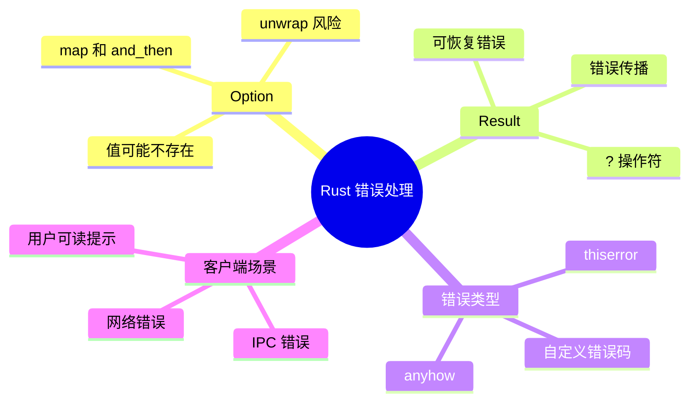
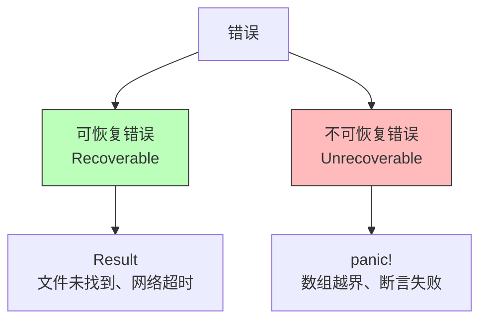
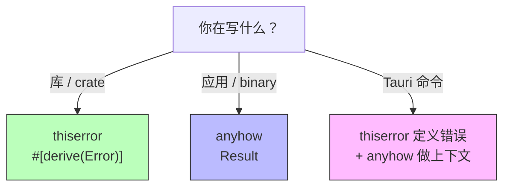

# 第七章 错误处理的艺术

> *"Errors should never pass silently. Unless explicitly silenced." — The Zen of Python（Rust 深以为然）*

C++ 有异常，Java 有 checked/unchecked exception。而 Rust 选择了一条截然不同的道路：**没有异常机制**。所有错误都通过类型系统显式表达——`Result<T, E>` 和 `Option<T>`。

这听起来可能很麻烦，但配合 `?` 操作符和强大的错误处理生态，Rust 的错误处理实际上比异常更安全、更可组合、更易于推理。



---

## 7.1 为什么 Rust 没有异常？

### 7.1.1 异常的问题

在 C++ 和 Java 中，异常带来了几个棘手的问题：

| 问题 | C++ | Java |
|------|-----|------|
| 隐式控制流 | 任何函数都可能抛异常，调用者无法从签名看出 | checked exception 试图解决，但大家都用 `RuntimeException` 绕过 |
| 性能开销 | 异常路径的栈展开（stack unwinding）开销大 | 异常对象创建 + 栈追踪开销 |
| 资源泄漏 | 需要 RAII 或 try-catch-finally | 需要 try-with-resources |
| 异常安全 | 需要保证强异常安全性（极难） | GC 帮忙，但逻辑状态可能不一致 |

### 7.1.2 Rust 的哲学

Rust 将错误分为两类：



- **可恢复错误**：用 `Result<T, E>` 表达，调用者必须处理
- **不可恢复错误**：用 `panic!` 终止程序（类似 C++ 的 `abort()`）

---

## 7.2 Option：值可能不存在

### 7.2.1 基本用法

```rust
fn find_user(id: u64) -> Option<String> {
    match id {
        1 => Some("Walter".to_string()),
        2 => Some("Alice".to_string()),
        _ => None,
    }
}

fn main() {
    match find_user(1) {
        Some(name) => println!("Found: {}", name),
        None => println!("User not found"),
    }
}
```

### 7.2.2 Option 的常用方法

```rust
fn main() {
    let name: Option<String> = Some("Walter".to_string());

    // unwrap_or：提供默认值
    let display = name.clone().unwrap_or("Anonymous".to_string());

    // map：转换内部值
    let upper: Option<String> = name.clone().map(|n| n.to_uppercase());

    // and_then：链式操作（flatMap）
    let first_char: Option<char> = name.and_then(|n| n.chars().next());

    // is_some / is_none
    let empty: Option<i32> = None;
    assert!(empty.is_none());

    println!("{}, {:?}, {:?}", display, upper, first_char);
}
```

### 7.2.3 三语对比：空值处理

| 特性 | Rust | C++ | Java |
|------|------|-----|------|
| 空值表示 | `Option<T>` | `std::optional<T>` (C++17) / 裸指针 | `null` / `Optional<T>` |
| 编译时检查 | ✅ 必须处理 `None` | ⚠️ `optional` 可以，指针不行 | ❌ `null` 不检查；`Optional` 可选 |
| 空指针异常 | 不可能 | 段错误 | `NullPointerException` |
| 链式操作 | `map`/`and_then`/`unwrap_or` | `value_or`/`transform` (C++23) | `map`/`flatMap`/`orElse` |

---

## 7.3 Result：操作可能失败

### 7.3.1 基本用法

```rust
use std::fs;
use std::io;

fn read_config(path: &str) -> Result<String, io::Error> {
    fs::read_to_string(path)
}

fn main() {
    match read_config("config.toml") {
        Ok(content) => println!("Config:\n{}", content),
        Err(e) => eprintln!("Failed to read config: {}", e),
    }
}
```

### 7.3.2 Result 的常用方法

```rust
use std::num::ParseIntError;

fn parse_port(s: &str) -> Result<u16, ParseIntError> {
    s.parse::<u16>()
}

fn main() {
    // unwrap_or：失败时用默认值
    let port = parse_port("abc").unwrap_or(8080);

    // map：转换成功值
    let doubled: Result<u32, _> = parse_port("3000").map(|p| p as u32 * 2);

    // and_then：链式操作
    let validated: Result<u16, String> = parse_port("3000")
        .map_err(|e| e.to_string())
        .and_then(|p| {
            if p > 1024 {
                Ok(p)
            } else {
                Err("Port must be > 1024".to_string())
            }
        });

    println!("port={}, doubled={:?}, validated={:?}", port, doubled, validated);
}
```

### 7.3.3 Result 与 Option 的关系

```rust
fn main() {
    // Option → Result
    let opt: Option<i32> = Some(42);
    let res: Result<i32, &str> = opt.ok_or("value is missing");

    // Result → Option
    let res: Result<i32, &str> = Ok(42);
    let opt: Option<i32> = res.ok();

    println!("{:?}, {:?}", res, opt);
}
```

---

## 7.4 ? 操作符：优雅的错误传播

### 7.4.1 从 match 地狱到 ?

**没有 ? 的写法**（嵌套 match，痛苦）：

```rust
use std::fs;
use std::io;

fn read_username_verbose() -> Result<String, io::Error> {
    let content = match fs::read_to_string("user.txt") {
        Ok(c) => c,
        Err(e) => return Err(e),
    };
    let first_line = match content.lines().next() {
        Some(line) => line.to_string(),
        None => return Err(io::Error::new(io::ErrorKind::InvalidData, "empty file")),
    };
    Ok(first_line)
}
```

**使用 ? 的写法**（清爽）：

```rust
use std::fs;
use std::io;

fn read_username() -> Result<String, io::Error> {
    let content = fs::read_to_string("user.txt")?;  // 失败则提前返回 Err
    let first_line = content
        .lines()
        .next()
        .ok_or(io::Error::new(io::ErrorKind::InvalidData, "empty file"))?;
    Ok(first_line.to_string())
}
```

### 7.4.2 ? 操作符的工作原理

`?` 做了两件事：

1. 如果 `Result` 是 `Ok(v)`，解包得到 `v`
2. 如果 `Result` 是 `Err(e)`，调用 `From::from(e)` 转换错误类型，然后 `return Err(converted)`

```mermaid
flowchart LR
    A["expression?"] --> B{Result?}
    B -->|Ok(v)| C["继续执行，值为 v"]
    B -->|Err(e)| D["From::from(e)"]
    D --> E["return Err(...)"]
    style C fill:#bfb,stroke:#333
    style E fill:#fbb,stroke:#333
```

### 7.4.3 链式使用 ?

```rust
use std::fs;
use std::io::{self, Write};

fn copy_first_line(from: &str, to: &str) -> Result<(), io::Error> {
    let content = fs::read_to_string(from)?;
    let first_line = content.lines().next().unwrap_or("");
    let mut file = fs::File::create(to)?;
    file.write_all(first_line.as_bytes())?;
    file.write_all(b"\n")?;
    Ok(())
}
```

### 7.4.4 三语对比：错误传播

| 特性 | Rust `?` | C++ 异常 | Java 异常 |
|------|----------|----------|-----------|
| 语法 | `let v = expr?;` | 自动传播（隐式） | 自动传播 / `throws` 声明 |
| 显式性 | ✅ 每个可能失败的地方都有 `?` | ❌ 看不出哪行会抛异常 | ⚠️ checked 需声明，unchecked 不需要 |
| 类型安全 | ✅ 编译器检查 `Result` 类型 | ❌ `catch(...)` 可以吞掉一切 | ⚠️ catch 可以过于宽泛 |
| 性能 | 零成本（就是普通的 if-return） | 异常路径开销大 | 异常对象 + 栈追踪开销 |

---

## 7.5 自定义错误类型

### 7.5.1 手动实现

```rust
use std::fmt;
use std::io;
use std::num::ParseIntError;

#[derive(Debug)]
enum AppError {
    Io(io::Error),
    Parse(ParseIntError),
    Config(String),
}

impl fmt::Display for AppError {
    fn fmt(&self, f: &mut fmt::Formatter<'_>) -> fmt::Result {
        match self {
            AppError::Io(e) => write!(f, "IO error: {}", e),
            AppError::Parse(e) => write!(f, "Parse error: {}", e),
            AppError::Config(msg) => write!(f, "Config error: {}", msg),
        }
    }
}

impl std::error::Error for AppError {
    fn source(&self) -> Option<&(dyn std::error::Error + 'static)> {
        match self {
            AppError::Io(e) => Some(e),
            AppError::Parse(e) => Some(e),
            AppError::Config(_) => None,
        }
    }
}

// 实现 From，让 ? 自动转换
impl From<io::Error> for AppError {
    fn from(e: io::Error) -> Self {
        AppError::Io(e)
    }
}

impl From<ParseIntError> for AppError {
    fn from(e: ParseIntError) -> Self {
        AppError::Parse(e)
    }
}
```

这样就可以在一个函数中混合使用不同错误类型：

```rust
use std::fs;

fn load_port_from_file(path: &str) -> Result<u16, AppError> {
    let content = fs::read_to_string(path)?;        // io::Error → AppError::Io
    let port: u16 = content.trim().parse()?;         // ParseIntError → AppError::Parse
    if port < 1024 {
        return Err(AppError::Config("Port must be >= 1024".into()));
    }
    Ok(port)
}
```

### 7.5.2 使用 thiserror 简化

手动实现 `Display`、`Error`、`From` 太繁琐了。[thiserror](https://docs.rs/thiserror) 通过 derive 宏大幅简化：

```rust
use thiserror::Error;

#[derive(Error, Debug)]
enum AppError {
    #[error("IO error: {0}")]
    Io(#[from] std::io::Error),

    #[error("Parse error: {0}")]
    Parse(#[from] std::num::ParseIntError),

    #[error("Config error: {msg}")]
    Config { msg: String },

    #[error("Unknown error")]
    Unknown,
}
```

一个 `#[derive(Error)]` + `#[error("...")]` + `#[from]` 就搞定了之前几十行的样板代码！

### 7.5.3 使用 anyhow 快速原型

[anyhow](https://docs.rs/anyhow) 适合**应用层**代码（不是库），它提供一个万能的 `anyhow::Error`：

```rust
use anyhow::{Context, Result};
use std::fs;

fn load_config() -> Result<String> {
    let content = fs::read_to_string("config.toml")
        .context("Failed to read config file")?;

    let port: u16 = content
        .lines()
        .find(|l| l.starts_with("port"))
        .and_then(|l| l.split('=').nth(1))
        .map(|s| s.trim())
        .ok_or_else(|| anyhow::anyhow!("Missing 'port' in config"))?
        .parse()
        .context("Invalid port number")?;

    Ok(format!("Server will listen on port {}", port))
}

fn main() {
    match load_config() {
        Ok(msg) => println!("{}", msg),
        Err(e) => {
            eprintln!("Error: {}", e);
            // 打印完整的错误链
            for cause in e.chain().skip(1) {
                eprintln!("  Caused by: {}", cause);
            }
        }
    }
}
```

### 7.5.4 thiserror vs anyhow：何时用哪个？

| 场景 | 推荐 | 理由 |
|------|------|------|
| **编写库（library）** | `thiserror` | 库需要定义明确的错误类型，让调用者能 match |
| **编写应用（binary）** | `anyhow` | 应用通常只需要打印/日志错误，不需要精确匹配 |
| **快速原型** | `anyhow` | 最少的样板代码 |
| **需要错误上下文** | `anyhow` | `.context("...")` 非常方便 |
| **Tauri 命令** | 两者结合 | 内部用 `anyhow`，暴露给前端时转为 `String` |



---

## 7.6 panic! 与不可恢复错误

### 7.6.1 何时 panic

```rust
fn main() {
    // 显式 panic
    // panic!("Something went terribly wrong!");

    // 隐式 panic：数组越界
    let v = vec![1, 2, 3];
    // let _ = v[10];  // 运行时 panic

    // unwrap / expect：Result 或 Option 为 Err/None 时 panic
    let _port: u16 = "not_a_number".parse().unwrap();  // panic!
}
```

### 7.6.2 panic 的适用场景

| 场景 | 是否该 panic | 替代方案 |
|------|-------------|----------|
| 程序初始化失败（如配置文件缺失） | ✅ 可以 | — |
| 逻辑不变量被违反（bug） | ✅ 应该 | `debug_assert!` |
| 用户输入错误 | ❌ 不应该 | `Result` |
| 网络请求失败 | ❌ 不应该 | `Result` + 重试 |
| 测试中 | ✅ 常用 | `assert!` / `assert_eq!` |
| 原型/示例代码 | ⚠️ 可接受 | `unwrap()` + `// TODO` |

### 7.6.3 unwrap 的正确使用

```rust
fn main() {
    // ❌ 生产代码中不要这样
    let content = std::fs::read_to_string("file.txt").unwrap();

    // ✅ 如果你确定不会失败，用 expect 并说明原因
    let home = std::env::var("HOME")
        .expect("HOME environment variable must be set");

    // ✅ 在确定安全的上下文中
    let numbers = vec![1, 2, 3];
    let first = numbers.first().unwrap();  // Vec 非空，这里是安全的

    println!("{}, {}", home, first);
}
```

---

## 7.7 错误处理模式实战

### 7.7.1 模式一：早返回（Early Return）

```rust
use std::fs;
use anyhow::{Context, Result};

fn process_data(path: &str) -> Result<Vec<i32>> {
    let content = fs::read_to_string(path)
        .context("reading data file")?;

    let numbers: Result<Vec<i32>, _> = content
        .lines()
        .filter(|l| !l.is_empty())
        .map(|l| l.trim().parse::<i32>())
        .collect();

    let numbers = numbers.context("parsing numbers")?;

    if numbers.is_empty() {
        anyhow::bail!("No numbers found in file");  // bail! = return Err(anyhow!(...))
    }

    Ok(numbers)
}
```

### 7.7.2 模式二：收集所有错误

```rust
fn validate_ports(inputs: &[&str]) -> (Vec<u16>, Vec<String>) {
    let mut valid = Vec::new();
    let mut errors = Vec::new();

    for input in inputs {
        match input.parse::<u16>() {
            Ok(port) if port > 1024 => valid.push(port),
            Ok(port) => errors.push(format!("{}: port too low", port)),
            Err(e) => errors.push(format!("'{}': {}", input, e)),
        }
    }

    (valid, errors)
}

fn main() {
    let inputs = vec!["8080", "abc", "80", "3000", "99999"];
    let (valid, errors) = validate_ports(&inputs);
    println!("Valid ports: {:?}", valid);
    println!("Errors: {:?}", errors);
}
```

### 7.7.3 模式三：为 Tauri 命令处理错误

在 Tauri 中，命令的错误需要能序列化为字符串传给前端：

```rust
use serde::Serialize;
use thiserror::Error;

#[derive(Error, Debug, Serialize)]
enum CommandError {
    #[error("File not found: {path}")]
    FileNotFound { path: String },

    #[error("Permission denied")]
    PermissionDenied,

    #[error("Internal error: {0}")]
    Internal(String),
}

// 让 Tauri 能把错误传给前端
impl From<CommandError> for String {
    fn from(e: CommandError) -> Self {
        e.to_string()
    }
}

// Tauri 命令示例
#[tauri::command]
fn read_project_file(path: String) -> Result<String, CommandError> {
    std::fs::read_to_string(&path).map_err(|e| match e.kind() {
        std::io::ErrorKind::NotFound => CommandError::FileNotFound { path },
        std::io::ErrorKind::PermissionDenied => CommandError::PermissionDenied,
        _ => CommandError::Internal(e.to_string()),
    })
}
```

---

## 7.8 三语错误处理全面对比

| 特性 | Rust | C++ | Java |
|------|------|-----|------|
| 错误机制 | `Result<T, E>` + `?` | 异常 (`throw`/`catch`) | 异常 (`throw`/`catch`) |
| 空值 | `Option<T>` | `std::optional` / `nullptr` | `null` / `Optional` |
| 编译时强制处理 | ✅ 必须处理 `Result` | ❌ 异常可以不 catch | ⚠️ 只有 checked exception |
| 性能 | 零开销（普通分支） | 异常路径开销大 | 异常对象创建开销 |
| 错误上下文 | `.context("...")` (anyhow) | 手动拼接 | `cause` / `suppressed` |
| 错误链 | `Error::source()` | `std::nested_exception` | `getCause()` |
| 不可恢复 | `panic!` | `std::abort()` / `terminate()` | `System.exit()` |
| 资源清理 | `Drop` trait（RAII） | RAII / 析构函数 | `try-with-resources` / `finally` |

---

## 7.9 本章小结

| 概念 | 关键点 |
|------|--------|
| **Option\<T\>** | 表示值可能不存在，替代 null |
| **Result\<T, E\>** | 表示操作可能失败，替代异常 |
| **? 操作符** | 优雅地传播错误，自动调用 `From` 转换 |
| **thiserror** | 用 derive 宏定义库级别的错误类型 |
| **anyhow** | 应用级别的万能错误类型，支持上下文链 |
| **panic!** | 仅用于不可恢复的 bug，不是正常的错误处理 |

### 思考题

1. 为什么 Rust 社区普遍认为 `unwrap()` 在生产代码中是"代码异味"（code smell）？什么情况下 `unwrap()` 是可接受的？
2. 如果一个函数可能遇到 `io::Error` 和 `serde_json::Error` 两种错误，你会怎么设计它的返回类型？
3. 在 Tauri 应用中，前端需要根据不同的错误类型显示不同的 UI 提示。你会如何设计错误类型来支持这个需求？

---

> **下一章预告**：第八章我们将进入 Rust 的异步编程世界——从线程到 `async/await`，从 `std::thread` 到 `tokio`，看 Rust 如何在安全与性能之间找到完美平衡。
