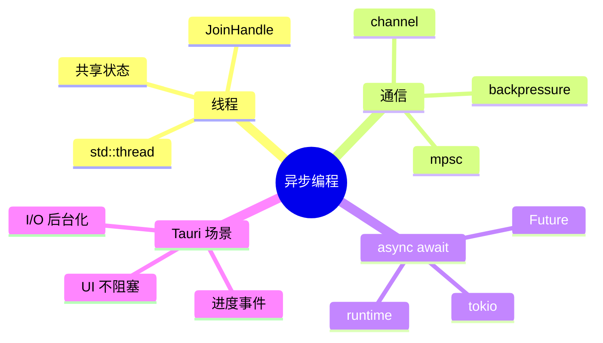
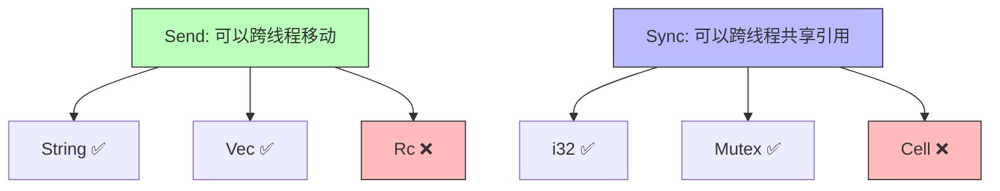
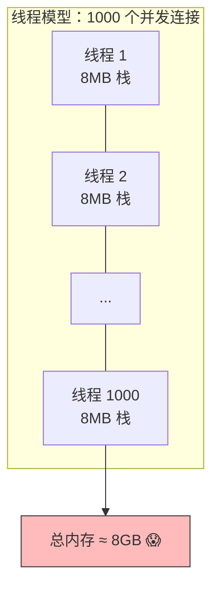
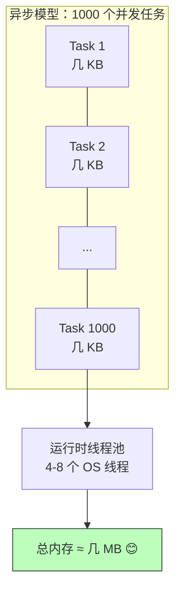
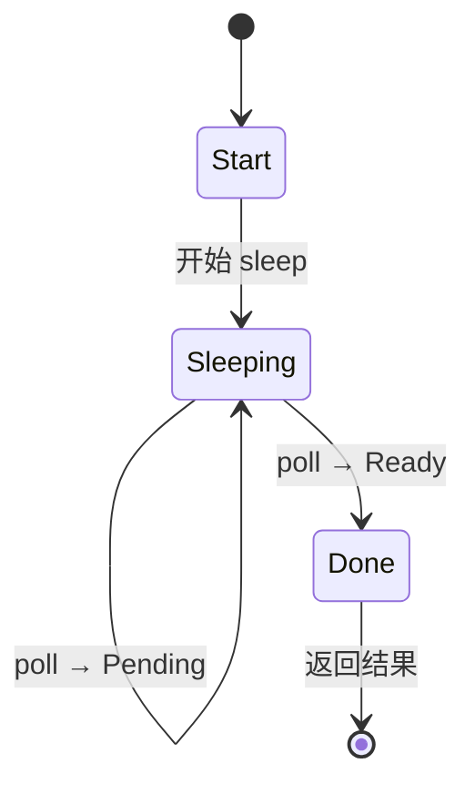
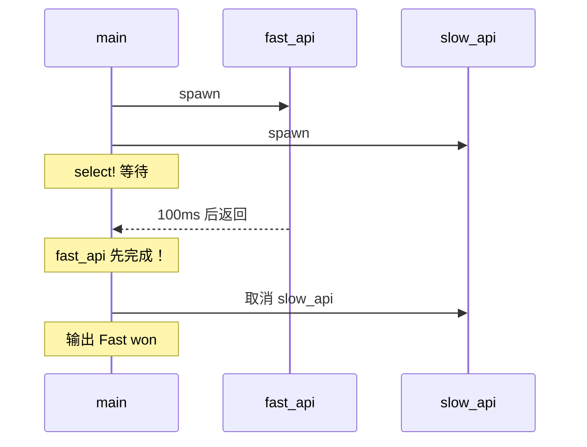
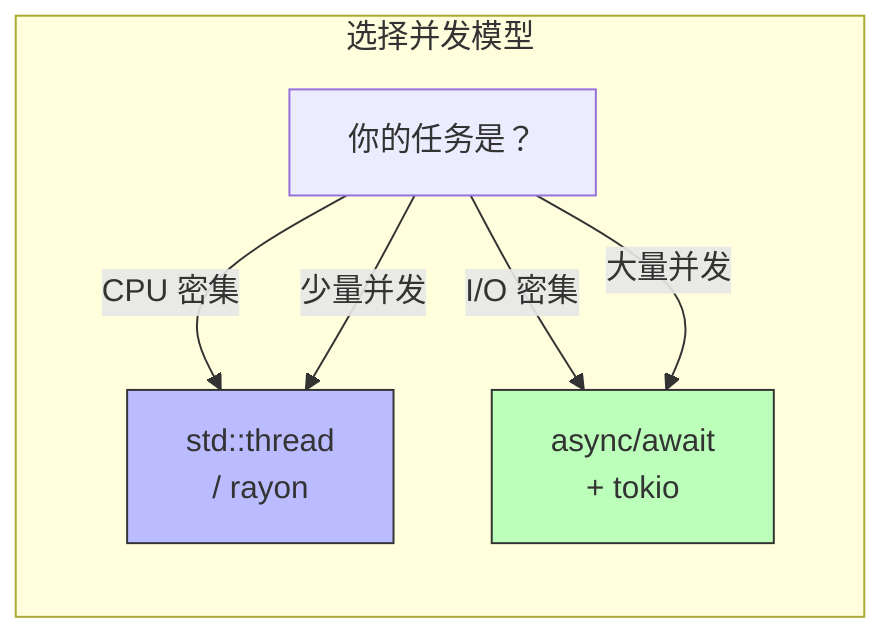

# 第八章 异步编程：从线程到 async/await

> *"Concurrency is not parallelism." — Rob Pike*

桌面应用的核心挑战之一是**保持 UI 响应**——网络请求、文件读写、数据库查询都不能阻塞主线程。C++ 用 `std::thread` + `std::async`，Java 用 `ExecutorService` + `CompletableFuture`，而 Rust 提供了从底层线程到高层 `async/await` 的完整工具链。

本章将从最基础的线程开始，逐步深入到 Rust 的异步运行时，为后续 Tauri 应用中的并发场景打下坚实基础。



---

## 8.1 线程：并发的起点

### 8.1.1 创建线程

```rust
use std::thread;
use std::time::Duration;

fn main() {
    let handle = thread::spawn(|| {
        for i in 1..=5 {
            println!("[worker] count: {}", i);
            thread::sleep(Duration::from_millis(500));
        }
        42  // 线程可以返回值
    });

    for i in 1..=3 {
        println!("[main] count: {}", i);
        thread::sleep(Duration::from_millis(300));
    }

    // join() 等待线程完成并获取返回值
    let result = handle.join().unwrap();
    println!("Worker returned: {}", result);
}
```

### 8.1.2 线程与所有权

Rust 的所有权系统在线程间同样生效——这是防止数据竞争的关键：

```rust
use std::thread;

fn main() {
    let message = String::from("Hello from main");

    // move 闭包：将 message 的所有权移入线程
    let handle = thread::spawn(move || {
        println!("{}", message);
    });

    // println!("{}", message);  // ❌ 编译错误：message 已被 move
    handle.join().unwrap();
}
```

### 8.1.3 三语对比：线程创建

| 特性 | Rust | C++ | Java |
|------|------|-----|------|
| 创建线程 | `thread::spawn(closure)` | `std::thread t(func)` | `new Thread(runnable).start()` |
| 等待完成 | `handle.join()` | `t.join()` | `thread.join()` |
| 返回值 | `JoinHandle<T>` | `std::future` (配合 `std::async`) | `Future<T>` (配合 `ExecutorService`) |
| 数据安全 | 编译时 `Send`/`Sync` 检查 | 程序员自己保证 | 程序员自己保证 |
| 数据竞争 | **编译时阻止** | 运行时 UB | 运行时 bug |

---

## 8.2 Send 与 Sync：线程安全的守门人

Rust 用两个 marker trait 在编译时保证线程安全：

### 8.2.1 Send

**`Send`**：一个类型的值可以安全地**发送**到另一个线程。

```rust
// 大多数类型都是 Send 的
// String: Send ✅
// Vec<i32>: Send ✅
// Rc<i32>: Send ❌（引用计数非原子操作）
```

### 8.2.2 Sync

**`Sync`**：一个类型的引用可以安全地在多个线程间**共享**。

```rust
// 如果 T: Sync，则 &T: Send
// i32: Sync ✅
// Mutex<T>: Sync ✅（内部有锁保护）
// Cell<i32>: Sync ❌（内部可变性，非线程安全）
// RefCell<i32>: Sync ❌
```

### 8.2.3 直觉理解



> **核心洞察**：C++ 和 Java 把线程安全交给程序员的自觉和代码审查。Rust 把它交给编译器——如果你的代码有数据竞争的可能，它根本不会编译通过。

---

## 8.3 共享状态：Mutex 与 Arc

### 8.3.1 Mutex：互斥锁

```rust
use std::sync::Mutex;

fn main() {
    let counter = Mutex::new(0);

    {
        let mut num = counter.lock().unwrap();  // 获取锁
        *num += 1;
    }  // MutexGuard 被 drop，自动释放锁

    println!("Counter: {}", counter.lock().unwrap());
}
```

### 8.3.2 Arc + Mutex：多线程共享可变状态

```rust
use std::sync::{Arc, Mutex};
use std::thread;

fn main() {
    let counter = Arc::new(Mutex::new(0));
    let mut handles = vec![];

    for _ in 0..10 {
        let counter = Arc::clone(&counter);
        let handle = thread::spawn(move || {
            let mut num = counter.lock().unwrap();
            *num += 1;
        });
        handles.push(handle);
    }

    for handle in handles {
        handle.join().unwrap();
    }

    println!("Final count: {}", counter.lock().unwrap());  // 10
}
```

### 8.3.3 为什么不能用 Rc？

```rust
use std::rc::Rc;
use std::thread;

fn main() {
    let counter = Rc::new(0);
    let counter_clone = Rc::clone(&counter);

    // ❌ 编译错误：Rc<i32> 没有实现 Send
    // thread::spawn(move || {
    //     println!("{}", counter_clone);
    // });
}
```

| 智能指针 | 引用计数 | Send | Sync | 用途 |
|----------|----------|------|------|------|
| `Rc<T>` | 非原子 | ❌ | ❌ | 单线程共享所有权 |
| `Arc<T>` | 原子 | ✅ | ✅ (if T: Sync) | 多线程共享所有权 |

### 8.3.4 三语对比：共享可变状态

| 特性 | Rust | C++ | Java |
|------|------|-----|------|
| 互斥锁 | `Mutex<T>` | `std::mutex` + 手动管理 | `synchronized` / `ReentrantLock` |
| 自动释放 | ✅ `MutexGuard` drop 时释放 | ⚠️ 需要 `lock_guard` | ⚠️ 需要 `try-finally` |
| 忘记释放锁 | 不可能（RAII） | 可能（不用 guard 的话） | 可能 |
| 死锁 | 可能（编译器不检查） | 可能 | 可能 |
| 原子引用计数 | `Arc<T>` | `std::shared_ptr<T>` | GC 自动管理 |

---

## 8.4 消息传递：Channel

Rust 推崇 **"通过通信来共享内存，而不是通过共享内存来通信"**。

### 8.4.1 mpsc Channel

```rust
use std::sync::mpsc;  // multi-producer, single-consumer
use std::thread;
use std::time::Duration;

fn main() {
    let (tx, rx) = mpsc::channel();

    // 生产者线程
    let tx1 = tx.clone();
    thread::spawn(move || {
        let messages = vec!["hello", "from", "thread 1"];
        for msg in messages {
            tx1.send(msg.to_string()).unwrap();
            thread::sleep(Duration::from_millis(200));
        }
    });

    thread::spawn(move || {
        let messages = vec!["hi", "from", "thread 2"];
        for msg in messages {
            tx.send(msg.to_string()).unwrap();
            thread::sleep(Duration::from_millis(300));
        }
    });

    // 消费者（主线程）
    for received in rx {
        println!("Got: {}", received);
    }
}
```

### 8.4.2 Channel 的类型

| 类型 | 特点 | 用法 |
|------|------|------|
| `mpsc::channel()` | 无界，异步发送 | 发送不会阻塞 |
| `mpsc::sync_channel(n)` | 有界（缓冲区大小 n） | 缓冲区满时发送阻塞 |

### 8.4.3 三语对比：消息传递

| 特性 | Rust | C++ | Java |
|------|------|-----|------|
| 内置 channel | `std::sync::mpsc` | ❌ 无内置（需第三方） | `BlockingQueue` |
| 所有权转移 | ✅ 发送时 move | ❌ 需要手动管理 | ❌ 共享引用 |
| 多生产者 | ✅ `tx.clone()` | — | ✅ 多线程 put |
| 多消费者 | ❌ 单消费者 | — | ✅ 多线程 take |
| 异步 channel | `tokio::sync::mpsc` | — | — |

---

## 8.5 从同步到异步：为什么需要 async

### 8.5.1 线程的问题



| 问题 | 描述 |
|------|------|
| 内存开销 | 每个线程默认 8MB 栈，1000 线程 = 8GB |
| 上下文切换 | 线程越多，OS 调度开销越大 |
| 创建/销毁成本 | 线程创建涉及系统调用 |

### 8.5.2 异步的解决方案



异步任务是**协作式调度**的轻量级"绿色线程"，由运行时（如 tokio）在少量 OS 线程上调度执行。

---

## 8.6 async/await 基础

### 8.6.1 第一个异步函数

```rust
// async fn 返回一个 Future
async fn fetch_data(url: &str) -> String {
    // 模拟网络请求
    tokio::time::sleep(tokio::time::Duration::from_secs(1)).await;
    format!("Data from {}", url)
}
```

### 8.6.2 Future 是什么？

`async fn` 实际上返回一个实现了 `Future` trait 的状态机：

```rust
use std::future::Future;
use std::pin::Pin;
use std::task::{Context, Poll};

// async fn fetch_data() 大致等价于：
struct FetchDataFuture {
    url: String,
    state: FetchState,
}

enum FetchState {
    Start,
    Sleeping(Pin<Box<dyn Future<Output = ()>>>),
    Done,
}

impl Future for FetchDataFuture {
    type Output = String;

    fn poll(self: Pin<&mut Self>, cx: &mut Context<'_>) -> Poll<Self::Output> {
        // 编译器自动生成的状态机逻辑
        // 每个 .await 点就是一个状态转换
        todo!()
    }
}
```



> **关键洞察**：Rust 的 Future 是**惰性的**——创建 Future 不会执行任何代码，只有被 `.await` 或被运行时 `poll` 时才会推进。这与 JavaScript 的 Promise（创建即执行）截然不同。

### 8.6.3 三语对比：异步原语

| 特性 | Rust | C++ | Java |
|------|------|-----|------|
| 异步函数 | `async fn` | `co_await` (C++20 协程) | `CompletableFuture` / Virtual Threads (Java 21) |
| 等待结果 | `.await` | `co_await` | `.get()` / `.join()` |
| 惰性/急切 | **惰性**（不 poll 不执行） | 惰性 | 急切（创建即执行） |
| 运行时 | 需要外部运行时 (tokio) | 需要调度器 | JVM 内置 |
| 零成本 | ✅ 编译为状态机 | ✅ 编译为协程帧 | ❌ 有对象开销 |

---

## 8.7 Tokio：Rust 的异步运行时

### 8.7.1 为什么需要运行时？

Rust 标准库只提供 `Future` trait 的定义，**不包含运行时**。你需要一个运行时来：

- 调度和执行 Future
- 提供异步 I/O（网络、文件）
- 提供定时器、channel 等异步原语

[Tokio](https://tokio.rs) 是 Rust 生态中最流行的异步运行时。

### 8.7.2 设置 Tokio

```toml
# Cargo.toml
[dependencies]
tokio = { version = "1", features = ["full"] }
```

### 8.7.3 基本用法

```rust
use tokio::time::{sleep, Duration};

#[tokio::main]  // 宏：创建 tokio 运行时并运行 main
async fn main() {
    println!("Starting...");

    let result = fetch_data("https://api.example.com").await;
    println!("{}", result);

    println!("Done!");
}

async fn fetch_data(url: &str) -> String {
    sleep(Duration::from_secs(1)).await;
    format!("Response from {}", url)
}
```

### 8.7.4 并发执行多个任务

```rust
use tokio::time::{sleep, Duration};

async fn download(file: &str) -> String {
    let delay = if file.contains("large") { 3 } else { 1 };
    sleep(Duration::from_secs(delay)).await;
    format!("Downloaded: {}", file)
}

#[tokio::main]
async fn main() {
    // 方式一：tokio::join! — 并发等待多个 future
    let (r1, r2, r3) = tokio::join!(
        download("small.txt"),
        download("large.zip"),
        download("medium.pdf"),
    );
    println!("{}\n{}\n{}", r1, r2, r3);

    // 方式二：tokio::spawn — 创建独立任务
    let handle1 = tokio::spawn(async {
        download("file1.txt").await
    });
    let handle2 = tokio::spawn(async {
        download("file2.txt").await
    });

    let r1 = handle1.await.unwrap();
    let r2 = handle2.await.unwrap();
    println!("{}\n{}", r1, r2);
}
```

### 8.7.5 tokio::select! — 竞争执行

```rust
use tokio::time::{sleep, Duration};

async fn fast_api() -> String {
    sleep(Duration::from_millis(100)).await;
    "Fast API response".to_string()
}

async fn slow_api() -> String {
    sleep(Duration::from_secs(5)).await;
    "Slow API response".to_string()
}

#[tokio::main]
async fn main() {
    // select! 返回第一个完成的 future 的结果
    tokio::select! {
        result = fast_api() => println!("Fast won: {}", result),
        result = slow_api() => println!("Slow won: {}", result),
    }
    // 输出：Fast won: Fast API response
}
```



---

## 8.8 异步 Channel：tokio::sync

### 8.8.1 tokio::sync::mpsc

```rust
use tokio::sync::mpsc;

#[tokio::main]
async fn main() {
    // 有界 channel，缓冲区大小 32
    let (tx, mut rx) = mpsc::channel::<String>(32);

    let tx1 = tx.clone();
    tokio::spawn(async move {
        for i in 0..5 {
            tx1.send(format!("Message {} from task 1", i)).await.unwrap();
            tokio::time::sleep(tokio::time::Duration::from_millis(100)).await;
        }
    });

    tokio::spawn(async move {
        for i in 0..5 {
            tx.send(format!("Message {} from task 2", i)).await.unwrap();
            tokio::time::sleep(tokio::time::Duration::from_millis(150)).await;
        }
    });

    // 接收消息
    while let Some(msg) = rx.recv().await {
        println!("Received: {}", msg);
    }
}
```

### 8.8.2 tokio::sync::oneshot

一次性 channel，适合请求-响应模式：

```rust
use tokio::sync::oneshot;

#[tokio::main]
async fn main() {
    let (tx, rx) = oneshot::channel::<String>();

    tokio::spawn(async move {
        // 模拟耗时计算
        tokio::time::sleep(tokio::time::Duration::from_secs(1)).await;
        tx.send("Computation result".to_string()).unwrap();
    });

    let result = rx.await.unwrap();
    println!("Got: {}", result);
}
```

### 8.8.3 tokio::sync::watch

广播最新值，适合配置更新：

```rust
use tokio::sync::watch;

#[tokio::main]
async fn main() {
    let (tx, mut rx1) = watch::channel("initial config".to_string());
    let mut rx2 = rx1.clone();

    // 消费者 1
    tokio::spawn(async move {
        while rx1.changed().await.is_ok() {
            println!("[Consumer 1] Config updated: {}", *rx1.borrow());
        }
    });

    // 消费者 2
    tokio::spawn(async move {
        while rx2.changed().await.is_ok() {
            println!("[Consumer 2] Config updated: {}", *rx2.borrow());
        }
    });

    // 生产者更新配置
    tokio::time::sleep(tokio::time::Duration::from_secs(1)).await;
    tx.send("new config v2".to_string()).unwrap();

    tokio::time::sleep(tokio::time::Duration::from_secs(1)).await;
    tx.send("new config v3".to_string()).unwrap();

    tokio::time::sleep(tokio::time::Duration::from_secs(1)).await;
}
```

### 8.8.4 Channel 类型速查

| Channel | 生产者 | 消费者 | 特点 |
|---------|--------|--------|------|
| `mpsc` | 多个 | 1 个 | 通用消息传递 |
| `oneshot` | 1 个 | 1 个 | 一次性请求-响应 |
| `watch` | 1 个 | 多个 | 广播最新值 |
| `broadcast` | 多个 | 多个 | 每个消费者收到所有消息 |

---

## 8.9 实战：异步 HTTP 客户端

让我们用 `reqwest`（基于 tokio 的 HTTP 客户端）写一个实际的异步示例：

```toml
# Cargo.toml
[dependencies]
tokio = { version = "1", features = ["full"] }
reqwest = { version = "0.12", features = ["json"] }
serde = { version = "1", features = ["derive"] }
serde_json = "1"
anyhow = "1"
```

```rust
use anyhow::{Context, Result};
use serde::Deserialize;
use std::time::Instant;

#[derive(Debug, Deserialize)]
struct GithubUser {
    login: String,
    name: Option<String>,
    public_repos: u32,
    followers: u32,
}

async fn fetch_github_user(username: &str) -> Result<GithubUser> {
    let url = format!("https://api.github.com/users/{}", username);
    let client = reqwest::Client::new();

    let user: GithubUser = client
        .get(&url)
        .header("User-Agent", "rust-book-example")
        .send()
        .await
        .context("Failed to send request")?
        .json()
        .await
        .context("Failed to parse JSON")?;

    Ok(user)
}

#[tokio::main]
async fn main() -> Result<()> {
    let usernames = vec!["rust-lang", "tokio-rs", "tauri-apps"];
    let start = Instant::now();

    // 并发请求所有用户
    let mut handles = vec![];
    for username in &usernames {
        let username = username.to_string();
        handles.push(tokio::spawn(async move {
            fetch_github_user(&username).await
        }));
    }

    for handle in handles {
        match handle.await? {
            Ok(user) => {
                println!(
                    "{} ({}) - {} repos, {} followers",
                    user.login,
                    user.name.unwrap_or_default(),
                    user.public_repos,
                    user.followers
                );
            }
            Err(e) => eprintln!("Error: {}", e),
        }
    }

    println!("\nCompleted in {:.2?}", start.elapsed());
    Ok(())
}
```

---

## 8.10 异步编程的陷阱

### 8.10.1 不要在异步代码中阻塞

```rust
// ❌ 错误：在异步上下文中调用阻塞操作
async fn bad_example() {
    std::thread::sleep(std::time::Duration::from_secs(5));  // 阻塞整个线程！
}

// ✅ 正确：使用 tokio 的异步 sleep
async fn good_example() {
    tokio::time::sleep(tokio::time::Duration::from_secs(5)).await;
}

// ✅ 如果必须调用阻塞代码，用 spawn_blocking
async fn blocking_io() -> String {
    tokio::task::spawn_blocking(|| {
        // 这里可以安全地做阻塞操作
        std::fs::read_to_string("large_file.txt").unwrap_or_default()
    })
    .await
    .unwrap()
}
```

### 8.10.2 async 与生命周期

```rust
// ❌ 这样不行：返回的 Future 引用了局部变量
// async fn bad<'a>() -> &'a str {
//     let s = String::from("hello");
//     &s  // s 在函数结束时被 drop
// }

// ✅ 返回拥有所有权的类型
async fn good() -> String {
    String::from("hello")
}
```

### 8.10.3 跨 await 持有 MutexGuard

```rust
use std::sync::Mutex;

// ❌ 危险：std::sync::Mutex 的 guard 跨 await 点
async fn bad_lock(mutex: &Mutex<Vec<i32>>) {
    let mut guard = mutex.lock().unwrap();
    guard.push(1);
    // 如果这里有 .await，guard 还没释放，会阻塞其他任务
    // some_async_fn().await;  // 💀
    // guard 在这里才被 drop
}

// ✅ 方案一：缩小锁的作用域
async fn good_lock_1(mutex: &Mutex<Vec<i32>>) {
    {
        let mut guard = mutex.lock().unwrap();
        guard.push(1);
    }  // guard 在 await 之前释放
    some_async_fn().await;
}

// ✅ 方案二：使用 tokio::sync::Mutex
async fn good_lock_2(mutex: &tokio::sync::Mutex<Vec<i32>>) {
    let mut guard = mutex.lock().await;  // 异步等待锁
    guard.push(1);
    some_async_fn().await;  // 安全
}

async fn some_async_fn() {
    tokio::time::sleep(tokio::time::Duration::from_millis(100)).await;
}
```

### 8.10.4 常见陷阱速查

| 陷阱 | 问题 | 解决方案 |
|------|------|----------|
| 异步中阻塞 | 阻塞整个运行时线程 | `tokio::task::spawn_blocking` |
| `std::sync::Mutex` 跨 await | 可能死锁 | `tokio::sync::Mutex` 或缩小作用域 |
| 忘记 `.await` | Future 不执行 | 编译器会警告 `unused Future` |
| `async fn` 返回引用 | 生命周期问题 | 返回拥有所有权的类型 |
| 在非 Send 类型上 spawn | 编译错误 | 使用 `spawn_local` 或确保类型是 Send |

---

## 8.11 Tauri 中的异步

在 Tauri 应用中，异步编程无处不在：

```rust
use tauri::command;
use serde::Serialize;

#[derive(Serialize)]
struct FileInfo {
    name: String,
    size: u64,
    content_preview: String,
}

// Tauri 命令天然支持 async
#[command]
async fn read_file_info(path: String) -> Result<FileInfo, String> {
    let metadata = tokio::fs::metadata(&path)
        .await
        .map_err(|e| format!("Cannot read metadata: {}", e))?;

    let content = tokio::fs::read_to_string(&path)
        .await
        .map_err(|e| format!("Cannot read file: {}", e))?;

    let preview = content.chars().take(200).collect::<String>();

    Ok(FileInfo {
        name: path.split('/').last().unwrap_or("unknown").to_string(),
        size: metadata.len(),
        content_preview: preview,
    })
}

// 前端调用：
// const info = await invoke('read_file_info', { path: '/tmp/test.txt' });
```

---

## 8.12 本章小结

| 概念 | 关键点 |
|------|--------|
| **std::thread** | OS 线程，适合 CPU 密集型任务 |
| **Send / Sync** | 编译时保证线程安全的 marker trait |
| **Arc + Mutex** | 多线程共享可变状态的标准方案 |
| **Channel** | "通过通信共享内存"，mpsc/oneshot/watch/broadcast |
| **async/await** | 异步编程，Future 是惰性状态机 |
| **Tokio** | 最流行的异步运行时，提供异步 I/O、定时器、channel |
| **spawn_blocking** | 在异步上下文中安全执行阻塞代码 |



### 思考题

1. 为什么 Rust 的 `Future` 是惰性的（lazy），而 JavaScript 的 `Promise` 是急切的（eager）？各有什么优缺点？
2. 在 Tauri 应用中，哪些操作应该用 `async`，哪些应该用 `spawn_blocking`？
3. 如果你需要在多个异步任务之间共享一个缓存（HashMap），你会选择什么方案？

---

> **下一章预告**：第九章我们将综合运用前八章的所有知识，从零构建一个完整的 CLI 聊天室——涉及网络编程、并发、错误处理和 trait 设计。
