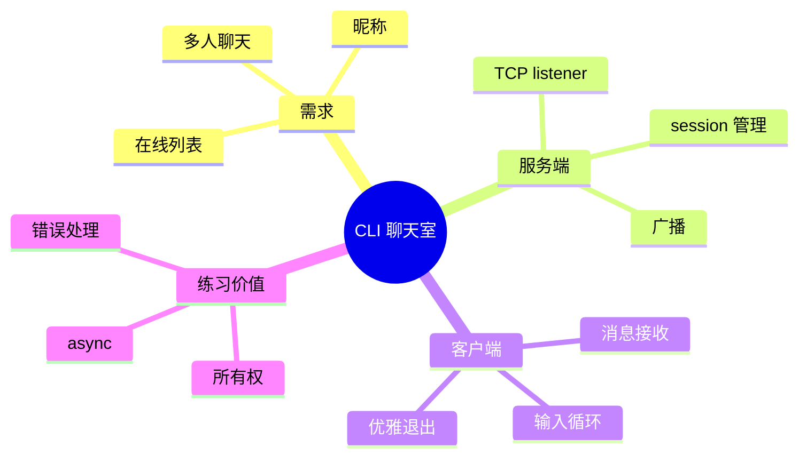
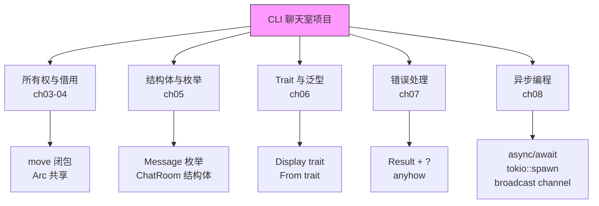
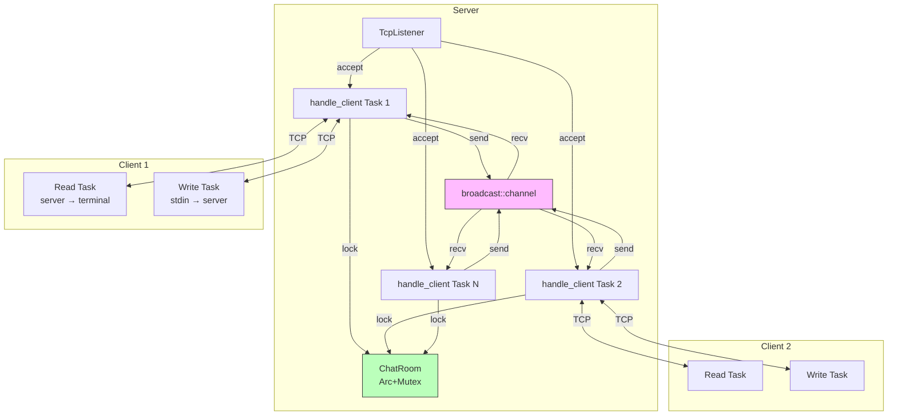
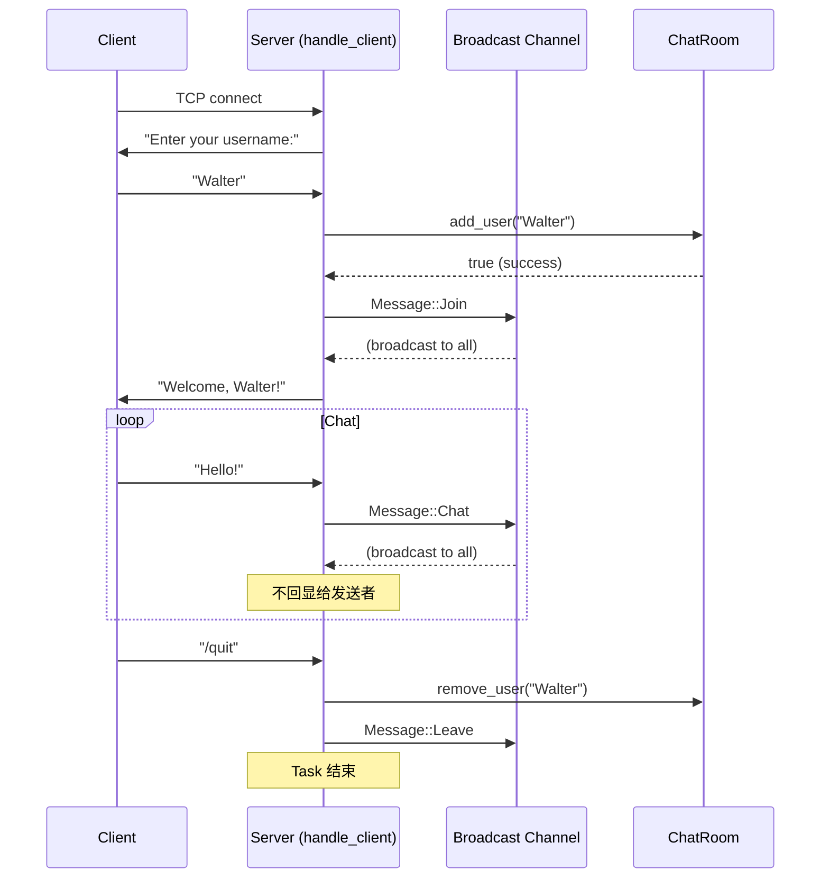

# 第九章 Rust 实战小项目：CLI 聊天室

> *"The best way to learn is by doing." — Richard Branson*

前八章我们学习了 Rust 的核心概念：所有权与借用、结构体与枚举、模式匹配、Trait 与泛型、错误处理、异步编程。现在是时候把它们融会贯通了。

本章我们将从零构建一个**终端聊天室**——一个 TCP 服务器和客户端，支持多人同时在线聊天。这个项目虽然不大，但几乎涉及了前八章的所有知识点。



---

## 9.1 项目规划

### 9.1.1 功能需求

| 功能 | 描述 |
|------|------|
| 多人聊天 | 多个客户端同时连接，消息广播给所有人 |
| 用户昵称 | 连接时设置昵称，消息带昵称前缀 |
| 系统通知 | 用户加入/离开时通知所有人 |
| 优雅退出 | 客户端输入 `/quit` 断开连接 |
| 在线列表 | 客户端输入 `/list` 查看在线用户 |

### 9.1.2 技术选型

| 组件 | 选择 | 理由 |
|------|------|------|
| 异步运行时 | Tokio | 成熟、高性能、生态丰富 |
| 网络协议 | TCP | 简单可靠，适合入门 |
| 消息格式 | 行分隔的文本 | 简单直观 |
| 广播机制 | `tokio::sync::broadcast` | 多生产者多消费者 |

### 9.1.3 项目结构

```
chat-room/
├── Cargo.toml
└── src/
    ├── main.rs        # 入口：根据参数启动 server 或 client
    ├── server.rs      # 聊天服务器
    ├── client.rs      # 聊天客户端
    └── protocol.rs    # 消息协议定义
```

### 9.1.4 知识点覆盖



---

## 9.2 消息协议

首先定义客户端和服务器之间的消息格式。

### 9.2.1 protocol.rs

```rust
// src/protocol.rs
use std::fmt;

/// 聊天室中的消息类型
#[derive(Debug, Clone)]
pub enum Message {
    /// 用户加入聊天室
    Join { username: String },
    /// 用户离开聊天室
    Leave { username: String },
    /// 普通聊天消息
    Chat { username: String, content: String },
    /// 系统消息
    System(String),
    /// 在线用户列表
    UserList(Vec<String>),
}

impl Message {
    /// 将消息序列化为一行文本（用于网络传输）
    pub fn encode(&self) -> String {
        match self {
            Message::Join { username } => format!("/join {}\n", username),
            Message::Leave { username } => format!("/leave {}\n", username),
            Message::Chat { username, content } => format!("/chat {} {}\n", username, content),
            Message::System(text) => format!("/system {}\n", text),
            Message::UserList(users) => format!("/users {}\n", users.join(",")),
        }
    }

    /// 从一行文本解析消息
    pub fn decode(line: &str) -> Result<Self, ProtocolError> {
        let line = line.trim();

        if let Some(rest) = line.strip_prefix("/join ") {
            Ok(Message::Join {
                username: rest.to_string(),
            })
        } else if let Some(rest) = line.strip_prefix("/leave ") {
            Ok(Message::Leave {
                username: rest.to_string(),
            })
        } else if let Some(rest) = line.strip_prefix("/chat ") {
            // 格式：/chat username content...
            let (username, content) = rest
                .split_once(' ')
                .ok_or(ProtocolError::MalformedMessage)?;
            Ok(Message::Chat {
                username: username.to_string(),
                content: content.to_string(),
            })
        } else if let Some(rest) = line.strip_prefix("/system ") {
            Ok(Message::System(rest.to_string()))
        } else if let Some(rest) = line.strip_prefix("/users ") {
            let users: Vec<String> = rest.split(',').map(|s| s.to_string()).collect();
            Ok(Message::UserList(users))
        } else {
            Err(ProtocolError::UnknownCommand)
        }
    }
}

/// 实现 Display trait —— 用于终端显示（ch06 知识）
impl fmt::Display for Message {
    fn fmt(&self, f: &mut fmt::Formatter<'_>) -> fmt::Result {
        match self {
            Message::Join { username } => {
                write!(f, "📥 {} joined the chat", username)
            }
            Message::Leave { username } => {
                write!(f, "📤 {} left the chat", username)
            }
            Message::Chat { username, content } => {
                write!(f, "💬 {}: {}", username, content)
            }
            Message::System(text) => {
                write!(f, "⚙️  {}", text)
            }
            Message::UserList(users) => {
                write!(f, "👥 Online ({}): {}", users.len(), users.join(", "))
            }
        }
    }
}

/// 协议错误类型（ch07 知识：自定义错误）
#[derive(Debug)]
pub enum ProtocolError {
    MalformedMessage,
    UnknownCommand,
}

impl fmt::Display for ProtocolError {
    fn fmt(&self, f: &mut fmt::Formatter<'_>) -> fmt::Result {
        match self {
            ProtocolError::MalformedMessage => write!(f, "Malformed message"),
            ProtocolError::UnknownCommand => write!(f, "Unknown command"),
        }
    }
}

impl std::error::Error for ProtocolError {}

#[cfg(test)]
mod tests {
    use super::*;

    #[test]
    fn test_encode_decode_chat() {
        let msg = Message::Chat {
            username: "Walter".to_string(),
            content: "Hello everyone!".to_string(),
        };
        let encoded = msg.encode();
        let decoded = Message::decode(&encoded).unwrap();

        match decoded {
            Message::Chat { username, content } => {
                assert_eq!(username, "Walter");
                assert_eq!(content, "Hello everyone!");
            }
            _ => panic!("Expected Chat message"),
        }
    }

    #[test]
    fn test_encode_decode_join() {
        let msg = Message::Join {
            username: "Alice".to_string(),
        };
        let encoded = msg.encode();
        let decoded = Message::decode(&encoded).unwrap();

        match decoded {
            Message::Join { username } => assert_eq!(username, "Alice"),
            _ => panic!("Expected Join message"),
        }
    }

    #[test]
    fn test_display() {
        let msg = Message::Chat {
            username: "Bob".to_string(),
            content: "Hi!".to_string(),
        };
        assert_eq!(format!("{}", msg), "💬 Bob: Hi!");
    }
}
```

> **知识点回顾**：
> - **枚举 + 关联数据**（ch05）：`Message` 枚举的每个变体携带不同数据
> - **模式匹配**（ch05）：`match` 解构枚举
> - **Display trait**（ch06）：为终端友好输出实现 `Display`
> - **自定义错误**（ch07）：`ProtocolError` 枚举
> - **单元测试**：`#[cfg(test)]` 模块

---

## 9.3 聊天服务器

### 9.3.1 server.rs

```rust
// src/server.rs
use crate::protocol::Message;
use anyhow::{Context, Result};
use std::collections::HashMap;
use std::sync::Arc;
use tokio::io::{AsyncBufReadExt, AsyncWriteExt, BufReader};
use tokio::net::{TcpListener, TcpStream};
use tokio::sync::{broadcast, Mutex};

/// 聊天室状态（ch05 知识：结构体）
struct ChatRoom {
    /// 在线用户：username -> () （用 HashMap 快速查找）
    users: HashMap<String, ()>,
}

impl ChatRoom {
    fn new() -> Self {
        Self {
            users: HashMap::new(),
        }
    }

    fn add_user(&mut self, username: &str) -> bool {
        if self.users.contains_key(username) {
            false // 用户名已存在
        } else {
            self.users.insert(username.to_string(), ());
            true
        }
    }

    fn remove_user(&mut self, username: &str) {
        self.users.remove(username);
    }

    fn list_users(&self) -> Vec<String> {
        self.users.keys().cloned().collect()
    }

    fn user_count(&self) -> usize {
        self.users.len()
    }
}

/// 启动聊天服务器
pub async fn run(addr: &str) -> Result<()> {
    let listener = TcpListener::bind(addr)
        .await
        .context(format!("Failed to bind to {}", addr))?;

    println!("🚀 Chat server listening on {}", addr);

    // 广播 channel：所有客户端共享（ch08 知识：broadcast channel）
    let (tx, _rx) = broadcast::channel::<Message>(100);

    // 聊天室状态：Arc + Mutex 多任务共享（ch08 知识）
    let room = Arc::new(Mutex::new(ChatRoom::new()));

    loop {
        let (socket, peer_addr) = listener.accept().await?;
        println!("📡 New connection from {}", peer_addr);

        // 为每个连接克隆共享资源（ch03 知识：Arc::clone 不是深拷贝）
        let tx = tx.clone();
        let rx = tx.subscribe();
        let room = Arc::clone(&room);

        // 为每个连接创建一个异步任务（ch08 知识：tokio::spawn）
        tokio::spawn(async move {
            if let Err(e) = handle_client(socket, tx, rx, room).await {
                eprintln!("❌ Error handling {}: {}", peer_addr, e);
            }
        });
    }
}

/// 处理单个客户端连接
async fn handle_client(
    socket: TcpStream,
    tx: broadcast::Sender<Message>,
    mut rx: broadcast::Receiver<Message>,
    room: Arc<Mutex<ChatRoom>>,
) -> Result<()> {
    let (reader, mut writer) = socket.into_split();
    let mut reader = BufReader::new(reader);
    let mut line = String::new();

    // === 第一步：获取用户昵称 ===
    writer
        .write_all(b"Welcome to Hive Chat! Enter your username: ")
        .await?;

    line.clear();
    let n = reader.read_line(&mut line).await?;
    if n == 0 {
        return Ok(()); // 客户端断开
    }

    let username = line.trim().to_string();
    if username.is_empty() {
        writer.write_all(b"Username cannot be empty. Goodbye!\n").await?;
        return Ok(());
    }

    // 注册用户到聊天室
    {
        let mut room = room.lock().await; // tokio::sync::Mutex（ch08 知识）
        if !room.add_user(&username) {
            writer
                .write_all(format!("Username '{}' is taken. Goodbye!\n", username).as_bytes())
                .await?;
            return Ok(());
        }
        let count = room.user_count();
        println!("✅ {} joined ({} users online)", username, count);
    }

    // 广播加入消息
    let join_msg = Message::Join {
        username: username.clone(),
    };
    let _ = tx.send(join_msg);

    // 发送欢迎消息给当前用户
    let welcome = Message::System(format!(
        "Welcome, {}! Type /list for online users, /quit to exit.",
        username
    ));
    writer.write_all(welcome.encode().as_bytes()).await?;

    // === 第二步：主循环 — 同时处理读和写 ===
    let username_for_read = username.clone();
    let username_for_write = username.clone();
    let room_for_cleanup = Arc::clone(&room);
    let tx_for_read = tx.clone();

    // 读取任务：从客户端读消息 → 广播
    let mut read_task = tokio::spawn(async move {
        let mut line = String::new();
        loop {
            line.clear();
            match reader.read_line(&mut line).await {
                Ok(0) => break, // 连接关闭
                Ok(_) => {
                    let trimmed = line.trim();
                    if trimmed.is_empty() {
                        continue;
                    }

                    // 处理命令
                    match trimmed {
                        "/quit" => break,
                        "/list" => {
                            let room = room.lock().await;
                            let users = room.list_users();
                            let msg = Message::UserList(users);
                            let _ = tx_for_read.send(msg);
                        }
                        _ => {
                            let msg = Message::Chat {
                                username: username_for_read.clone(),
                                content: trimmed.to_string(),
                            };
                            let _ = tx_for_read.send(msg);
                        }
                    }
                }
                Err(e) => {
                    eprintln!("Read error: {}", e);
                    break;
                }
            }
        }
    });

    // 写入任务：从广播接收消息 → 发送给客户端
    let mut write_task = tokio::spawn(async move {
        loop {
            match rx.recv().await {
                Ok(msg) => {
                    // 不把自己的聊天消息回显给自己
                    let should_skip = matches!(
                        &msg,
                        Message::Chat { username, .. } if username == &username_for_write
                    );

                    if !should_skip {
                        let text = format!("{}\n", msg); // 使用 Display trait
                        if writer.write_all(text.as_bytes()).await.is_err() {
                            break;
                        }
                    }
                }
                Err(broadcast::error::RecvError::Lagged(n)) => {
                    eprintln!("Warning: {} missed {} messages", username_for_write, n);
                }
                Err(broadcast::error::RecvError::Closed) => break,
            }
        }
    });

    // 等待任一任务结束（ch08 知识：tokio::select!）
    tokio::select! {
        _ = &mut read_task => {
            write_task.abort();
        }
        _ = &mut write_task => {
            read_task.abort();
        }
    }

    // === 第三步：清理 ===
    {
        let mut room = room_for_cleanup.lock().await;
        room.remove_user(&username);
        let count = room.user_count();
        println!("👋 {} left ({} users online)", username, count);
    }

    let leave_msg = Message::Leave {
        username: username.clone(),
    };
    let _ = tx.send(leave_msg);

    Ok(())
}
```

> **知识点回顾**：
> - **Arc + Mutex**（ch08）：`ChatRoom` 被多个异步任务共享
> - **broadcast channel**（ch08）：消息广播给所有客户端
> - **tokio::spawn**（ch08）：每个连接一个异步任务
> - **tokio::select!**（ch08）：同时等待读和写
> - **所有权与 move**（ch03-04）：`username.clone()` 给不同的任务
> - **错误处理**（ch07）：`?` 操作符 + `anyhow`

---

## 9.4 聊天客户端

### 9.4.1 client.rs

```rust
// src/client.rs
use crate::protocol::Message;
use anyhow::{Context, Result};
use tokio::io::{self, AsyncBufReadExt, AsyncWriteExt, BufReader};
use tokio::net::TcpStream;

/// 启动聊天客户端
pub async fn run(addr: &str) -> Result<()> {
    let stream = TcpStream::connect(addr)
        .await
        .context(format!("Failed to connect to {}", addr))?;

    println!("🔗 Connected to {}", addr);

    let (reader, mut writer) = stream.into_split();
    let mut server_reader = BufReader::new(reader);
    let stdin = io::stdin();
    let mut stdin_reader = BufReader::new(stdin);

    // 读取服务器的欢迎消息（要求输入用户名）
    let mut welcome = String::new();
    server_reader.read_line(&mut welcome).await?;
    print!("{}", welcome);

    // 读取用户输入的用户名并发送
    let mut username = String::new();
    stdin_reader.read_line(&mut username).await?;
    writer.write_all(username.as_bytes()).await?;

    let username = username.trim().to_string();
    println!("✅ Logged in as '{}'. Start chatting!\n", username);

    // 从服务器读取消息 → 显示在终端
    let mut read_task = tokio::spawn(async move {
        let mut line = String::new();
        loop {
            line.clear();
            match server_reader.read_line(&mut line).await {
                Ok(0) => {
                    println!("\n🔌 Server disconnected.");
                    break;
                }
                Ok(_) => {
                    let trimmed = line.trim();
                    // 尝试解析为 Message 以获得漂亮的显示
                    match Message::decode(trimmed) {
                        Ok(msg) => println!("{}", msg), // Display trait
                        Err(_) => print!("{}", line),   // 原样显示
                    }
                }
                Err(e) => {
                    eprintln!("Read error: {}", e);
                    break;
                }
            }
        }
    });

    // 从终端读取用户输入 → 发送给服务器
    let mut write_task = tokio::spawn(async move {
        let mut line = String::new();
        loop {
            line.clear();
            match stdin_reader.read_line(&mut line).await {
                Ok(0) => break, // EOF (Ctrl+D)
                Ok(_) => {
                    let trimmed = line.trim();
                    if trimmed == "/quit" {
                        writer.write_all(b"/quit\n").await.ok();
                        println!("👋 Goodbye!");
                        break;
                    }

                    // 发送原始文本，服务器会处理
                    if writer.write_all(line.as_bytes()).await.is_err() {
                        break;
                    }
                }
                Err(e) => {
                    eprintln!("Input error: {}", e);
                    break;
                }
            }
        }
    });

    // 任一任务结束则退出
    tokio::select! {
        _ = &mut read_task => write_task.abort(),
        _ = &mut write_task => read_task.abort(),
    }

    Ok(())
}
```

---

## 9.5 主入口

### 9.5.1 main.rs

```rust
// src/main.rs
mod client;
mod protocol;
mod server;

use anyhow::Result;
use std::env;

const DEFAULT_ADDR: &str = "127.0.0.1:6379";

#[tokio::main]
async fn main() -> Result<()> {
    let args: Vec<String> = env::args().collect();

    match args.get(1).map(|s| s.as_str()) {
        Some("server") => {
            let addr = args.get(2).map(|s| s.as_str()).unwrap_or(DEFAULT_ADDR);
            server::run(addr).await
        }
        Some("client") => {
            let addr = args.get(2).map(|s| s.as_str()).unwrap_or(DEFAULT_ADDR);
            client::run(addr).await
        }
        _ => {
            println!("Hive Chat - A Terminal Chat Room");
            println!();
            println!("Usage:");
            println!("  chat-room server [addr]   Start the chat server");
            println!("  chat-room client [addr]   Connect as a client");
            println!();
            println!("Default address: {}", DEFAULT_ADDR);
            Ok(())
        }
    }
}
```

### 9.5.2 Cargo.toml

```toml
[package]
name = "chat-room"
version = "0.1.0"
edition = "2021"

[dependencies]
tokio = { version = "1", features = ["full"] }
anyhow = "1"
```

---

## 9.6 运行与测试

### 9.6.1 启动服务器

```bash
$ cargo run -- server
🚀 Chat server listening on 127.0.0.1:6379
```

### 9.6.2 启动客户端（开多个终端）

**终端 2**：

```bash
$ cargo run -- client
🔗 Connected to 127.0.0.1:6379
Welcome to Hive Chat! Enter your username: Walter
✅ Logged in as 'Walter'. Start chatting!

Hello everyone!
```

**终端 3**：

```bash
$ cargo run -- client
🔗 Connected to 127.0.0.1:6379
Welcome to Hive Chat! Enter your username: Alice
✅ Logged in as 'Alice'. Start chatting!

📥 Alice joined the chat
💬 Walter: Hello everyone!
Hi Walter!
```

### 9.6.3 完整对话示例

```
[Walter 的终端]                      [Alice 的终端]
──────────────────────────────────   ──────────────────────────────────
Hello everyone!                      📥 Alice joined the chat
📥 Alice joined the chat             💬 Walter: Hello everyone!
💬 Alice: Hi Walter!                 Hi Walter!
/list                                /list
👥 Online (2): Walter, Alice         👥 Online (2): Walter, Alice
How's the Tauri book going?
💬 Alice: Great! Almost done.        Great! Almost done.
/quit                                📤 Walter left the chat
👋 Goodbye!
```

---

## 9.7 架构回顾



### 9.7.1 每个连接的生命周期



---

## 9.8 知识点总结与映射

| 章节 | 知识点 | 在项目中的应用 |
|------|--------|----------------|
| **ch03** 所有权 | move 语义、clone | `username.clone()` 给不同的 spawn 任务 |
| **ch04** 借用 | 引用、生命周期 | `&str` 参数、`&self` 方法 |
| **ch05** 结构体/枚举 | 枚举 + 关联数据、impl | `Message` 枚举、`ChatRoom` 结构体 |
| **ch06** Trait | Display、From、Error | `impl Display for Message`、`impl Error for ProtocolError` |
| **ch07** 错误处理 | Result、?、anyhow | 所有 I/O 操作的错误传播 |
| **ch08** 异步 | async/await、spawn、select!、channel、Arc+Mutex | 整个服务器和客户端的并发架构 |

---

## 9.9 扩展挑战

如果你想进一步练习，可以尝试以下扩展：

### 挑战 1：私聊功能

```rust
// 添加私聊命令：/msg <username> <content>
// 提示：在 Message 枚举中添加 DirectMessage 变体
// 在服务器端根据目标用户名过滤发送
```

### 挑战 2：聊天记录持久化

```rust
// 将聊天记录保存到文件
// 提示：使用 tokio::fs::OpenOptions 异步写入
// 新用户加入时发送最近 N 条历史消息
```

### 挑战 3：JSON 协议

```rust
// 将文本协议替换为 JSON
// 提示：使用 serde_json 序列化/反序列化 Message
// 这为后续与 Tauri 前端对接做准备
```

### 挑战 4：心跳检测

```rust
// 定期发送心跳包，检测断线的客户端
// 提示：使用 tokio::time::interval + tokio::select!
```

---

## 9.10 本章小结

在这一章中，我们从零构建了一个完整的 CLI 聊天室，综合运用了 Rust 的核心特性：

| 成就 | 描述 |
|------|------|
| ✅ **所有权实战** | 理解了 move 闭包、Arc 共享、clone 的使用场景 |
| ✅ **类型系统实战** | 用枚举建模消息协议，用结构体管理状态 |
| ✅ **Trait 实战** | 为自定义类型实现 Display、Error 等标准 trait |
| ✅ **错误处理实战** | 在真实的 I/O 场景中使用 Result + ? + anyhow |
| ✅ **异步编程实战** | tokio::spawn、broadcast channel、select! 的实际应用 |
| ✅ **项目组织** | 多模块项目结构、关注点分离 |

> **这个聊天室虽然简单，但它的架构模式——事件广播、异步任务、共享状态——正是 Tauri 桌面应用后端的核心模式。** 在后续章节中，我们会把这些模式直接应用到 Tauri 的 IPC 通信、状态管理和插件系统中。

---

> **Part 1 完结！** 🎉 恭喜你完成了 Rust 速成的全部内容。从下一章开始，我们将进入 Part 2——Tauri 框架深度解析，把 Rust 的力量带到桌面应用开发中。
