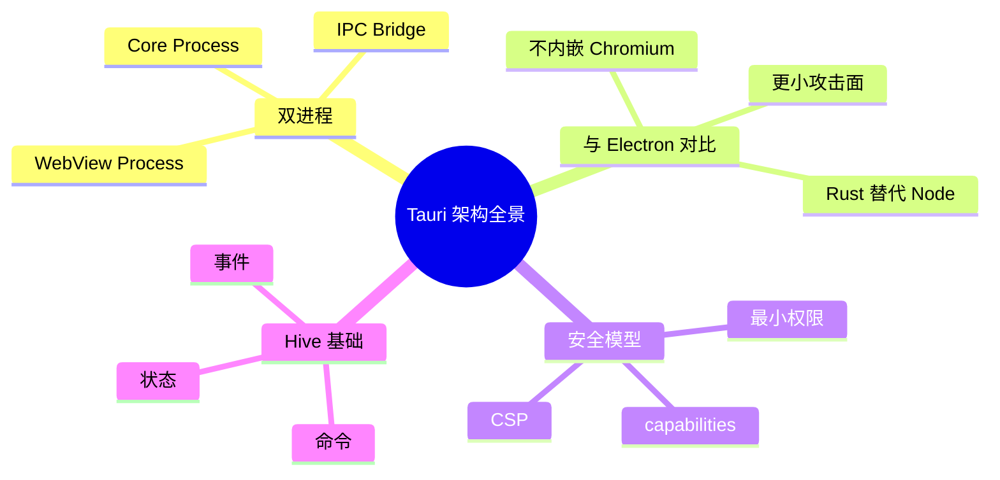

# 第十章 Tauri 架构全景

> *"要驾驭一个框架，先要看透它的骨架。"*

经过 Part 1 的 Rust 速成，你已经具备了阅读和编写 Rust 代码的能力。从本章开始，我们正式进入 Tauri 的世界。本章将从宏观视角剖析 Tauri 的架构设计，理解它为什么能做到"小而安全"。



---

## 10.1 Tauri 与 Electron：架构对比

在深入 Tauri 之前，我们先对比它与 Electron 的架构差异：

```
┌─────────────────────────────────────────────────────┐
│                    Electron                          │
│                                                     │
│  ┌─────────────┐    ┌─────────────────────────────┐ │
│  │ Main Process│    │    Renderer Process          │ │
│  │  (Node.js)  │◄──►│  (Chromium 完整内核)         │ │
│  │             │IPC │  HTML / CSS / JS             │ │
│  └─────────────┘    └─────────────────────────────┘ │
│                                                     │
│  打包体积：~150 MB+（含完整 Chromium + Node.js）      │
│  内存占用：~100-300 MB                               │
└─────────────────────────────────────────────────────┘

┌─────────────────────────────────────────────────────┐
│                     Tauri                            │
│                                                     │
│  ┌─────────────┐    ┌─────────────────────────────┐ │
│  │ Core Process│    │    WebView Process           │ │
│  │   (Rust)    │◄──►│  (系统原生 WebView)           │ │
│  │             │IPC │  HTML / CSS / JS             │ │
│  └─────────────┘    └─────────────────────────────┘ │
│                                                     │
│  打包体积：~3-10 MB（复用系统 WebView）               │
│  内存占用：~30-80 MB                                 │
└─────────────────────────────────────────────────────┘
```

### 关键差异

| 维度 | Electron | Tauri |
|------|----------|-------|
| 后端语言 | JavaScript (Node.js) | Rust |
| 渲染引擎 | 自带 Chromium | 系统 WebView (WebKit/WebView2/WebKitGTK) |
| 打包体积 | 150 MB+ | 3-10 MB |
| 内存占用 | 100-300 MB | 30-80 MB |
| 安全模型 | Node.js 拥有完整系统权限 | 最小权限 + 能力声明 |
| 跨平台 WebView | 一致（Chromium） | 不同平台不同引擎 |
| 生态成熟度 | 非常成熟 | 快速成长中 |

---

## 10.2 Tauri 的双进程模型

Tauri 应用由两个核心进程组成：

```
┌──────────────────────────────────────────────────────────┐
│                    Tauri 应用                              │
│                                                          │
│  ┌────────────────────────┐  IPC Bridge  ┌─────────────┐ │
│  │     Core Process       │◄────────────►│  WebView     │ │
│  │     (Rust 后端)         │              │  (前端 UI)   │ │
│  │                        │   invoke()   │             │ │
│  │  • 业务逻辑            │◄─────────────│  • HTML     │ │
│  │  • 文件系统访问         │              │  • CSS      │ │
│  │  • 数据库操作           │   emit()     │  • JS/TS    │ │
│  │  • 网络请求            │─────────────►│  • React    │ │
│  │  • 系统 API            │              │  • Vue      │ │
│  │  • 插件管理            │   listen()   │  • Svelte   │ │
│  │  • 安全策略            │◄─────────────│             │ │
│  └────────────────────────┘              └─────────────┘ │
│                                                          │
│  macOS: WKWebView    Windows: WebView2    Linux: WebKitGTK│
└──────────────────────────────────────────────────────────┘
```

### 10.2.1 Core Process（核心进程）

Core Process 是用 Rust 编写的后端进程，负责：

1. **应用生命周期管理** — 启动、运行、退出
2. **窗口管理** — 创建、关闭、调整窗口
3. **系统 API 访问** — 文件、网络、托盘、通知等
4. **IPC 处理** — 接收前端请求，返回结果
5. **安全策略执行** — 权限检查、CSP 策略

```rust
// src-tauri/src/main.rs — Core Process 入口
fn main() {
    tauri::Builder::default()
        // 注册插件
        .plugin(tauri_plugin_shell::init())
        .plugin(tauri_plugin_fs::init())
        // 注册命令（供前端 invoke 调用）
        .invoke_handler(tauri::generate_handler![
            greet,
            read_config,
            save_note,
        ])
        // 管理全局状态
        .manage(AppState::default())
        // 配置窗口创建回调
        .setup(|app| {
            println!("Hive 应用启动！");
            Ok(())
        })
        .run(tauri::generate_context!())
        .expect("error while running tauri application");
}
```

### 10.2.2 WebView Process（WebView 进程）

WebView Process 负责渲染用户界面：

- **macOS** — 使用 WKWebView（Safari 内核）
- **Windows** — 使用 WebView2（Edge/Chromium 内核）
- **Linux** — 使用 WebKitGTK

```javascript
// src/main.js — 前端入口
import { invoke } from '@tauri-apps/api/core';
import { listen } from '@tauri-apps/api/event';

// 调用 Rust 后端命令
const result = await invoke('greet', { name: 'Walter' });
console.log(result); // "Hello, Walter!"

// 监听后端事件
await listen('file-changed', (event) => {
    console.log('文件变更：', event.payload);
});
```

### 10.2.3 为什么是双进程？

```
┌─────────────────────────────────────────────┐
│              安全边界（Sandbox）               │
│                                             │
│  WebView 进程                Core 进程       │
│  ┌───────────┐              ┌───────────┐   │
│  │ 只能渲染   │   IPC 桥     │ 可访问     │   │
│  │ HTML/CSS  │◄────────────►│ 系统资源   │   │
│  │ /JS       │  权限检查     │ 文件/网络  │   │
│  │           │              │ 数据库     │   │
│  │ 无法直接   │              │           │   │
│  │ 访问文件系统│              │ 按需授权   │   │
│  └───────────┘              └───────────┘   │
└─────────────────────────────────────────────┘
```

**核心原则：最小权限（Principle of Least Privilege）**

- WebView 默认没有任何系统权限
- 每个能力都需要显式声明
- Core Process 作为"守门人"验证每个请求

---

## 10.3 IPC 通信机制概览

Tauri 提供两种 IPC 通信模式：

### 10.3.1 Command 模式（请求-响应）

前端通过 `invoke()` 调用 Rust 命令，等待返回结果：

```
前端 (JS)                          后端 (Rust)
   │                                   │
   │  invoke('save_note', {content})   │
   │──────────────────────────────────►│
   │                                   │  fn save_note(content)
   │                                   │  → 写入文件
   │                                   │  → 返回 Result
   │       Ok("saved") / Err(...)      │
   │◄──────────────────────────────────│
   │                                   │
```

**Rust 端：**

```rust
#[tauri::command]
async fn save_note(content: String) -> Result<String, String> {
    std::fs::write("note.md", &content)
        .map_err(|e| e.to_string())?;
    Ok("saved".to_string())
}
```

**前端：**

```javascript
try {
    const result = await invoke('save_note', { content: '# Hello' });
    console.log(result); // "saved"
} catch (error) {
    console.error('保存失败：', error);
}
```

### 10.3.2 Event 模式（发布-订阅）

适用于后端主动推送、双向通知的场景：

```
前端 (JS)                          后端 (Rust)
   │                                   │
   │  listen('download-progress')      │
   │  ┌──────────────────────────┐     │
   │  │ 注册监听器               │     │
   │  └──────────────────────────┘     │
   │                                   │
   │       emit('download-progress',   │
   │            { percent: 30 })       │
   │◄──────────────────────────────────│
   │                                   │
   │       emit('download-progress',   │
   │            { percent: 70 })       │
   │◄──────────────────────────────────│
   │                                   │
   │       emit('download-progress',   │
   │            { percent: 100 })      │
   │◄──────────────────────────────────│
```

**Rust 端发送事件：**

```rust
use tauri::Emitter;

#[tauri::command]
async fn download_file(app: tauri::AppHandle, url: String) -> Result<(), String> {
    for i in (0..=100).step_by(10) {
        // 模拟下载进度
        tokio::time::sleep(std::time::Duration::from_millis(200)).await;
        app.emit("download-progress", serde_json::json!({
            "percent": i
        })).map_err(|e| e.to_string())?;
    }
    Ok(())
}
```

**前端监听事件：**

```javascript
import { listen } from '@tauri-apps/api/event';

const unlisten = await listen('download-progress', (event) => {
    const { percent } = event.payload;
    updateProgressBar(percent);
});

// 不再需要时取消监听
// unlisten();
```

### 10.3.3 两种模式对比

| 维度 | Command (invoke) | Event (emit/listen) |
|------|------------------|---------------------|
| 方向 | 前端 → 后端 → 前端 | 双向 |
| 模式 | 请求-响应 | 发布-订阅 |
| 返回值 | 有（Result） | 无（fire-and-forget） |
| 适用场景 | CRUD 操作、查询 | 进度通知、状态变更、实时推送 |
| 类比 | REST API | WebSocket / SSE |

---

## 10.4 Tauri 的安全模型

安全是 Tauri 的核心设计理念之一。

### 10.4.1 能力系统（Capabilities）

Tauri 2.0 引入了声明式的能力系统：

```json
// src-tauri/capabilities/default.json
{
  "identifier": "default",
  "description": "默认能力集",
  "windows": ["main"],
  "permissions": [
    "core:default",
    "shell:allow-open",
    "fs:allow-read-text-file",
    "fs:allow-write-text-file",
    {
      "identifier": "fs:scope",
      "allow": [
        "$APPDATA/**",
        "$DOCUMENT/**"
      ]
    }
  ]
}
```

### 10.4.2 安全层次

```
┌─────────────────────────────────────────────┐
│            Tauri 安全模型（四层防御）          │
│                                             │
│  Layer 4: CSP（内容安全策略）                 │
│  ┌─────────────────────────────────────┐    │
│  │ 限制 JS 可加载的资源来源              │    │
│  └─────────────────────────────────────┘    │
│                                             │
│  Layer 3: Capabilities（能力声明）            │
│  ┌─────────────────────────────────────┐    │
│  │ 声明窗口可使用的 API 权限             │    │
│  └─────────────────────────────────────┘    │
│                                             │
│  Layer 2: IPC 过滤                          │
│  ┌─────────────────────────────────────┐    │
│  │ 只有注册的命令才能被调用              │    │
│  └─────────────────────────────────────┘    │
│                                             │
│  Layer 1: 进程隔离                          │
│  ┌─────────────────────────────────────┐    │
│  │ WebView 无法直接访问系统资源          │    │
│  └─────────────────────────────────────┘    │
└─────────────────────────────────────────────┘
```

### 10.4.3 与 Electron 安全对比

| 维度 | Electron | Tauri |
|------|----------|-------|
| 默认权限 | Node.js 拥有完整系统权限 | WebView 默认无权限 |
| 权限控制 | 需手动配置 contextIsolation | 声明式 Capabilities |
| 远程代码 | 可通过 `require()` 执行任意代码 | CSP 严格限制 |
| 文件访问 | 默认可访问整个文件系统 | 需声明 scope 范围 |

---

## 10.5 Tauri 应用的生命周期

```
┌──────────────────────────────────────────────────┐
│              Tauri 应用生命周期                     │
│                                                  │
│  ┌─────────┐                                     │
│  │  启动    │ main() → tauri::Builder             │
│  └────┬────┘                                     │
│       ▼                                          │
│  ┌─────────┐                                     │
│  │  setup   │ .setup(|app| { ... })              │
│  │  初始化   │ 注册插件、初始化状态、创建窗口        │
│  └────┬────┘                                     │
│       ▼                                          │
│  ┌─────────┐                                     │
│  │  运行    │ 事件循环（Event Loop）               │
│  │         │ 处理 IPC、窗口事件、系统事件           │
│  └────┬────┘                                     │
│       ▼                                          │
│  ┌─────────┐                                     │
│  │  退出    │ on_window_event(CloseRequested)     │
│  │         │ 清理资源、保存状态                    │
│  └─────────┘                                     │
└──────────────────────────────────────────────────┘
```

### 生命周期钩子

```rust
fn main() {
    tauri::Builder::default()
        // 1. setup — 应用初始化
        .setup(|app| {
            println!("✅ 应用初始化");

            // 获取应用数据目录
            let app_dir = app.path().app_data_dir()
                .expect("无法获取应用数据目录");
            std::fs::create_dir_all(&app_dir).ok();

            // 创建额外窗口
            let _settings_window = tauri::WebviewWindowBuilder::new(
                app,
                "settings",
                tauri::WebviewUrl::App("settings.html".into()),
            )
            .title("设置")
            .inner_size(600.0, 400.0)
            .build()?;

            Ok(())
        })
        // 2. on_window_event — 窗口事件
        .on_window_event(|window, event| {
            match event {
                tauri::WindowEvent::CloseRequested { api, .. } => {
                    println!("窗口 {} 请求关闭", window.label());
                    // 可以阻止关闭：api.prevent_close();
                }
                tauri::WindowEvent::Focused(focused) => {
                    println!("窗口 {} 焦点: {}", window.label(), focused);
                }
                _ => {}
            }
        })
        .run(tauri::generate_context!())
        .expect("error while running tauri application");
}
```

---

## 10.6 Tauri 项目结构深度解析

```
hive/
├── src-tauri/                    # Rust 后端
│   ├── Cargo.toml                # Rust 依赖管理
│   ├── tauri.conf.json           # Tauri 核心配置
│   ├── capabilities/             # 能力声明（安全策略）
│   │   └── default.json
│   ├── icons/                    # 应用图标
│   │   ├── icon.ico
│   │   ├── icon.png
│   │   └── icon.icns
│   ├── src/
│   │   ├── main.rs               # 入口（桌面端）
│   │   ├── lib.rs                # 核心库（可被测试引用）
│   │   ├── commands/             # IPC 命令模块
│   │   │   ├── mod.rs
│   │   │   ├── notes.rs
│   │   │   └── settings.rs
│   │   ├── models/               # 数据模型
│   │   │   ├── mod.rs
│   │   │   └── note.rs
│   │   └── state.rs              # 全局状态
│   └── build.rs                  # 构建脚本
│
├── src/                          # 前端代码
│   ├── index.html
│   ├── main.js                   # 或 main.ts
│   ├── styles.css
│   ├── components/
│   └── pages/
│
├── package.json                  # 前端依赖
└── vite.config.js                # 前端构建配置
```

### tauri.conf.json 核心配置

```json
{
  "productName": "Hive",
  "version": "0.1.0",
  "identifier": "com.example.hive",
  "build": {
    "frontendDist": "../dist",
    "devUrl": "http://localhost:5173",
    "beforeDevCommand": "npm run dev",
    "beforeBuildCommand": "npm run build"
  },
  "app": {
    "windows": [
      {
        "label": "main",
        "title": "Hive",
        "width": 1024,
        "height": 768,
        "resizable": true,
        "fullscreen": false
      }
    ],
    "security": {
      "csp": "default-src 'self'; script-src 'self'"
    }
  },
  "bundle": {
    "active": true,
    "targets": "all",
    "icon": [
      "icons/32x32.png",
      "icons/128x128.png",
      "icons/icon.icns",
      "icons/icon.ico"
    ]
  }
}
```

---

## 10.7 从 C++/Java 架构师视角看 Tauri

### 与 C++ Qt 对比

| 维度 | Qt | Tauri |
|------|-----|-------|
| UI 技术 | QML / Widgets (C++) | HTML/CSS/JS |
| 后端语言 | C++ | Rust |
| 信号-槽 | Qt Signal/Slot | Command + Event |
| 跨平台 | 编译时适配 | 运行时 WebView 适配 |
| 包管理 | qmake / CMake | Cargo + npm |
| 学习曲线 | 陡峭（MOC、QObject 体系） | 中等（Web 前端 + Rust） |

### 与 Java Swing/JavaFX 对比

| 维度 | JavaFX | Tauri |
|------|--------|-------|
| UI 技术 | FXML / CSS | HTML/CSS/JS |
| 后端语言 | Java | Rust |
| 事件模型 | EventHandler | Command + Event |
| 打包 | jlink / jpackage (~50 MB+) | tauri build (~5 MB) |
| 性能 | JVM 启动慢 | 原生启动快 |

---

## 10.8 Hive 项目架构设计

在接下来的章节中，我们将逐步构建 Hive 项目。这里先给出整体架构：

```
┌─────────────────────────────────────────────────────┐
│                    Hive 架构                         │
│                                                     │
│  ┌─────────────────────────────────────────────────┐│
│  │                 前端 (WebView)                   ││
│  │                                                 ││
│  │  ┌──────┐  ┌──────┐  ┌──────┐  ┌──────────┐   ││
│  │  │ 笔记  │  │ 聊天  │  │ 设置  │  │ 插件面板  │   ││
│  │  │ 编辑器│  │ 窗口  │  │ 页面  │  │          │   ││
│  │  └──┬───┘  └──┬───┘  └──┬───┘  └────┬─────┘   ││
│  │     │         │         │            │         ││
│  │     └─────────┴─────────┴────────────┘         ││
│  │                    │ invoke() / listen()        ││
│  └────────────────────┼───────────────────────────┘│
│                       │ IPC Bridge                  │
│  ┌────────────────────┼───────────────────────────┐│
│  │                 后端 (Rust)                      ││
│  │                    │                            ││
│  │  ┌────────────┐  ┌┴───────────┐  ┌──────────┐ ││
│  │  │ 命令处理器  │  │ 事件分发器  │  │ 插件管理器│ ││
│  │  └─────┬──────┘  └─────┬──────┘  └────┬─────┘ ││
│  │        │               │               │       ││
│  │  ┌─────┴───────────────┴───────────────┴─────┐ ││
│  │  │              服务层 (Service)               │ ││
│  │  │  NoteService  ChatService  ConfigService   │ ││
│  │  └─────────────────┬─────────────────────────┘ ││
│  │                    │                            ││
│  │  ┌─────────────────┴─────────────────────────┐ ││
│  │  │              存储层 (Storage)               │ ││
│  │  │  SQLite    FileSystem    HTTP Client        │ ││
│  │  └───────────────────────────────────────────┘ ││
│  └────────────────────────────────────────────────┘│
└─────────────────────────────────────────────────────┘
```

---

## 10.9 小结

本章我们从宏观视角了解了 Tauri 的架构设计：

### 核心知识点

| 概念 | 要点 |
|------|------|
| **双进程模型** | Core Process (Rust) + WebView Process (系统原生) |
| **IPC 通信** | Command（请求-响应）+ Event（发布-订阅） |
| **安全模型** | 四层防御：进程隔离 → IPC 过滤 → Capabilities → CSP |
| **生命周期** | setup → 事件循环 → 退出清理 |
| **项目结构** | src-tauri/ (Rust) + src/ (前端) + tauri.conf.json |

### Tauri 设计哲学

```
┌────────────────────────────────────────┐
│         Tauri 设计哲学                  │
│                                        │
│  🔒 安全优先 — 最小权限原则             │
│  📦 轻量打包 — 复用系统 WebView         │
│  🦀 性能保障 — Rust 零成本抽象          │
│  🌐 Web 生态 — 复用前端技术栈           │
│  🔌 可扩展   — 插件系统                 │
└────────────────────────────────────────┘
```

### 下一章预告

第十一章我们将深入 **前后端通信**，详细学习 `#[tauri::command]` 的各种用法、参数传递、状态管理，以及事件系统的高级模式。

---

> **扩展阅读**
> - [Tauri 官方架构文档](https://v2.tauri.app/concept/)
> - [Tauri 安全模型](https://v2.tauri.app/security/)
> - [Tauri vs Electron 性能对比](https://github.com/nicehash/nicehash-benchmark)
