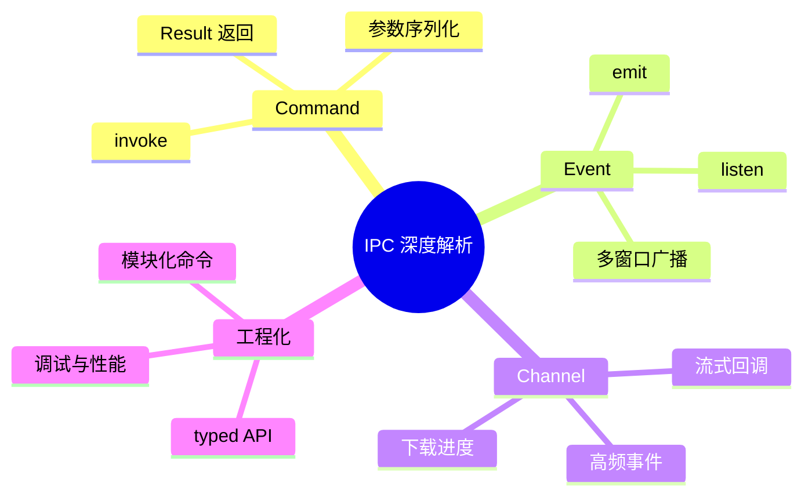

# 第十一章 前后端通信：IPC 深度解析

> *"好的架构，是让前后端各司其职，又能无缝协作。"*

上一章我们了解了 Tauri 的双进程架构和 IPC 通信概览。本章将深入 IPC 的每一个细节——从命令定义到参数传递，从错误处理到性能优化，掌握前后端通信的全部技巧。



---

## 11.1 Command 系统详解

### 11.1.1 基本命令定义

`#[tauri::command]` 宏将普通 Rust 函数暴露为前端可调用的 IPC 命令：

```rust
// 最简单的命令
#[tauri::command]
fn greet(name: String) -> String {
    format!("Hello, {}!", name)
}

// 注册命令
fn main() {
    tauri::Builder::default()
        .invoke_handler(tauri::generate_handler![greet])
        .run(tauri::generate_context!())
        .expect("error while running tauri application");
}
```

前端调用：

```javascript
import { invoke } from '@tauri-apps/api/core';

const message = await invoke('greet', { name: 'Walter' });
console.log(message); // "Hello, Walter!"
```

### 11.1.2 命令命名规则

Rust 函数名使用 `snake_case`，前端调用时也使用 `snake_case`：

```rust
#[tauri::command]
fn get_user_profile(user_id: u64) -> UserProfile { ... }
```

```javascript
// 前端调用——保持 snake_case
const profile = await invoke('get_user_profile', { userId: 64 });
```

> ⚠️ **注意**：Rust 参数名 `user_id` 在前端变为 `userId`（camelCase），这是 Tauri 自动转换的。如果你想禁用自动转换，可以使用 `#[tauri::command(rename_all = "snake_case")]`。

```rust
#[tauri::command(rename_all = "snake_case")]
fn get_user_profile(user_id: u64) -> UserProfile { ... }

// 前端调用时保持 snake_case
// invoke('get_user_profile', { user_id: 64 })
```

---

## 11.2 参数传递

### 11.2.1 基本类型

Tauri 命令支持所有可序列化的类型：

```rust
use serde::{Deserialize, Serialize};

#[tauri::command]
fn add(a: f64, b: f64) -> f64 {
    a + b
}

#[tauri::command]
fn concat_strings(items: Vec<String>) -> String {
    items.join(", ")
}

#[tauri::command]
fn check_flag(enabled: bool) -> String {
    if enabled { "ON".into() } else { "OFF".into() }
}
```

```javascript
await invoke('add', { a: 1.5, b: 2.3 });           // 3.8
await invoke('concat_strings', { items: ["a", "b"] }); // "a, b"
await invoke('check_flag', { enabled: true });       // "ON"
```

### 11.2.2 结构体参数

传递复杂对象时，使用 `Serialize + Deserialize` 的结构体：

```rust
use serde::{Deserialize, Serialize};

#[derive(Debug, Serialize, Deserialize)]
pub struct CreateNoteRequest {
    pub title: String,
    pub content: String,
    pub tags: Vec<String>,
}

#[derive(Debug, Serialize)]
pub struct NoteResponse {
    pub id: u64,
    pub title: String,
    pub content: String,
    pub tags: Vec<String>,
    pub created_at: String,
}

#[tauri::command]
fn create_note(request: CreateNoteRequest) -> NoteResponse {
    NoteResponse {
        id: 1,
        title: request.title,
        content: request.content,
        tags: request.tags,
        created_at: "2025-05-01T12:00:00Z".to_string(),
    }
}
```

```javascript
const note = await invoke('create_note', {
    request: {
        title: 'Rust 学习笔记',
        content: '# 所有权\n所有权是 Rust 的核心...',
        tags: ['rust', 'learning'],
    }
});
console.log(note.id);        // 1
console.log(note.createdAt); // "2025-05-01T12:00:00Z"
```

### 11.2.3 枚举参数

```rust
#[derive(Debug, Serialize, Deserialize)]
#[serde(tag = "type", content = "data")]
pub enum SortOrder {
    Asc,
    Desc,
    Custom(Vec<String>),
}

#[derive(Debug, Deserialize)]
pub struct QueryParams {
    pub keyword: Option<String>,
    pub page: u32,
    pub page_size: u32,
    pub sort: SortOrder,
}

#[tauri::command]
fn search_notes(params: QueryParams) -> Vec<NoteResponse> {
    // 根据参数搜索笔记
    vec![]
}
```

```javascript
const results = await invoke('search_notes', {
    params: {
        keyword: 'Rust',
        page: 1,
        pageSize: 20,
        sort: { type: 'Desc' },
    }
});
```

### 11.2.4 Optional 参数

```rust
#[tauri::command]
fn search(keyword: Option<String>, limit: Option<u32>) -> Vec<String> {
    let limit = limit.unwrap_or(10);
    let keyword = keyword.unwrap_or_default();
    // 执行搜索...
    vec![format!("搜索 '{}', 限制 {} 条", keyword, limit)]
}
```

```javascript
// 可以省略 Optional 参数
await invoke('search', {});
await invoke('search', { keyword: 'Rust' });
await invoke('search', { keyword: 'Rust', limit: 5 });
```

---

## 11.3 返回值与错误处理

### 11.3.1 返回 Result

生产代码中，命令通常返回 `Result`：

```rust
use serde::Serialize;

// 方式一：返回 String 错误（简单场景）
#[tauri::command]
fn read_file_simple(path: String) -> Result<String, String> {
    std::fs::read_to_string(&path)
        .map_err(|e| format!("读取文件失败: {}", e))
}

// 方式二：自定义错误类型（推荐）
#[derive(Debug, Serialize)]
pub struct AppError {
    pub code: String,
    pub message: String,
}

impl std::fmt::Display for AppError {
    fn fmt(&self, f: &mut std::fmt::Formatter<'_>) -> std::fmt::Result {
        write!(f, "[{}] {}", self.code, self.message)
    }
}

// 让 AppError 可以作为命令的错误类型
impl From<std::io::Error> for AppError {
    fn from(e: std::io::Error) -> Self {
        AppError {
            code: "IO_ERROR".to_string(),
            message: e.to_string(),
        }
    }
}

#[tauri::command]
fn read_file(path: String) -> Result<String, AppError> {
    let content = std::fs::read_to_string(&path)?;
    Ok(content)
}
```

前端错误处理：

```javascript
try {
    const content = await invoke('read_file', { path: '/some/file.txt' });
    console.log(content);
} catch (error) {
    // error 是序列化后的 AppError
    console.error(`错误 [${error.code}]: ${error.message}`);
}
```

### 11.3.2 使用 thiserror 定义错误

```rust
use thiserror::Error;
use serde::Serialize;

#[derive(Debug, Error)]
pub enum AppError {
    #[error("文件操作失败: {0}")]
    Io(#[from] std::io::Error),

    #[error("JSON 解析失败: {0}")]
    Json(#[from] serde_json::Error),

    #[error("数据库错误: {0}")]
    Database(String),

    #[error("未找到: {0}")]
    NotFound(String),

    #[error("权限不足: {0}")]
    Forbidden(String),
}

// Tauri 要求错误类型实现 Serialize
impl Serialize for AppError {
    fn serialize<S>(&self, serializer: S) -> Result<S::Ok, S::Error>
    where
        S: serde::Serializer,
    {
        use serde::ser::SerializeStruct;
        let mut state = serializer.serialize_struct("AppError", 2)?;

        let (code, message) = match self {
            AppError::Io(e) => ("IO_ERROR", e.to_string()),
            AppError::Json(e) => ("JSON_ERROR", e.to_string()),
            AppError::Database(msg) => ("DB_ERROR", msg.clone()),
            AppError::NotFound(msg) => ("NOT_FOUND", msg.clone()),
            AppError::Forbidden(msg) => ("FORBIDDEN", msg.clone()),
        };

        state.serialize_field("code", code)?;
        state.serialize_field("message", &message)?;
        state.end()
    }
}

type AppResult<T> = Result<T, AppError>;

#[tauri::command]
fn get_note(id: u64) -> AppResult<NoteResponse> {
    if id == 0 {
        return Err(AppError::NotFound(format!("笔记 {} 不存在", id)));
    }
    // ...查询笔记
    Ok(NoteResponse {
        id,
        title: "示例笔记".to_string(),
        content: "内容".to_string(),
        tags: vec![],
        created_at: "2025-05-01".to_string(),
    })
}
```

### 11.3.3 返回 Unit 类型

不需要返回值的命令：

```rust
#[tauri::command]
fn delete_note(id: u64) -> Result<(), AppError> {
    // 删除笔记...
    Ok(())
}
```

```javascript
await invoke('delete_note', { id: 42 });
// 成功时返回 null
```

---

## 11.4 访问 Tauri 内置对象

### 11.4.1 AppHandle

`AppHandle` 提供对应用实例的全局访问：

```rust
use tauri::Manager;

#[tauri::command]
async fn get_app_info(app: tauri::AppHandle) -> Result<serde_json::Value, String> {
    let version = app.package_info().version.to_string();
    let app_dir = app.path().app_data_dir()
        .map_err(|e| e.to_string())?;

    Ok(serde_json::json!({
        "version": version,
        "dataDir": app_dir.to_string_lossy(),
    }))
}
```

### 11.4.2 Window / WebviewWindow

访问当前窗口：

```rust
use tauri::WebviewWindow;

#[tauri::command]
async fn toggle_fullscreen(window: WebviewWindow) -> Result<(), String> {
    let is_fullscreen = window.is_fullscreen()
        .map_err(|e| e.to_string())?;
    window.set_fullscreen(!is_fullscreen)
        .map_err(|e| e.to_string())?;
    Ok(())
}

#[tauri::command]
async fn set_window_title(window: WebviewWindow, title: String) -> Result<(), String> {
    window.set_title(&title)
        .map_err(|e| e.to_string())?;
    Ok(())
}
```

### 11.4.3 State（全局状态）

```rust
use std::sync::Mutex;
use tauri::State;

pub struct AppState {
    pub counter: Mutex<u64>,
    pub config: Mutex<AppConfig>,
}

#[derive(Default, Clone, serde::Serialize)]
pub struct AppConfig {
    pub theme: String,
    pub language: String,
}

#[tauri::command]
fn increment(state: State<'_, AppState>) -> u64 {
    let mut counter = state.counter.lock().unwrap();
    *counter += 1;
    *counter
}

#[tauri::command]
fn get_config(state: State<'_, AppState>) -> AppConfig {
    state.config.lock().unwrap().clone()
}

// 注册状态
fn main() {
    tauri::Builder::default()
        .manage(AppState {
            counter: Mutex::new(0),
            config: Mutex::new(AppConfig {
                theme: "dark".to_string(),
                language: "zh-CN".to_string(),
            }),
        })
        .invoke_handler(tauri::generate_handler![increment, get_config])
        .run(tauri::generate_context!())
        .expect("error");
}
```

---

## 11.5 异步命令

### 11.5.1 async 命令

耗时操作应使用异步命令，避免阻塞主线程：

```rust
#[tauri::command]
async fn fetch_data(url: String) -> Result<String, String> {
    let response = reqwest::get(&url)
        .await
        .map_err(|e| format!("请求失败: {}", e))?;

    let body = response.text()
        .await
        .map_err(|e| format!("读取响应失败: {}", e))?;

    Ok(body)
}

#[tauri::command]
async fn heavy_computation() -> Result<u64, String> {
    // 将 CPU 密集型任务放到阻塞线程池
    let result = tokio::task::spawn_blocking(|| {
        // 模拟耗时计算
        let mut sum: u64 = 0;
        for i in 0..1_000_000 {
            sum += i;
        }
        sum
    })
    .await
    .map_err(|e| e.to_string())?;

    Ok(result)
}
```

### 11.5.2 异步命令中访问 State

异步命令中不能直接使用 `State<'_, T>` 引用（因为生命周期问题），需要通过 `AppHandle` 获取：

```rust
use tauri::Manager;

#[tauri::command]
async fn async_increment(app: tauri::AppHandle) -> Result<u64, String> {
    let state = app.state::<AppState>();
    let mut counter = state.counter.lock().unwrap();
    *counter += 1;
    Ok(*counter)
}
```

### 11.5.3 同步 vs 异步命令选择

```
┌─────────────────────────────────────────────────┐
│           命令类型选择指南                         │
│                                                 │
│  同步命令 (fn)                                   │
│  ├── 纯计算（数学运算、字符串处理）                │
│  ├── 读取内存状态                                │
│  └── 执行时间 < 1ms                              │
│                                                 │
│  异步命令 (async fn)                              │
│  ├── 文件 I/O                                    │
│  ├── 网络请求                                    │
│  ├── 数据库操作                                   │
│  ├── 调用其他异步 API                             │
│  └── 执行时间 > 1ms                              │
│                                                 │
│  异步 + spawn_blocking                           │
│  ├── CPU 密集型计算                               │
│  ├── 加密/哈希                                   │
│  └── 图片/视频处理                                │
└─────────────────────────────────────────────────┘
```

---

## 11.6 Event 系统详解

### 11.6.1 后端发送事件

```rust
use tauri::Emitter;

// 全局事件——所有窗口都能收到
#[tauri::command]
async fn start_sync(app: tauri::AppHandle) -> Result<(), String> {
    // 模拟同步过程
    for i in 0..=100 {
        tokio::time::sleep(std::time::Duration::from_millis(50)).await;

        app.emit("sync-progress", serde_json::json!({
            "percent": i,
            "message": format!("正在同步... {}%", i),
        })).map_err(|e| e.to_string())?;
    }

    app.emit("sync-complete", serde_json::json!({
        "total": 42,
        "message": "同步完成",
    })).map_err(|e| e.to_string())?;

    Ok(())
}

// 定向事件——只发送到指定窗口
#[tauri::command]
async fn notify_window(app: tauri::AppHandle, label: String) -> Result<(), String> {
    use tauri::Emitter;
    app.emit_to(&label, "notification", serde_json::json!({
        "title": "提醒",
        "body": "你有新消息",
    })).map_err(|e| e.to_string())?;
    Ok(())
}
```

### 11.6.2 前端监听事件

```javascript
import { listen } from '@tauri-apps/api/event';

// 监听同步进度
const unlistenProgress = await listen('sync-progress', (event) => {
    const { percent, message } = event.payload;
    console.log(`${message} (${percent}%)`);
    updateProgressBar(percent);
});

// 监听同步完成
const unlistenComplete = await listen('sync-complete', (event) => {
    const { total, message } = event.payload;
    console.log(`${message}, 共 ${total} 条`);
    showNotification(message);
});

// 组件卸载时取消监听
function cleanup() {
    unlistenProgress();
    unlistenComplete();
}
```

### 11.6.3 前端发送事件到后端

```javascript
import { emit } from '@tauri-apps/api/event';

// 前端发送事件
await emit('user-action', {
    action: 'click',
    target: 'save-button',
    timestamp: Date.now(),
});
```

```rust
use tauri::Listener;

fn main() {
    tauri::Builder::default()
        .setup(|app| {
            // 后端监听前端事件
            app.listen("user-action", |event| {
                println!("用户操作: {:?}", event.payload());
            });
            Ok(())
        })
        .run(tauri::generate_context!())
        .expect("error");
}
```

### 11.6.4 事件通信模式总结

```
┌───────────────────────────────────────────────────────┐
│              Tauri 事件通信全景                          │
│                                                       │
│  前端 → 后端                                           │
│  ┌──────────┐    invoke()     ┌──────────┐            │
│  │  前端 JS  │───────────────►│  Rust Cmd │            │
│  │          │◄───────────────│  Handler  │            │
│  │          │    返回 Result   │          │            │
│  └──────────┘                └──────────┘            │
│                                                       │
│  前端 → 后端（事件）                                    │
│  ┌──────────┐    emit()      ┌──────────┐            │
│  │  前端 JS  │───────────────►│  Rust     │            │
│  │          │               │  listen() │            │
│  └──────────┘                └──────────┘            │
│                                                       │
│  后端 → 前端                                           │
│  ┌──────────┐    emit()      ┌──────────┐            │
│  │  Rust    │───────────────►│  前端 JS   │            │
│  │          │               │  listen() │            │
│  └──────────┘                └──────────┘            │
│                                                       │
│  后端 → 指定窗口                                       │
│  ┌──────────┐  emit_to()    ┌──────────┐            │
│  │  Rust    │───────────────►│  窗口 A   │            │
│  │          │               └──────────┘            │
│  │          │  ╳            ┌──────────┐            │
│  │          │               │  窗口 B   │            │
│  └──────────┘                └──────────┘            │
└───────────────────────────────────────────────────────┘
```

---

## 11.7 Channel：高性能流式传输

Tauri 2.0 引入了 `Channel` 类型，适用于需要频繁传输数据的场景：

```rust
use tauri::ipc::Channel;
use serde::Serialize;

#[derive(Clone, Serialize)]
#[serde(rename_all = "camelCase", tag = "event", content = "data")]
enum DownloadEvent {
    #[serde(rename_all = "camelCase")]
    Started {
        url: String,
        total_size: u64,
    },
    #[serde(rename_all = "camelCase")]
    Progress {
        downloaded: u64,
        total: u64,
        percent: f64,
    },
    Finished {
        path: String,
    },
    #[serde(rename_all = "camelCase")]
    Error {
        message: String,
    },
}

#[tauri::command]
async fn download_file(
    url: String,
    save_path: String,
    on_event: Channel<DownloadEvent>,
) -> Result<(), String> {
    // 通知开始
    on_event.send(DownloadEvent::Started {
        url: url.clone(),
        total_size: 1024 * 1024, // 1 MB
    }).map_err(|e| e.to_string())?;

    // 模拟下载过程
    let total = 1024 * 1024u64;
    for i in (0..=100).step_by(5) {
        tokio::time::sleep(std::time::Duration::from_millis(100)).await;

        let downloaded = total * i / 100;
        on_event.send(DownloadEvent::Progress {
            downloaded,
            total,
            percent: i as f64,
        }).map_err(|e| e.to_string())?;
    }

    // 通知完成
    on_event.send(DownloadEvent::Finished {
        path: save_path,
    }).map_err(|e| e.to_string())?;

    Ok(())
}
```

前端使用 Channel：

```javascript
import { invoke, Channel } from '@tauri-apps/api/core';

const onEvent = new Channel();

onEvent.onmessage = (event) => {
    switch (event.event) {
        case 'Started':
            console.log(`开始下载: ${event.data.url}`);
            break;
        case 'Progress':
            console.log(`进度: ${event.data.percent}%`);
            updateProgressBar(event.data.percent);
            break;
        case 'Finished':
            console.log(`下载完成: ${event.data.path}`);
            break;
        case 'Error':
            console.error(`下载失败: ${event.data.message}`);
            break;
    }
};

await invoke('download_file', {
    url: 'https://example.com/file.zip',
    savePath: '/tmp/file.zip',
    onEvent,
});
```

### Channel vs Event 对比

| 维度 | Event (emit/listen) | Channel |
|------|-------------------|---------|
| 性能 | 一般（JSON 序列化 + 事件系统） | 高（直接回调） |
| 方向 | 双向 | 后端 → 前端 |
| 生命周期 | 全局/手动取消 | 跟随命令调用 |
| 适用场景 | 全局通知、状态广播 | 流式数据、进度回调 |
| 类比 | WebSocket | Stream / Callback |

---

## 11.8 二进制数据传输

### 11.8.1 发送二进制数据到前端

```rust
#[tauri::command]
fn read_image(path: String) -> Result<Vec<u8>, String> {
    std::fs::read(&path)
        .map_err(|e| format!("读取图片失败: {}", e))
}

// 使用 tauri::ipc::Response 返回原始字节（更高效）
use tauri::ipc::Response;

#[tauri::command]
fn read_image_raw(path: String) -> Result<Response, String> {
    let bytes = std::fs::read(&path)
        .map_err(|e| format!("读取图片失败: {}", e))?;
    Ok(Response::new(bytes))
}
```

```javascript
// Vec<u8> 会被转为 ArrayBuffer
const imageData = await invoke('read_image', { path: '/tmp/photo.png' });
const blob = new Blob([new Uint8Array(imageData)], { type: 'image/png' });
const url = URL.createObjectURL(blob);
```

### 11.8.2 从前端发送二进制数据

```javascript
// 使用 ArrayBuffer 发送
const fileInput = document.getElementById('file-input');
const file = fileInput.files[0];
const arrayBuffer = await file.arrayBuffer();

await invoke('upload_file', {
    name: file.name,
    data: Array.from(new Uint8Array(arrayBuffer)),
});
```

```rust
#[tauri::command]
fn upload_file(name: String, data: Vec<u8>) -> Result<String, String> {
    let path = format!("/tmp/{}", name);
    std::fs::write(&path, &data)
        .map_err(|e| format!("保存失败: {}", e))?;
    Ok(format!("已保存到 {}", path))
}
```

---

## 11.9 命令组织与模块化

随着应用增长，命令应按功能模块组织：

### 11.9.1 模块化结构

```
src-tauri/src/
├── main.rs
├── lib.rs
├── commands/
│   ├── mod.rs
│   ├── notes.rs
│   ├── settings.rs
│   └── files.rs
├── models/
│   ├── mod.rs
│   ├── note.rs
│   └── config.rs
├── services/
│   ├── mod.rs
│   ├── note_service.rs
│   └── config_service.rs
├── error.rs
└── state.rs
```

### 11.9.2 命令模块示例

```rust
// src-tauri/src/commands/notes.rs
use crate::error::AppResult;
use crate::models::note::{CreateNoteRequest, NoteResponse};
use crate::state::AppState;
use tauri::State;

#[tauri::command]
pub fn create_note(
    state: State<'_, AppState>,
    request: CreateNoteRequest,
) -> AppResult<NoteResponse> {
    let service = state.note_service.lock().unwrap();
    service.create(request)
}

#[tauri::command]
pub fn list_notes(
    state: State<'_, AppState>,
    page: Option<u32>,
    page_size: Option<u32>,
) -> AppResult<Vec<NoteResponse>> {
    let service = state.note_service.lock().unwrap();
    service.list(page.unwrap_or(1), page_size.unwrap_or(20))
}

#[tauri::command]
pub fn get_note(
    state: State<'_, AppState>,
    id: u64,
) -> AppResult<NoteResponse> {
    let service = state.note_service.lock().unwrap();
    service.get(id)
}

#[tauri::command]
pub fn delete_note(
    state: State<'_, AppState>,
    id: u64,
) -> AppResult<()> {
    let service = state.note_service.lock().unwrap();
    service.delete(id)
}
```

```rust
// src-tauri/src/commands/mod.rs
pub mod notes;
pub mod settings;
pub mod files;
```

```rust
// src-tauri/src/lib.rs
mod commands;
mod error;
mod models;
mod services;
mod state;

use commands::{notes, settings, files};

pub fn run() {
    tauri::Builder::default()
        .manage(state::AppState::new())
        .invoke_handler(tauri::generate_handler![
            // 笔记命令
            notes::create_note,
            notes::list_notes,
            notes::get_note,
            notes::delete_note,
            // 设置命令
            settings::get_settings,
            settings::update_settings,
            // 文件命令
            files::read_file,
            files::write_file,
        ])
        .run(tauri::generate_context!())
        .expect("error while running tauri application");
}
```

### 11.9.3 前端封装

```typescript
// src/api/notes.ts
import { invoke } from '@tauri-apps/api/core';

export interface Note {
    id: number;
    title: string;
    content: string;
    tags: string[];
    createdAt: string;
}

export interface CreateNoteRequest {
    title: string;
    content: string;
    tags: string[];
}

export const notesApi = {
    create: (request: CreateNoteRequest): Promise<Note> =>
        invoke('create_note', { request }),

    list: (page = 1, pageSize = 20): Promise<Note[]> =>
        invoke('list_notes', { page, pageSize }),

    get: (id: number): Promise<Note> =>
        invoke('get_note', { id }),

    delete: (id: number): Promise<void> =>
        invoke('delete_note', { id }),
};
```

```typescript
// src/App.tsx — 使用封装好的 API
import { notesApi } from './api/notes';

async function loadNotes() {
    const notes = await notesApi.list(1, 20);
    setNotes(notes);
}

async function handleCreate() {
    const note = await notesApi.create({
        title: '新笔记',
        content: '# Hello',
        tags: ['draft'],
    });
    console.log('创建成功:', note.id);
}
```

---

## 11.10 IPC 性能优化

### 11.10.1 减少 IPC 调用次数

```rust
// ❌ 不好：多次 IPC 调用
// 前端分别调用 get_user、get_settings、get_notifications

// ✅ 好：批量获取
#[derive(Serialize)]
pub struct DashboardData {
    pub user: UserProfile,
    pub settings: AppConfig,
    pub notifications: Vec<Notification>,
    pub recent_notes: Vec<NoteResponse>,
}

#[tauri::command]
async fn get_dashboard(state: State<'_, AppState>) -> AppResult<DashboardData> {
    Ok(DashboardData {
        user: get_current_user(&state)?,
        settings: get_settings_inner(&state)?,
        notifications: get_unread_notifications(&state)?,
        recent_notes: get_recent_notes(&state, 5)?,
    })
}
```

### 11.10.2 使用 Channel 替代频繁 emit

```rust
// ❌ 不好：每 16ms emit 一次事件
// app.emit("frame-data", data)?;

// ✅ 好：使用 Channel 流式传输
#[tauri::command]
async fn stream_data(channel: Channel<FrameData>) -> Result<(), String> {
    loop {
        let frame = capture_frame().await;
        channel.send(frame).map_err(|e| e.to_string())?;
    }
}
```

### 11.10.3 大数据传输优化

```rust
// ❌ 不好：传输大量 JSON
#[tauri::command]
fn get_large_data() -> Vec<Record> { /* 10MB JSON */ }

// ✅ 好：使用 Response 返回原始字节
use tauri::ipc::Response;

#[tauri::command]
fn get_large_data_optimized() -> Result<Response, String> {
    let data = generate_data();
    let bytes = bincode::serialize(&data)
        .map_err(|e| e.to_string())?;
    Ok(Response::new(bytes))
}

// ✅ 好：分页传输
#[tauri::command]
fn get_paged_data(page: u32, size: u32) -> AppResult<PagedResult<Record>> {
    // 每次只传输一页数据
    Ok(query_page(page, size)?)
}
```

---

## 11.11 调试 IPC 通信

### 11.11.1 Rust 端日志

```rust
use log::{info, debug, error};

#[tauri::command]
async fn create_note(request: CreateNoteRequest) -> AppResult<NoteResponse> {
    info!("创建笔记: {:?}", request.title);

    let result = do_create(request);

    match &result {
        Ok(note) => debug!("笔记创建成功: id={}", note.id),
        Err(e) => error!("笔记创建失败: {}", e),
    }

    result
}

// 在 main 中初始化日志
fn main() {
    env_logger::init();
    // 或使用 tauri-plugin-log
    tauri::Builder::default()
        .plugin(tauri_plugin_log::Builder::new().build())
        // ...
}
```

### 11.11.2 前端拦截器

```typescript
// src/api/interceptor.ts
import { invoke as tauriInvoke } from '@tauri-apps/api/core';

export async function invoke<T>(cmd: string, args?: Record<string, unknown>): Promise<T> {
    const start = performance.now();
    console.log(`[IPC] → ${cmd}`, args);

    try {
        const result = await tauriInvoke<T>(cmd, args);
        const duration = (performance.now() - start).toFixed(1);
        console.log(`[IPC] ← ${cmd} (${duration}ms)`, result);
        return result;
    } catch (error) {
        const duration = (performance.now() - start).toFixed(1);
        console.error(`[IPC] ✗ ${cmd} (${duration}ms)`, error);
        throw error;
    }
}
```

---

## 11.12 实战：Hive 笔记模块 IPC 设计

综合本章知识，为 Hive 项目设计完整的笔记模块 IPC：

```
┌─────────────────────────────────────────────────────┐
│            Hive 笔记模块 IPC 设计                     │
│                                                     │
│  Commands (请求-响应)                                │
│  ┌─────────────────────────────────────────────┐   │
│  │ create_note(request) → NoteResponse         │   │
│  │ get_note(id) → NoteResponse                 │   │
│  │ update_note(id, request) → NoteResponse     │   │
│  │ delete_note(id) → ()                        │   │
│  │ list_notes(page, size, sort) → PagedNotes   │   │
│  │ search_notes(query) → Vec<NoteResponse>     │   │
│  │ export_note(id, format) → Response (bytes)  │   │
│  └─────────────────────────────────────────────┘   │
│                                                     │
│  Events (发布-订阅)                                  │
│  ┌─────────────────────────────────────────────┐   │
│  │ note-created  { id, title }                 │   │
│  │ note-updated  { id, title, fields }         │   │
│  │ note-deleted  { id }                        │   │
│  │ notes-synced  { count, timestamp }          │   │
│  └─────────────────────────────────────────────┘   │
│                                                     │
│  Channels (流式传输)                                 │
│  ┌─────────────────────────────────────────────┐   │
│  │ import_notes(file, on_progress) → ()        │   │
│  │ sync_notes(on_event) → ()                   │   │
│  └─────────────────────────────────────────────┘   │
└─────────────────────────────────────────────────────┘
```

---

## 11.13 小结

### 核心知识点

| 概念 | 要点 |
|------|------|
| **Command** | `#[tauri::command]` + `invoke()` 实现请求-响应 |
| **参数传递** | 基本类型、结构体、枚举、Option，自动 camelCase 转换 |
| **错误处理** | `Result<T, E>` + thiserror + 自定义 Serialize |
| **内置对象** | AppHandle、WebviewWindow、State 可直接注入 |
| **异步命令** | `async fn` + `spawn_blocking` 处理耗时操作 |
| **Event** | `emit()`/`listen()` 实现发布-订阅 |
| **Channel** | 高性能流式传输，适合进度回调 |
| **二进制** | `Vec<u8>` / `Response` 传输二进制数据 |
| **模块化** | 按功能拆分 commands/、前端封装 API 层 |

### IPC 选择指南

```
┌────────────────────────────────────────────────┐
│           IPC 模式选择决策树                      │
│                                                │
│  需要返回值？                                    │
│  ├── 是 → Command (invoke)                     │
│  └── 否 → 需要流式数据？                         │
│           ├── 是 → Channel                     │
│           └── 否 → 需要广播到多窗口？              │
│                   ├── 是 → Event (emit)        │
│                   └── 否 → Event (emit_to)     │
└────────────────────────────────────────────────┘
```

### 下一章预告

第十二章我们将进入 **前端集成**，比较 Vanilla、React、Vue 与 Svelte 在 Tauri 中的使用方式，并为 Hive 做出可维护的技术选型。

---

> **扩展阅读**
> - [Tauri Commands 官方文档](https://v2.tauri.app/develop/calling-rust/)
> - [Tauri Events 官方文档](https://v2.tauri.app/develop/calling-rust/#event-system)
> - [Tauri Channel API](https://v2.tauri.app/develop/calling-rust/#channels)
> - [serde 序列化指南](https://serde.rs/)
