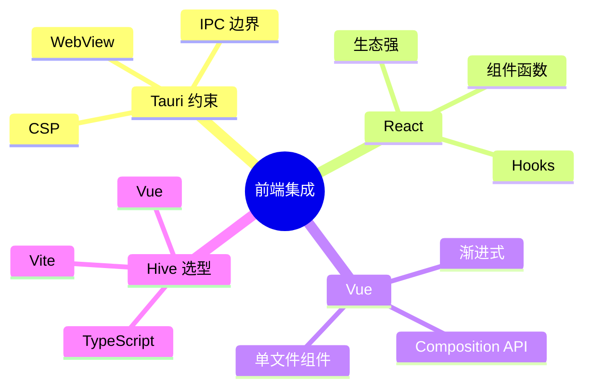
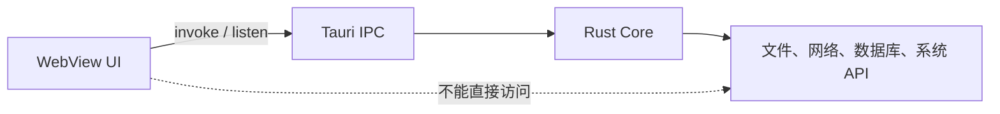
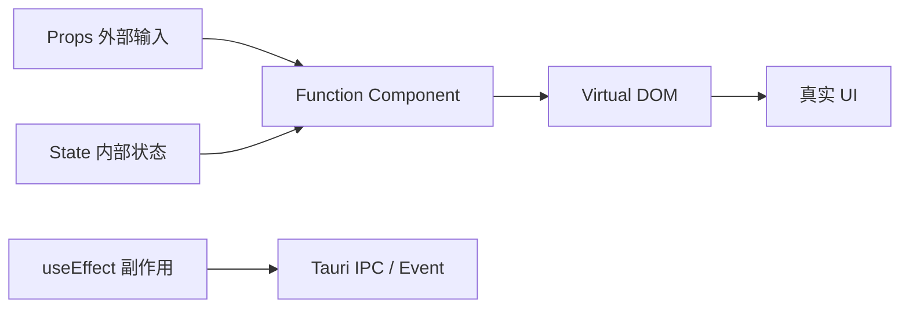
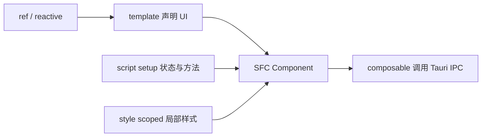
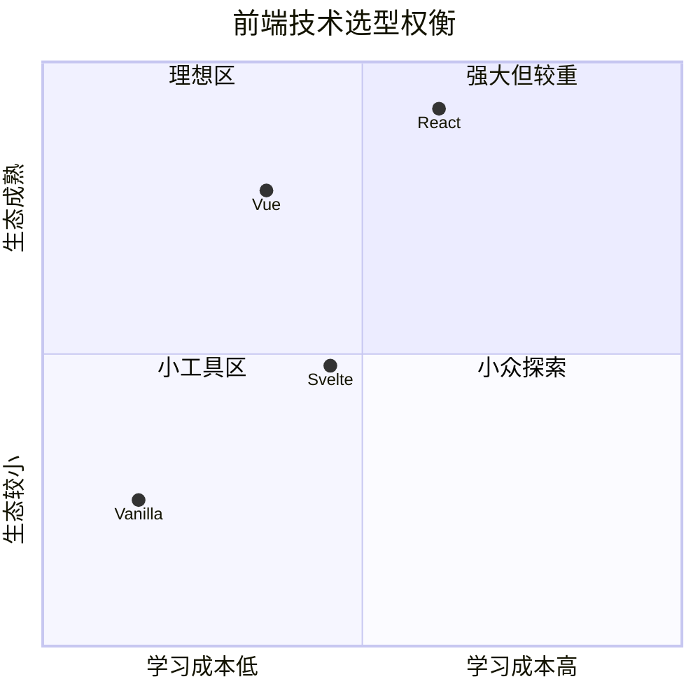

# 第十二章 前端集成：选择你的武器

> *"Tauri 不规定你怎样写 UI，它只规定前端不能绕过安全边界。"*

从这一章开始，Hive 不再只是 Rust Core 的练习项目，而要变成一个真正可用的桌面应用。前端不是 Tauri 的附属品，它承担了信息架构、交互效率、视觉一致性和错误反馈。本章比较 Vanilla、React、Vue、Svelte 四种路线，并给出 Hive 的选型。



---

## 12.1 Tauri 前端的共同约束

无论选择哪个框架，Tauri 前端都运行在系统 WebView 中，通过 IPC 调用 Rust 后端。它不像 Electron renderer 那样天然拥有 Node.js 能力。



这带来三个工程约束：

1. 前端把系统能力看成 API，而不是本地全权限运行时。
2. 所有跨边界数据都必须可序列化、可版本化、可验证。
3. UI 构建产物必须适合嵌入：静态资源、路由、CSP、加载路径都要受控。

---

## 12.2 Vanilla：最小依赖路线

Vanilla 前端适合工具型小应用：设置面板、内部工具、单窗口编辑器。它的优势是构建链简单，缺点是状态和组件复用很快会变得混乱。

```javascript
import { invoke } from "@tauri-apps/api/core";

const editor = document.querySelector("#editor");
const save = document.querySelector("#save");

save.addEventListener("click", async () => {
  await invoke("save_note", { content: editor.value });
});
```

Vanilla 路线的判断标准很直接：如果页面少于五个、状态关系简单、没有复杂列表或协作交互，它很舒服。一旦出现多视图、缓存、乐观更新、快捷键上下文，应该尽早换成组件框架。

---

## 12.3 React：生态与工程化优先

React 是 Meta 开源的 UI 库，它的核心思想是：**界面是状态的函数**。你把状态组织好，React 根据状态计算出应该显示什么。对于后端工程师，可以把 React 组件理解成“纯函数 + 局部状态 + 副作用边界”的组合。

React 不是完整框架，而是 UI 层。路由、状态管理、请求封装、表单、测试通常由生态包补齐。这是它的强大之处，也是复杂度来源：大型团队可以拼出非常成熟的工程体系，小团队也可能被选择淹没。

### 12.3.1 React 的基本心智模型



React 组件通常写成函数：

- `props` 是父组件传入的只读参数，类似函数参数。
- `state` 是组件自己的可变状态，通过 `useState` 更新。
- `useEffect` 用来处理副作用，例如订阅事件、调用 IPC、启动定时器。
- `hooks` 是一种组合逻辑的方式，可以把“加载笔记”“监听同步状态”封装成可复用函数。

React 适合大型产品团队，尤其是已有 TypeScript、组件库、状态管理和测试栈的团队。它的心智模型偏函数式，适合把 IPC 封装成 hooks。

```typescript
import { useEffect, useState } from "react";
import { invoke } from "@tauri-apps/api/core";

type Note = {
  id: number;
  title: string;
  content: string;
};

export function useNotes() {
  const [notes, setNotes] = useState<Note[]>([]);

  useEffect(() => {
    invoke<Note[]>("list_notes").then(setNotes);
  }, []);

  return notes;
}
```

React 的优势是生态巨大，缺点是应用规模一大，状态层、服务层、组件层很容易各自发明一套约定。Tauri 项目中应把 IPC 封装在 `src/api`，让组件只消费 typed function。

### 12.3.2 React 在 Tauri 中的推荐组织

React + Tauri 的关键不是把 `invoke()` 写进每个按钮，而是建立清晰的 API 层和 hooks 层。

```text
src/
├── api/
│   └── notes.ts          # invoke 封装
├── hooks/
│   └── useNotes.ts       # React 状态与生命周期
├── components/
│   └── NoteList.tsx
└── views/
    └── NotesPage.tsx
```

一个健康的边界是：`api` 知道 Tauri，`hooks` 知道 React，组件只知道数据和事件处理函数。这样以后从 Tauri 迁移到 Web 版，或者把后端 mock 掉做测试，都不会牵动整个 UI。

```typescript
// api/notes.ts
import { invoke } from "@tauri-apps/api/core";

export type Note = { id: string; title: string; content: string };

export function listNotes(): Promise<Note[]> {
  return invoke("list_notes");
}
```

```typescript
// hooks/useNotes.ts
import { useEffect, useState } from "react";
import { listNotes, type Note } from "../api/notes";

export function useNotes() {
  const [notes, setNotes] = useState<Note[]>([]);
  const [loading, setLoading] = useState(true);

  useEffect(() => {
    listNotes()
      .then(setNotes)
      .finally(() => setLoading(false));
  }, []);

  return { notes, loading };
}
```

如果团队选择 React，建议从第一天就启用 TypeScript、ESLint、组件测试和统一的状态管理约定。React 的自由度很高，越自由越需要团队纪律。

---

## 12.4 Vue：渐进式与团队可读性

Vue 是 Evan You 创建的渐进式前端框架。它的核心思想是：**把模板、状态和样式放在一个可读的组件单元里**，同时通过响应式系统自动追踪依赖。对于后端工程师，Vue 往往比 React 更像“有框架约束的 MVC 视图层”：模板声明 UI，脚本组织状态，样式局部化。

Vue 的“渐进式”意味着你可以只用它写一个页面，也可以配合 Vue Router、Pinia、Vite、测试工具组成完整应用。它不像 React 那样把大部分选择交给生态，也不像传统大框架那样一开始就规定所有目录。

### 12.4.1 Vue 的基本心智模型



Vue 单文件组件（SFC）通常包含三块：

- `<template>` 写结构，接近 HTML，容易扫描。
- `<script setup>` 写状态、方法、生命周期和导入。
- `<style scoped>` 写局部样式，减少全局 CSS 污染。
- `ref` / `reactive` 提供响应式状态，状态变化后模板自动更新。
- `computed` / `watch` 用来表达派生状态和副作用。

Vue 的模板、组合式 API 与单文件组件，对后端工程师通常更友好。Hive 这类笔记与协作应用，既有表单、列表、编辑器，也有实时状态，Vue + TypeScript 是一个稳健选择。

```vue
<script setup lang="ts">
import { onMounted, ref } from "vue";
import { invoke } from "@tauri-apps/api/core";

type Note = { id: number; title: string; content: string };

const notes = ref<Note[]>([]);

onMounted(async () => {
  notes.value = await invoke<Note[]>("list_notes");
});
</script>

<template>
  <ul>
    <li v-for="note in notes" :key="note.id">{{ note.title }}</li>
  </ul>
</template>
```

Vue 的关键收益是约束清晰：模板负责视图，composable 负责状态和副作用，API 模块负责 IPC。

### 12.4.2 Vue 在 Tauri 中的推荐组织

Vue 项目中，可以把 Tauri 事件监听封装成 composable，把跨页面状态放进 Pinia 或简单 store。

```text
src/
├── api/
│   └── notes.ts
├── composables/
│   ├── useNotes.ts
│   └── useTauriEvent.ts
├── stores/
│   └── sync.ts
├── components/
│   └── NoteList.vue
└── views/
    └── NotesView.vue
```

```typescript
// composables/useNotes.ts
import { onMounted, ref } from "vue";
import { listNotes, type Note } from "../api/notes";

export function useNotes() {
  const notes = ref<Note[]>([]);
  const loading = ref(true);

  onMounted(async () => {
    try {
      notes.value = await listNotes();
    } finally {
      loading.value = false;
    }
  });

  return { notes, loading };
}
```

Vue 的优势是“默认组织方式”更明显。对一本面向后端工程师的 Tauri 书来说，这很重要：读者的认知预算应该花在 Rust、IPC、状态一致性和安全边界上，而不是先迷失在前端架构选择里。

### 12.4.3 React 与 Vue 的简短对照

| 维度 | React | Vue |
|------|-------|-----|
| 定位 | UI library，生态组合成框架 | 渐进式框架，官方配套更完整 |
| 组件写法 | JSX / TSX，逻辑与标记混写 | SFC，template/script/style 分区 |
| 状态模型 | hooks + 外部状态库 | ref/reactive + Pinia |
| 学习曲线 | 概念少但工程选择多 | 概念稍多但默认路径清晰 |
| Tauri 适配 | hooks 封装 IPC 很自然 | composables 封装 IPC 很自然 |
| 适合团队 | 已有 React 资产或大型前端团队 | 后端转前端、工具型产品、渐进建设 |

---

## 12.5 Svelte：轻量与编译期优化

Svelte 把大量框架工作前移到编译期，运行时较轻。对于 Tauri 这种强调体积和启动速度的应用，Svelte 很有吸引力。

```html
<script lang="ts">
  import { invoke } from "@tauri-apps/api/core";

  let title = "";

  async function createNote() {
    await invoke("create_note", { request: { title, content: "", tags: [] } });
    title = "";
  }
</script>

<input bind:value={title} />
<button on:click={createNote}>保存</button>
```

Svelte 的主要成本是团队熟悉度和生态规模。如果团队已经大量使用 React 或 Vue，不必为了轻量而重新训练全队。

---

## 12.6 Hive 的选择：Vue + TypeScript + Vite

Hive 选择 Vue + TypeScript + Vite，理由不是“最好”，而是它在学习成本、可维护性、构建速度之间最均衡。



推荐结构：

```text
src/
├── api/
│   ├── notes.ts
│   └── sync.ts
├── components/
├── composables/
├── stores/
├── views/
└── main.ts
```

`api` 封装 IPC，`stores` 保存跨页面状态，`composables` 组合事件监听、快捷键、生命周期。Rust Core 的命令名不应散落在组件里。

---

## 12.7 路由、资源与 CSP

桌面应用推荐使用 hash 路由或 history fallback，避免刷新后 WebView 找不到本地路径。静态资源应通过前端构建系统打包，用户文件则通过 Rust 或官方插件读取。

```typescript
import { createRouter, createWebHashHistory } from "vue-router";

export const router = createRouter({
  history: createWebHashHistory(),
  routes: [
    { path: "/", component: () => import("./views/NotesView.vue") },
    { path: "/settings", component: () => import("./views/SettingsView.vue") },
  ],
});
```

CSP 不应在开发时关闭后遗忘。开发期可以放宽 `connect-src`，发布前必须收紧到应用真正需要的范围。

---

## 12.8 小结

前端选型不是框架信仰，而是组织能力、应用复杂度和运行时约束的交集。Hive 采用 Vue + TypeScript + Vite，并把 IPC 当成稳定 API 边界处理。

下一章我们把数据落到本地：从文件到 SQLite，建立 Hive 的持久化层。
