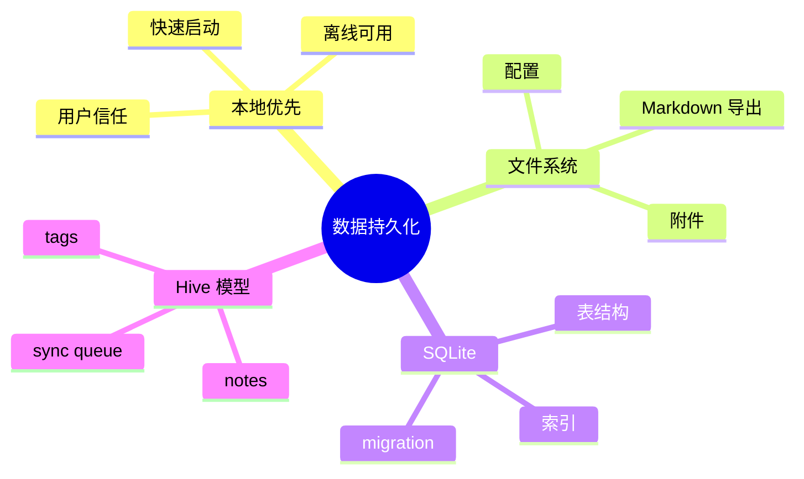
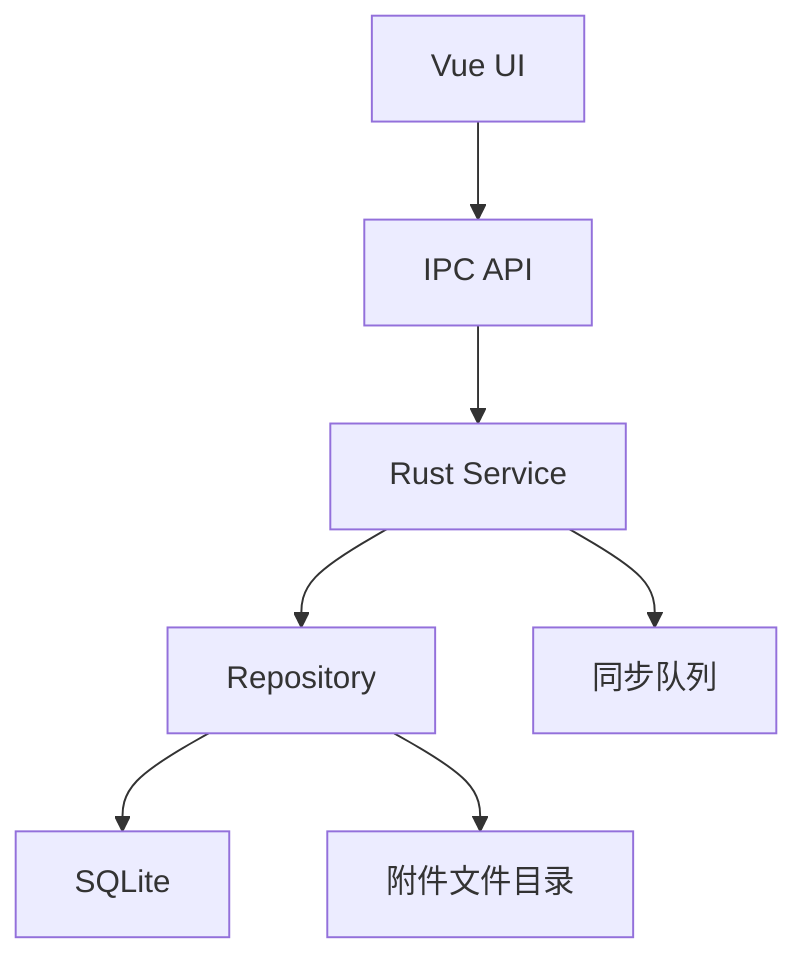
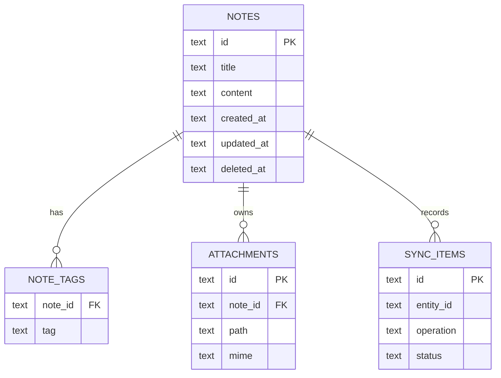

# 第十三章 数据持久化：从文件到 SQLite

> *"桌面应用最怕的不是没有云，而是离线时什么都做不了。"*

Hive 的第一条产品原则是本地优先：用户打开应用、编辑笔记、搜索历史、查看最近消息，都不应该依赖网络。本章从文件存储讲起，最终落到 SQLite + Rust service 的持久化架构。



---

## 13.1 本地优先的分层模型



这套模型把“存储在哪里”和“业务怎样表达”分开。UI 不关心 SQLite，Service 不关心按钮，Repository 不关心窗口。

---

## 13.2 文件存储适合什么

Markdown 笔记天然适合文件存储。它可读、可 diff、容易导入导出。配置、草稿、导出结果也可以放在应用数据目录。

```rust
use tauri::Manager;

#[tauri::command]
async fn save_markdown(
    app: tauri::AppHandle,
    name: String,
    content: String,
) -> Result<(), String> {
    let dir = app.path().app_data_dir().map_err(|e| e.to_string())?;
    std::fs::create_dir_all(&dir).map_err(|e| e.to_string())?;
    std::fs::write(dir.join(name), content).map_err(|e| e.to_string())?;
    Ok(())
}
```

文件存储的问题也明显：按标签查询、全文搜索、排序分页、冲突合并都会变复杂。Hive 可以把正文导出为 Markdown，但主数据模型仍应进入数据库。

---

## 13.3 SQLite 的位置

SQLite 是桌面应用的默认好选择：零服务、事务可靠、查询能力强、备份容易。它不是“轻量玩具数据库”，而是非常成熟的嵌入式数据库。

```sql
CREATE TABLE notes (
  id TEXT PRIMARY KEY,
  title TEXT NOT NULL,
  content TEXT NOT NULL,
  created_at TEXT NOT NULL,
  updated_at TEXT NOT NULL,
  deleted_at TEXT
);

CREATE TABLE note_tags (
  note_id TEXT NOT NULL,
  tag TEXT NOT NULL,
  PRIMARY KEY (note_id, tag)
);
```

---

## 13.4 使用 sqlx 建模

`sqlx` 提供异步数据库访问、连接池、查询映射。Tauri Core 中可以把连接池作为 managed state。

```rust
use sqlx::{sqlite::SqlitePoolOptions, SqlitePool};

pub struct AppState {
    pub db: SqlitePool,
}

pub async fn open_db(path: &str) -> Result<SqlitePool, sqlx::Error> {
    SqlitePoolOptions::new()
        .max_connections(5)
        .connect(path)
        .await
}
```

创建笔记：

```rust
#[derive(serde::Serialize, sqlx::FromRow)]
pub struct Note {
    pub id: String,
    pub title: String,
    pub content: String,
    pub created_at: String,
    pub updated_at: String,
}

pub async fn insert_note(db: &SqlitePool, note: &Note) -> Result<(), sqlx::Error> {
    sqlx::query(
        "INSERT INTO notes (id, title, content, created_at, updated_at)
         VALUES (?, ?, ?, ?, ?)",
    )
    .bind(&note.id)
    .bind(&note.title)
    .bind(&note.content)
    .bind(&note.created_at)
    .bind(&note.updated_at)
    .execute(db)
    .await?;

    Ok(())
}
```

---

## 13.5 Migration：让数据结构可演进

桌面应用一旦发布，用户本地就有各种历史版本数据库。迁移脚本必须随应用一起发布。

```text
src-tauri/migrations/
├── 0001_create_notes.sql
├── 0002_add_sync_state.sql
└── 0003_create_attachments.sql
```

```rust
sqlx::migrate!("./migrations").run(&pool).await?;
```

迁移原则：

1. 只向前迁移，不指望用户手动回滚。
2. 大表变更分批执行，避免启动时长时间卡住。
3. 每次迁移都要能重复验证：旧库升级、新库初始化都要测试。

---

## 13.6 Hive 的数据模型



Hive 使用软删除支持撤销与同步冲突处理。附件只在数据库保存元数据，真实文件放在 app data 目录，避免数据库膨胀。

---

## 13.7 小结

文件适合人类可读的导入导出，SQLite 适合应用内部的查询和一致性。Hive 的持久化层采用 SQLite 保存结构化数据，文件系统保存附件，并通过 migration 支撑长期升级。

下一章我们让 Hive 连接云端 API，并设计离线队列。
