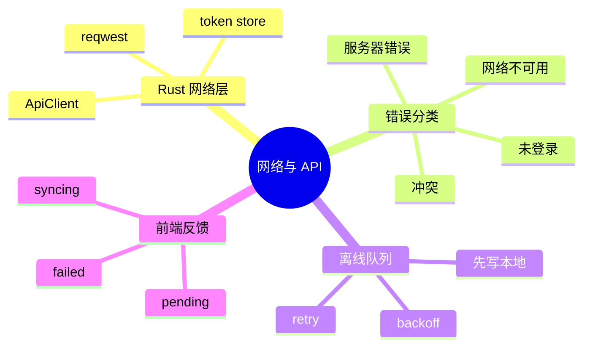
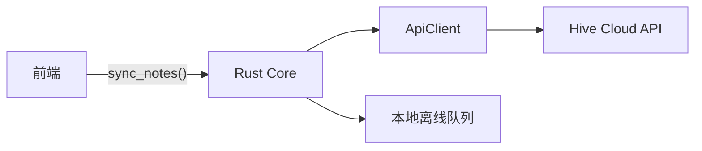
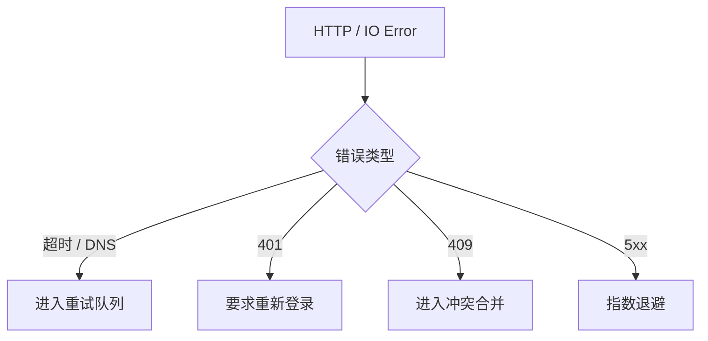

# 第十四章 网络与 API 调用

> *"桌面客户端不是网页的外壳，它要在网络不可靠时继续工作。"*

客户端访问后端 API 看似只是发 HTTP 请求，但桌面环境多了代理、证书、离线、重试、后台同步和本地状态一致性。本章用 `reqwest` 设计 Hive 的云同步入口。



---

## 14.1 网络调用应该放在哪里

前端当然可以 `fetch()`，但 Hive 把外部 API 调用放在 Rust Core 中。



这样做有四个收益：证书与代理配置集中、token 不暴露给 UI、错误模型一致、离线队列更容易和 SQLite 放在同一事务边界。

---

## 14.2 reqwest 客户端封装

```rust
#[derive(Clone)]
pub struct ApiClient {
    base_url: String,
    client: reqwest::Client,
}

impl ApiClient {
    pub fn new(base_url: String) -> Result<Self, reqwest::Error> {
        let client = reqwest::Client::builder()
            .user_agent("Hive Desktop/0.1")
            .timeout(std::time::Duration::from_secs(15))
            .build()?;

        Ok(Self { base_url, client })
    }

    pub async fn push_note(&self, token: &str, note: &Note) -> Result<(), reqwest::Error> {
        self.client
            .post(format!("{}/notes", self.base_url))
            .bearer_auth(token)
            .json(note)
            .send()
            .await?
            .error_for_status()?;
        Ok(())
    }
}
```

不要在每个命令里创建 `Client`。连接池、DNS 缓存和 TLS 状态都应该复用。

---

## 14.3 错误分类

网络错误不能只变成一句“请求失败”。用户关心的是能否重试、是否需要登录、数据有没有保存。

```rust
#[derive(Debug, thiserror::Error)]
pub enum SyncError {
    #[error("network unavailable")]
    Network,
    #[error("authentication required")]
    Unauthorized,
    #[error("remote conflict")]
    Conflict,
    #[error("server error: {0}")]
    Server(u16),
}
```



---

## 14.4 离线队列

Hive 的编辑操作先写本地数据库，再记录一个待同步项。网络恢复后后台任务逐条推送。

```sql
CREATE TABLE sync_queue (
  id TEXT PRIMARY KEY,
  entity_type TEXT NOT NULL,
  entity_id TEXT NOT NULL,
  operation TEXT NOT NULL,
  payload TEXT NOT NULL,
  attempts INTEGER NOT NULL DEFAULT 0,
  next_retry_at TEXT,
  created_at TEXT NOT NULL
);
```

同步器的循环：

```rust
pub async fn run_sync_once(db: &SqlitePool, api: &ApiClient) -> Result<(), SyncError> {
    let items = load_due_items(db).await?;
    for item in items {
        match push_item(api, &item).await {
            Ok(()) => mark_synced(db, &item.id).await?,
            Err(err) => schedule_retry(db, &item.id, &err).await?,
        }
    }
    Ok(())
}
```

---

## 14.5 Token 与本地凭据

访问令牌不应该明文存在 SQLite。优先使用系统 keychain：macOS Keychain、Windows Credential Manager、Linux Secret Service。Tauri 可通过插件或 Rust crate 封装这些能力。

```rust
pub trait TokenStore {
    fn get_token(&self) -> Result<Option<String>, anyhow::Error>;
    fn set_token(&self, token: &str) -> Result<(), anyhow::Error>;
    fn clear_token(&self) -> Result<(), anyhow::Error>;
}
```

把 `TokenStore` 做成 trait 的好处是测试时可以替换成内存实现。

---

## 14.6 前端反馈

同步不是一个弹窗，而是一组状态：本地已保存、等待同步、同步中、冲突、失败可重试。

```typescript
type SyncState =
  | { kind: "local" }
  | { kind: "pending"; count: number }
  | { kind: "syncing"; percent?: number }
  | { kind: "conflict"; noteId: string }
  | { kind: "failed"; message: string };
```

这些状态来自 Rust 事件，前端只负责展示，不自己推断网络状态。

---

## 14.7 小结

网络层的核心不是 `GET` 和 `POST`，而是失败时的产品体验。Hive 采用 Rust Core 统一访问 API，本地事务先行，再用离线队列和可分类错误保证用户的修改不会丢。

下一章我们进入实时通信，用 WebSocket 实现群聊和在线状态。
