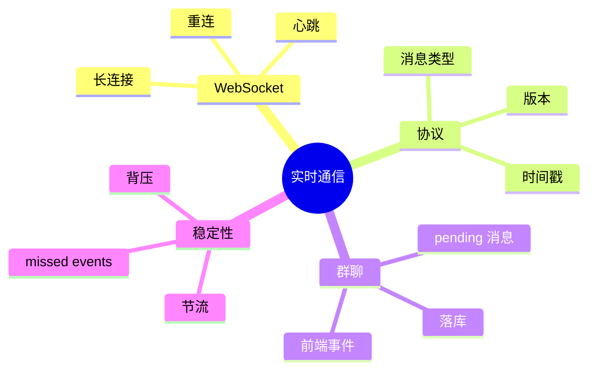
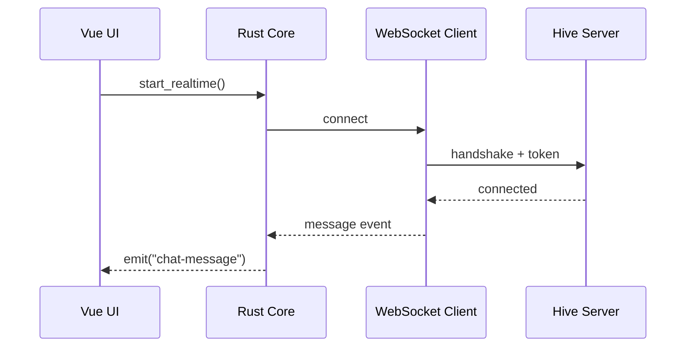
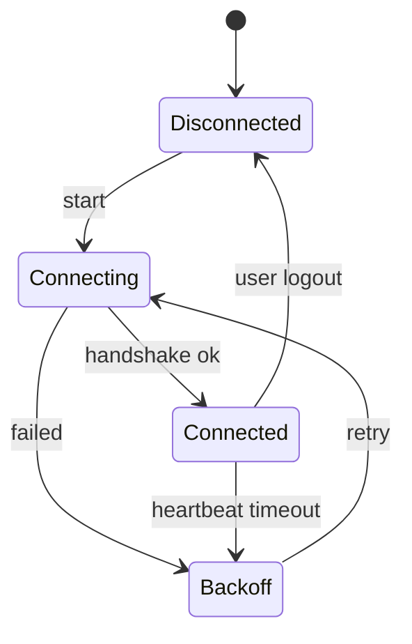

# 第十五章 实时通信：WebSocket 与群聊

> *"同步解决最终一致，实时通信解决此刻发生了什么。"*

Hive 从个人笔记走向团队协作，需要群聊、在线状态、正在编辑提示和服务端推送。HTTP 适合请求响应，WebSocket 适合持续连接。本章设计 Hive 的实时通信层。



---

## 15.1 WebSocket 的角色



Hive 不让前端直接持有 WebSocket。Rust Core 负责连接、重连、心跳、鉴权和消息落库；前端通过事件订阅得到 UI 所需数据。

---

## 15.2 消息协议

协议要有版本、类型、ID 和时间戳，便于调试和兼容。

```rust
#[derive(Debug, serde::Serialize, serde::Deserialize)]
#[serde(tag = "type", content = "payload", rename_all = "snake_case")]
pub enum RealtimeMessage {
    ChatPosted {
        room_id: String,
        message_id: String,
        author: String,
        text: String,
        sent_at: String,
    },
    PresenceChanged {
        user_id: String,
        status: Presence,
    },
    Typing {
        room_id: String,
        user_id: String,
    },
}

#[derive(Debug, serde::Serialize, serde::Deserialize)]
#[serde(rename_all = "snake_case")]
pub enum Presence {
    Online,
    Away,
    Offline,
}
```

JSON 足够适合早期版本。等消息量和性能压力出现，再考虑 MessagePack 或 Protobuf。

---

## 15.3 tokio-tungstenite 客户端

```rust
use futures_util::{SinkExt, StreamExt};
use tokio_tungstenite::connect_async;
use tungstenite::Message;

pub async fn connect_loop(url: String) -> anyhow::Result<()> {
    let (socket, _) = connect_async(url).await?;
    let (mut writer, mut reader) = socket.split();

    writer.send(Message::Text(r#"{"type":"hello"}"#.into())).await?;

    while let Some(frame) = reader.next().await {
        let frame = frame?;
        if let Message::Text(text) = frame {
            let msg: RealtimeMessage = serde_json::from_str(&text)?;
            handle_message(msg).await?;
        }
    }

    Ok(())
}
```

真实项目要拆成 reader task、writer task 和 supervisor。不要把所有逻辑塞进一个循环。

---

## 15.4 连接监督与重连



重连策略：

1. 指数退避，避免网络恢复前疯狂重试。
2. 用户登出立即停止，不在后台偷偷重连。
3. 重连后拉取 missed events，补齐断线期间消息。

---

## 15.5 群聊的数据流

收到群聊消息后，Core 先写 SQLite，再通知前端。这样前端刷新或崩溃后仍能看到消息。

```rust
pub async fn handle_chat_posted(
    db: &SqlitePool,
    app: &tauri::AppHandle,
    msg: ChatMessage,
) -> anyhow::Result<()> {
    insert_message(db, &msg).await?;
    app.emit("chat-message", &msg)?;
    Ok(())
}
```

发送消息则先生成本地临时 ID，展示为 pending，服务端确认后替换为正式 ID。

---

## 15.6 背压与限流

实时系统最容易被忽略的是背压。如果服务端快速推送一千条消息，前端不应被一千次事件刷新拖垮。

推荐做法：

1. Core 批量落库。
2. UI 事件按房间合并。
3. 前端虚拟列表渲染长消息历史。
4. typing、presence 这类高频状态使用节流。

```typescript
const flush = debounce(() => {
  chatStore.reloadCurrentRoom();
}, 100);
```

---

## 15.7 小结

WebSocket 是实时能力的传输层，不是架构本身。Hive 的实时层由 Rust Core 管理连接，由 SQLite 兜底一致性，由前端展示当前状态。

下一章我们接入桌面原生能力：托盘、通知、快捷键和剪贴板。
