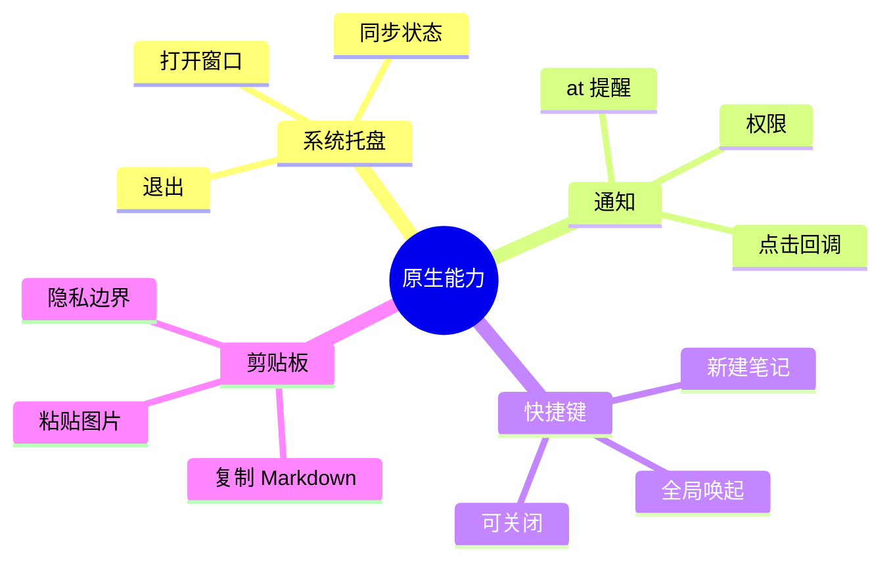
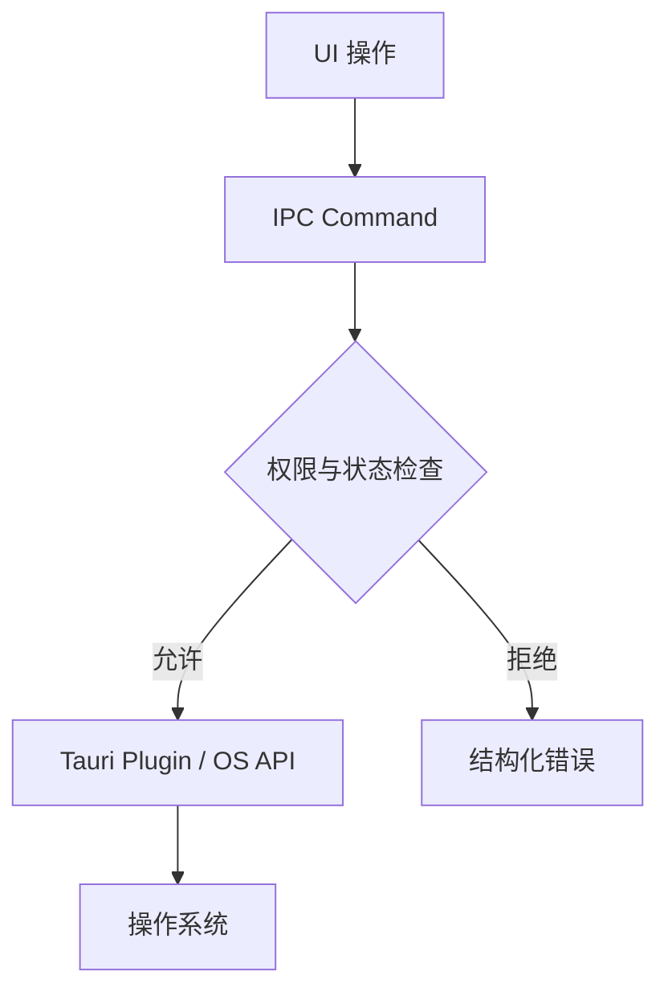
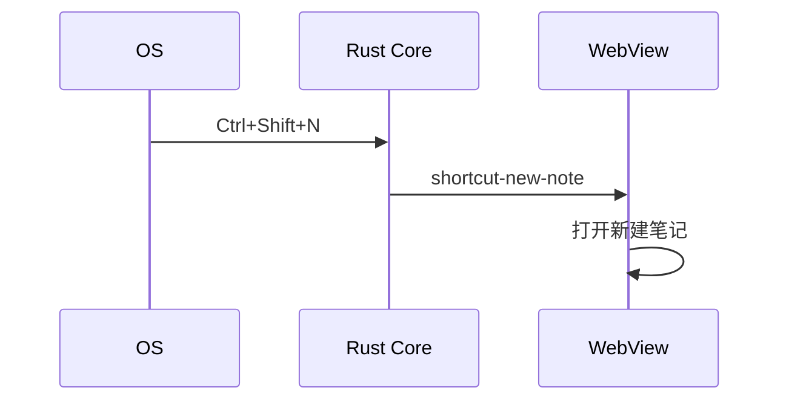

# 第十六章 原生能力：托盘、通知、快捷键、剪贴板

> *"桌面应用之所以像桌面应用，是因为它住在操作系统里。"*

Tauri 的价值不只是把网页装进窗口，而是让 Web UI 通过受控边界使用系统能力。本章为 Hive 加入系统托盘、桌面通知、全局快捷键和剪贴板。



---

## 16.1 原生能力的安全边界



原生能力要遵循两个原则：用户可预期、权限最小化。比如全局快捷键必须能在设置里关闭，通知必须尊重系统权限。

---

## 16.2 系统托盘

托盘适合常驻应用：快速打开、显示同步状态、退出应用。

```rust
use tauri::menu::{Menu, MenuItem};
use tauri::tray::TrayIconBuilder;

fn setup_tray(app: &tauri::App) -> tauri::Result<()> {
    let open = MenuItem::with_id(app, "open", "打开 Hive", true, None::<&str>)?;
    let quit = MenuItem::with_id(app, "quit", "退出", true, None::<&str>)?;
    let menu = Menu::with_items(app, &[&open, &quit])?;

    TrayIconBuilder::new()
        .menu(&menu)
        .on_menu_event(|app, event| match event.id.as_ref() {
            "open" => {
                if let Some(window) = app.get_webview_window("main") {
                    let _ = window.show();
                    let _ = window.set_focus();
                }
            }
            "quit" => app.exit(0),
            _ => {}
        })
        .build(app)?;
    Ok(())
}
```

---

## 16.3 桌面通知

通知不是日志。只有用户需要被打断时才发通知，例如有人 @ 你、同步失败需要处理。

```rust
#[tauri::command]
async fn notify_message(
    app: tauri::AppHandle,
    room: String,
    sender: String,
    text: String,
) -> Result<(), String> {
    app.notification()
        .builder()
        .title(format!("{} · {}", room, sender))
        .body(text)
        .show()
        .map_err(|e| e.to_string())
}
```

发布前要验证 macOS、Windows、Linux 的通知行为。不同平台的权限弹窗和点击回调并不完全一致。

---

## 16.4 全局快捷键

快捷键适合高频动作：快速唤起、全局搜索、截图或新建笔记。

```rust
use tauri_plugin_global_shortcut::{Code, GlobalShortcutExt, Modifiers, Shortcut};

fn register_shortcuts(app: &tauri::App) -> tauri::Result<()> {
    let shortcut = Shortcut::new(Some(Modifiers::CONTROL | Modifiers::SHIFT), Code::KeyN);
    app.global_shortcut().on_shortcut(shortcut, |app, _, event| {
        if event.state().is_pressed() {
            let _ = app.emit("shortcut-new-note", ());
        }
    })?;
    Ok(())
}
```



---

## 16.5 剪贴板

剪贴板可以支持复制 Markdown、粘贴图片、复制消息链接。注意剪贴板可能包含敏感内容，不要在后台自动读取。

```rust
#[tauri::command]
async fn copy_markdown(app: tauri::AppHandle, markdown: String) -> Result<(), String> {
    app.clipboard()
        .write_text(markdown)
        .map_err(|e| e.to_string())
}
```

剪贴板读取应该由用户动作触发，比如点击“从剪贴板导入”。

---

## 16.6 小结

原生能力让 Tauri 应用融入操作系统，但也会增加权限、安全和跨平台测试成本。Hive 把这些能力集中在 Rust Core，通过命令和事件暴露给前端。

下一章我们讨论安全加固：CSP、capabilities、IPC 权限与代码签名。
