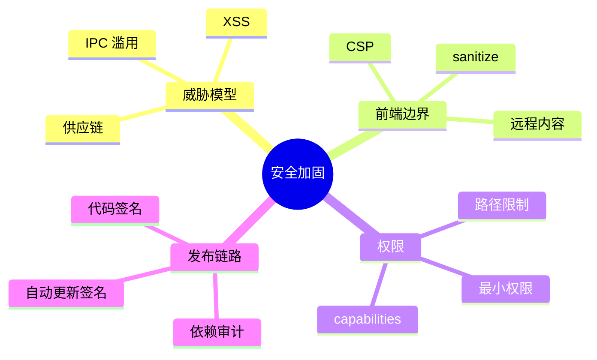
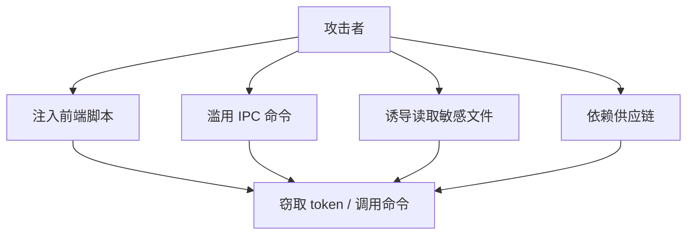
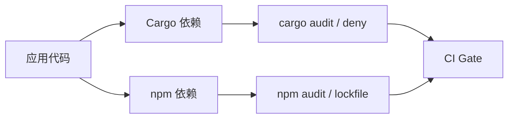

# 第十七章 安全加固

> *"桌面应用的攻击面，不会因为它看起来像网页而变小。"*

Tauri 默认比 Electron 更克制，但安全不是框架送你的护身符。本章从威胁模型开始，建立 Hive 的安全基线：CSP、能力配置、IPC 校验、依赖和签名。



---

## 17.1 威胁模型



安全设计先问三个问题：谁可能攻击、能触达什么输入、成功后能造成什么损害。Hive 的主要风险是 XSS 后滥用 IPC、恶意附件、token 泄漏和自动更新链路被污染。

---

## 17.2 CSP：限制前端能加载什么

内容安全策略用于限制脚本、样式、图片、网络连接来源。开发期常见的 `unsafe-inline` 不应直接进入生产。

```json
{
  "security": {
    "csp": "default-src 'self'; img-src 'self' asset: https://asset.localhost; connect-src 'self' https://api.example.com; script-src 'self'; style-src 'self' 'unsafe-inline'"
  }
}
```

样式通常需要一定放宽，脚本不应该放宽。远程内容应通过后端清洗或使用受限视图展示。

---

## 17.3 Capabilities：声明最小权限

Tauri 2 的 capability 文件让你按窗口声明可用权限。

```json
{
  "$schema": "../gen/schemas/desktop-schema.json",
  "identifier": "main-capability",
  "windows": ["main"],
  "permissions": [
    "core:default",
    "dialog:default",
    {
      "identifier": "fs:allow-read-text-file",
      "allow": [{ "path": "$APPDATA/hive/**" }]
    }
  ]
}
```

不要给主窗口“一揽子文件系统权限”。如果只需要应用数据目录，就只开放应用数据目录。

---

## 17.4 IPC 输入校验

Rust 类型系统能保证反序列化后的形状，但业务约束仍要自己检查。

```rust
#[derive(serde::Deserialize)]
pub struct CreateNoteRequest {
    title: String,
    content: String,
    tags: Vec<String>,
}

impl CreateNoteRequest {
    pub fn validate(&self) -> Result<(), AppError> {
        if self.title.trim().is_empty() {
            return Err(AppError::Validation("title is required".into()));
        }
        if self.title.len() > 120 {
            return Err(AppError::Validation("title too long".into()));
        }
        Ok(())
    }
}
```

路径参数尤其危险。不要让前端传任意绝对路径再由 Rust 读取，应该传业务 ID，由后端映射到允许目录。

---

## 17.5 依赖与供应链



建议基线：

1. 提交 `Cargo.lock` 和前端 lockfile。
2. CI 中跑 `cargo audit` 或 `cargo deny`。
3. 避免安装低维护、高权限的前端包。
4. 对自动更新包做签名校验。

---

## 17.6 代码签名与自动更新

代码签名解决“这个包是不是你发布的”，自动更新签名解决“更新内容有没有被篡改”。两者都属于发布链路安全，不是最后一天才补的配置。

发布前检查清单：

- macOS notarization 通过。
- Windows 签名证书有效。
- Linux 包元数据正确。
- 自动更新私钥不进入仓库和 CI 日志。
- 更新 manifest 可审计、可回滚。

---

## 17.7 小结

安全加固的目标不是把应用锁死，而是让每个能力都有边界。Hive 通过 CSP、capabilities、IPC 校验、依赖审计和签名发布建立一条可执行的安全基线。

下一章进入高级实践，学习如何开发 Tauri 插件。
