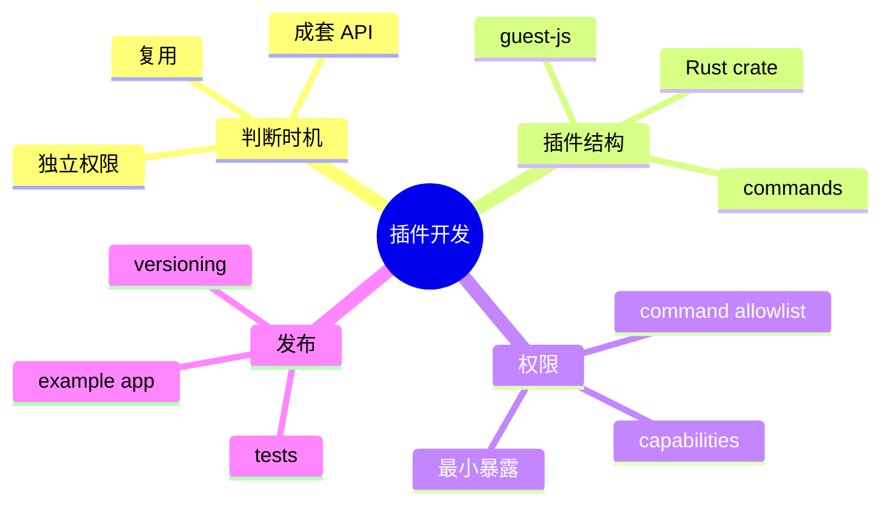
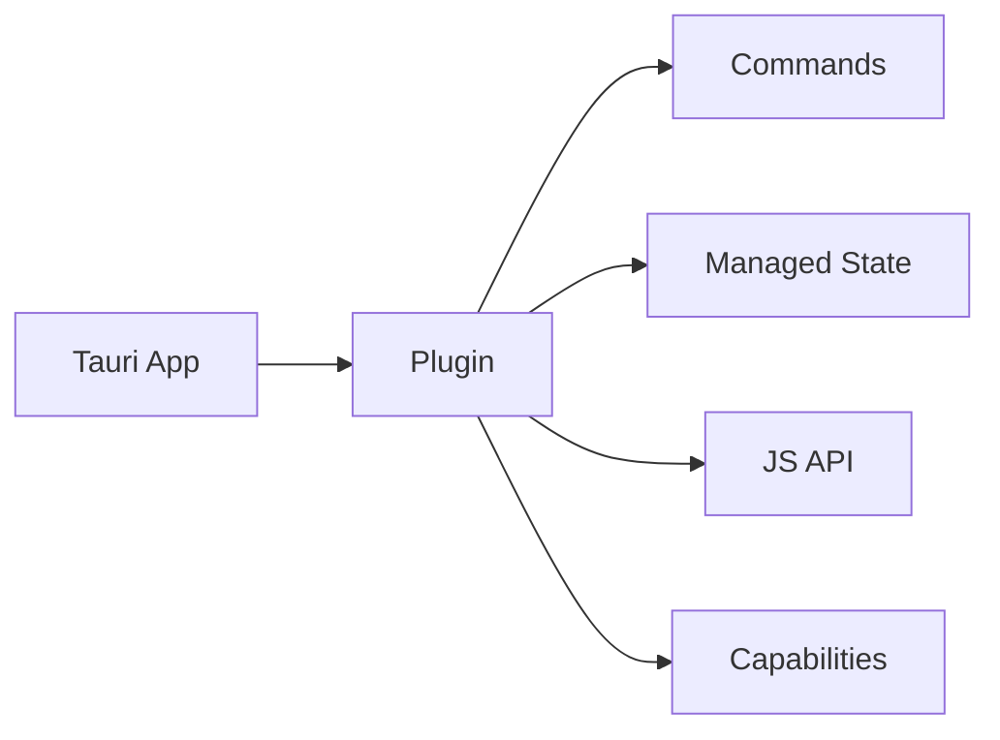
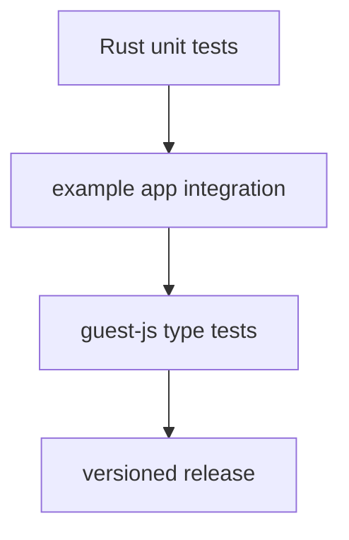

# 第十八章 插件开发

> *"当一项能力会被多个应用复用，它就不该永远藏在业务代码里。"*

Tauri 插件把 Rust 能力、前端 API、权限声明和初始化流程打包成一个可复用模块。本章用 Hive 的“工作区元数据”能力做例子，学习插件的边界和结构。



---

## 18.1 什么时候需要插件

不要为了“架构漂亮”过早插件化。下面三类能力适合插件：

1. 多个应用复用，例如日志、认证、加密存储。
2. 需要前后端成套 API，例如截图、设备访问。
3. 需要独立权限声明和初始化生命周期。



---

## 18.2 插件结构

典型插件包含 Rust crate 和前端 guest API。

```text
plugins/tauri-plugin-workspace/
├── Cargo.toml
├── src/
│   ├── lib.rs
│   ├── commands.rs
│   └── models.rs
└── guest-js/
    ├── index.ts
    └── package.json
```

Rust 侧负责真实能力，TypeScript 侧只做 typed wrapper。

---

## 18.3 Rust 插件入口

```rust
use tauri::{plugin::TauriPlugin, Runtime};

mod commands;

pub fn init<R: Runtime>() -> TauriPlugin<R> {
    tauri::plugin::Builder::new("workspace")
        .invoke_handler(tauri::generate_handler![
            commands::get_workspace,
            commands::set_workspace,
        ])
        .build()
}
```

应用注册：

```rust
tauri::Builder::default()
    .plugin(tauri_plugin_workspace::init())
    .run(tauri::generate_context!())?;
```

---

## 18.4 前端 API

```typescript
import { invoke } from "@tauri-apps/api/core";

export type Workspace = {
  id: string;
  name: string;
  root: string;
};

export function getWorkspace(): Promise<Workspace | null> {
  return invoke("plugin:workspace|get_workspace");
}

export function setWorkspace(workspace: Workspace): Promise<void> {
  return invoke("plugin:workspace|set_workspace", { workspace });
}
```

业务代码只 import `getWorkspace()`，不关心 IPC 命令名。

---

## 18.5 权限与配置

插件不应要求应用授予过大的默认权限。把权限拆细，让应用按需启用。

```json
{
  "identifier": "workspace-default",
  "description": "Read and write Hive workspace metadata",
  "commands": {
    "allow": ["get_workspace", "set_workspace"]
  }
}
```

---

## 18.6 测试插件



插件测试至少包含 Rust 单元测试和一个 example app。否则你只能证明 crate 能编译，不能证明 Tauri 运行时集成正确。

---

## 18.7 小结

插件是复用边界，不是文件夹重命名。Hive 只有在能力跨应用复用、需要前后端成套 API、或需要独立权限声明时才插件化。

下一章我们系统整理测试策略。
