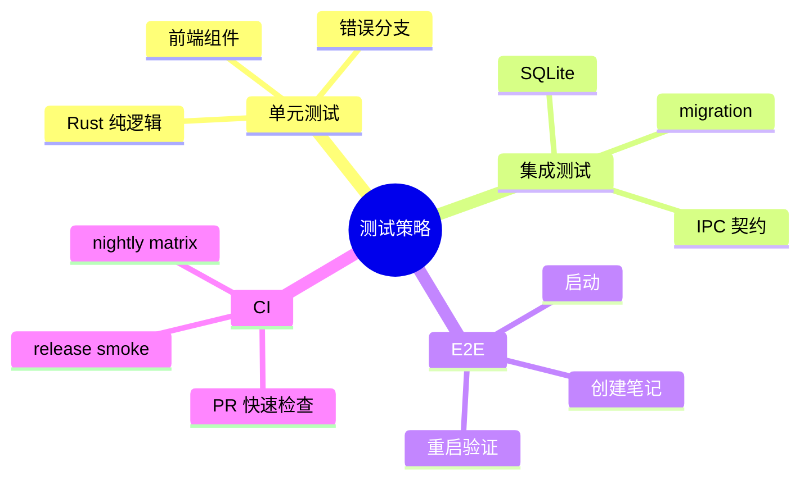
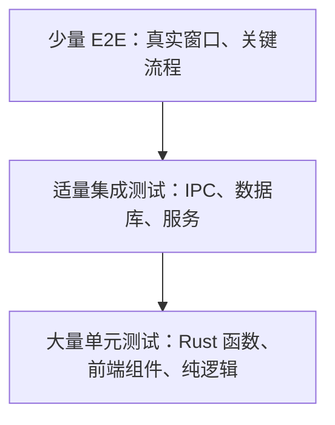
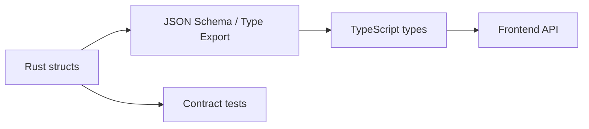

# 第十九章 测试策略

> *"桌面应用的测试，不该只在发布前靠人点一遍。"*

Tauri 应用横跨 Rust、前端、IPC、数据库和系统能力。测试策略必须分层：底层快速、上层真实、关键路径自动化。本章建立 Hive 的测试金字塔。



---

## 19.1 测试金字塔



越靠下越快、越稳定；越靠上越接近用户，但也更慢更脆。不要用 E2E 覆盖所有边界条件，也不要只靠单元测试证明应用可用。

---

## 19.2 Rust 单元测试

把业务逻辑从 Tauri command 中拆出来，才能轻松测试。

```rust
pub fn validate_title(title: &str) -> Result<(), String> {
    if title.trim().is_empty() {
        return Err("title is required".into());
    }
    if title.len() > 120 {
        return Err("title too long".into());
    }
    Ok(())
}

#[cfg(test)]
mod tests {
    use super::*;

    #[test]
    fn rejects_blank_title() {
        assert!(validate_title("   ").is_err());
    }
}
```

---

## 19.3 数据库集成测试

SQLite 测试要覆盖 migration、事务和查询语义。推荐使用临时目录或内存数据库。

```rust
#[tokio::test]
async fn creates_and_lists_notes() {
    let db = open_test_db().await;
    migrate(&db).await.unwrap();

    create_note(&db, "n1", "Hello", "Body").await.unwrap();
    let notes = list_notes(&db).await.unwrap();

    assert_eq!(notes.len(), 1);
    assert_eq!(notes[0].title, "Hello");
}
```

---

## 19.4 前端组件测试

前端测试关注渲染、交互和状态变化。IPC API 应被 mock 成 typed function。

```typescript
import { mount } from "@vue/test-utils";
import NotesView from "./NotesView.vue";

it("renders notes", async () => {
  const wrapper = mount(NotesView, {
    global: {
      provide: {
        notesApi: { list: async () => [{ id: 1, title: "Hello" }] },
      },
    },
  });

  await flushPromises();
  expect(wrapper.text()).toContain("Hello");
});
```

---

## 19.5 IPC 契约测试

IPC 是前后端契约，最怕双方各改各的。可以把请求响应类型放到共享 schema，或生成 TypeScript 类型。



契约测试至少覆盖命令名、参数名、错误格式和核心返回字段。

---

## 19.6 E2E 测试

E2E 覆盖用户关键路径：

1. 启动应用。
2. 创建笔记。
3. 重启后笔记仍在。
4. 修改后进入待同步状态。
5. 模拟网络恢复后同步完成。

桌面 E2E 可以通过 WebDriver 或 Playwright 驱动 WebView，系统能力则通过测试替身降低不稳定性。

---

## 19.7 CI 集成

```text
pull request
├── cargo fmt / clippy / test
├── npm typecheck / test
├── migration smoke test
├── sphinx docs build
└── nightly e2e matrix
```

PR 阶段追求快，nightly 阶段追求覆盖面。跨平台打包测试可以放到 nightly 或 release 分支。

---

## 19.8 小结

Hive 的测试策略不是追求某个覆盖率数字，而是把风险放到合适层级验证：纯逻辑单元测，存储集成测，IPC 做契约测，关键用户流程做 E2E。

下一章我们关注性能优化。
