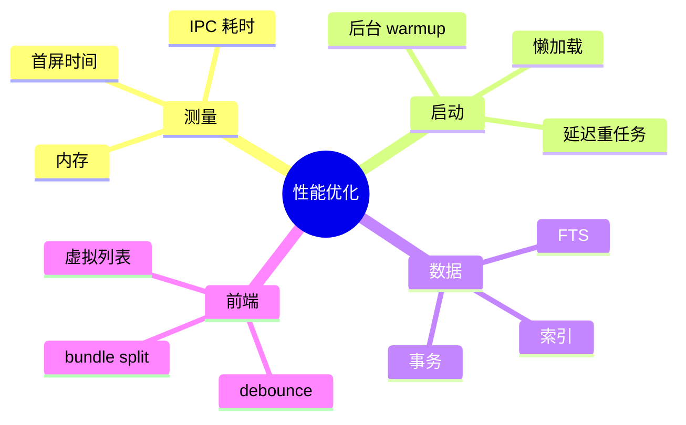
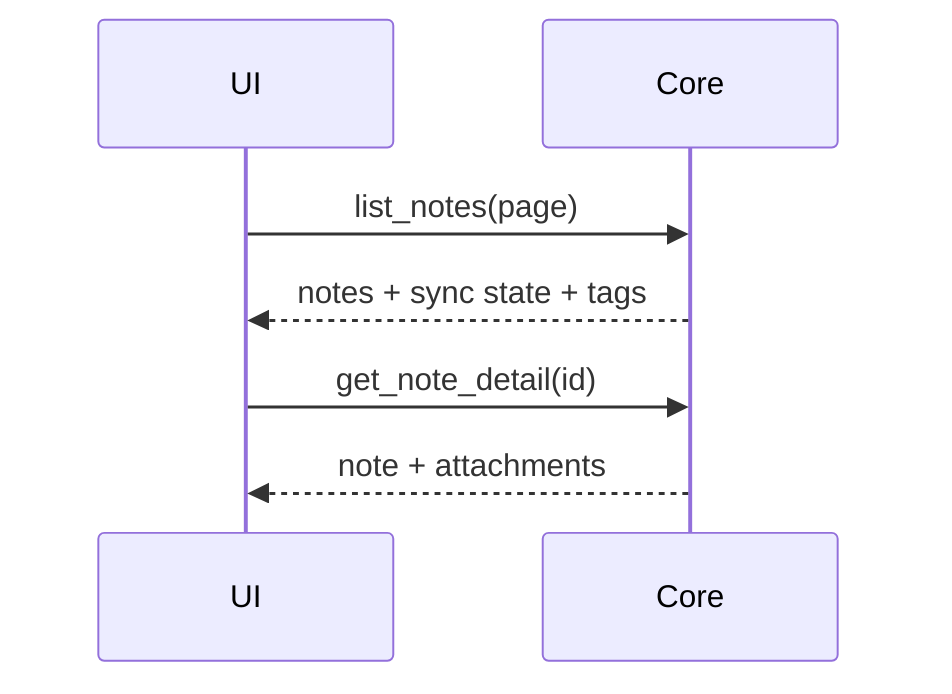

# 第二十章 性能优化

> *"Tauri 的轻量只是起点，真正的性能来自每一层都不浪费。"*

Tauri 避免了 Electron 打包 Chromium 的体积成本，但应用仍可能启动慢、列表卡、IPC 频繁、数据库查询差。本章建立 Hive 的性能分析方法。



---

## 20.1 先测量，再优化


常用指标：

- 冷启动到首屏时间。
- 空闲内存。
- 创建、搜索、打开笔记耗时。
- IPC 调用次数与耗时。
- 大列表滚动帧率。

---

## 20.2 启动性能

启动路径上只做首屏必需工作。migration、同步、索引重建可以延后或后台执行。

```rust
tauri::Builder::default()
    .setup(|app| {
        let handle = app.handle().clone();
        tauri::async_runtime::spawn(async move {
            if let Err(err) = warm_up_background_services(handle).await {
                eprintln!("background warmup failed: {err}");
            }
        });
        Ok(())
    });
```

启动优化清单：

1. 前端 bundle 分块，非首屏页面懒加载。
2. Rust setup 避免同步 I/O。
3. 数据库连接和轻量查询可以启动时做，重任务后台做。
4. 首屏展示本地缓存，而不是等待云同步。

---

## 20.3 IPC 性能

IPC 是边界，不是函数调用。频繁小调用会积累明显开销。



优化方法：

- 合并首屏所需数据，避免瀑布式调用。
- 大数据分页或流式传输。
- 进度类更新使用 Channel 或节流事件。
- 前端 API 层记录命令耗时。

---

## 20.4 数据库性能

SQLite 性能通常足够好，前提是有索引、事务和合理查询。

```sql
CREATE INDEX idx_notes_updated_at ON notes(updated_at);
CREATE INDEX idx_note_tags_tag ON note_tags(tag);
```

批量写入必须使用事务：

```rust
let mut tx = db.begin().await?;
for note in notes {
    insert_note_tx(&mut tx, note).await?;
}
tx.commit().await?;
```

全文搜索可以使用 SQLite FTS，而不是把所有内容拉到前端过滤。

---

## 20.5 前端渲染性能

Hive 的消息列表和笔记列表都可能很长，应使用虚拟列表。编辑器则要避免每个键盘输入都触发昂贵同步。

```typescript
const saveDraft = debounce(async (content: string) => {
  await notesApi.saveDraft(currentNoteId.value, content);
}, 500);
```

CSS 动画和阴影也有成本。桌面工具界面更需要稳定、清晰、快速，而不是复杂动效。

---

## 20.6 Rust profiling

Rust 侧可以用 tracing 记录关键 span。

```rust
#[tracing::instrument(skip(db))]
pub async fn search_notes(db: &SqlitePool, query: &str) -> anyhow::Result<Vec<Note>> {
    query_notes(db, query).await
}
```

对 CPU 密集问题可使用 flamegraph，对异步任务可结合 tracing subscriber 分析等待时间。

---

## 20.7 小结

性能优化是一套闭环：目标、测量、定位、修改、验证。Hive 的重点在启动路径、IPC 批量化、SQLite 索引、虚拟列表和后台任务调度。

下一章我们把应用打包并发布到多个平台。
