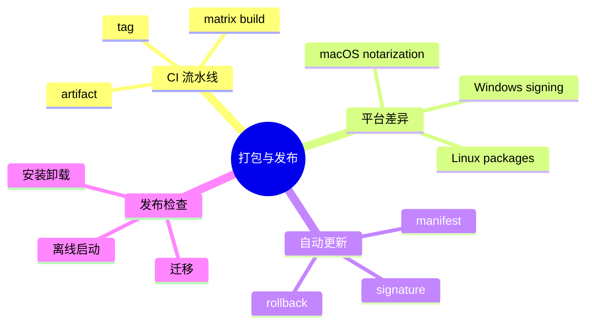
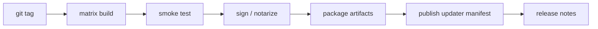
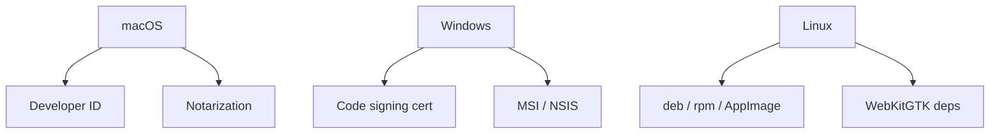

# 第二十一章 多平台打包与发布

> *"能在本机跑起来只是开始，能可靠交到用户手里才叫发布。"*

Tauri 的跨平台能力最终要落到打包、签名、安装、更新和回滚。本章梳理 Hive 面向 macOS、Windows、Linux 的发布流水线。



---

## 21.1 发布流水线



发布不是单个命令，而是一个可重复流水线。每一步都应该能在 CI 中记录产物和日志。

---

## 21.2 tauri.conf.json 的发布项

应用 ID、版本、图标、资源、bundle 类型都要进入配置管理。

```json
{
  "productName": "Hive",
  "version": "1.0.0",
  "identifier": "com.example.hive",
  "bundle": {
    "active": true,
    "targets": ["dmg", "msi", "deb", "appimage"],
    "icon": ["icons/icon.png", "icons/icon.icns", "icons/icon.ico"]
  }
}
```

版本号应由 release 流程统一更新，避免 Rust、前端和 Tauri 配置出现不同版本。

---

## 21.3 GitHub Actions 示例

```yaml
name: release

on:
  push:
    tags:
      - "v*"

jobs:
  build:
    strategy:
      matrix:
        platform: [macos-latest, windows-latest, ubuntu-22.04]
    runs-on: ${{ matrix.platform }}
    steps:
      - uses: actions/checkout@v4
      - uses: dtolnay/rust-toolchain@stable
      - uses: actions/setup-node@v4
        with:
          node-version: 22
      - run: npm ci
      - run: npm run build
      - run: cargo test
      - run: npm run tauri build
```

真实项目还要加入平台依赖、签名密钥和 artifact 上传。

---

## 21.4 平台差异



macOS 最容易卡在 notarization 和 entitlements，Windows 重点是签名证书和安装器体验，Linux 则要处理发行版依赖差异。

---

## 21.5 自动更新

自动更新需要签名 manifest。客户端只接受可信发布者签名的更新包。

```json
{
  "version": "1.0.1",
  "notes": "Fix sync retry issue",
  "pub_date": "2026-05-01T00:00:00Z",
  "platforms": {
    "darwin-aarch64": {
      "signature": "...",
      "url": "https://download.example.com/hive_1.0.1_aarch64.app.tar.gz"
    }
  }
}
```

更新策略不要过度激进。协作类应用可以后台下载，下一次启动安装；安全修复可以提示用户尽快更新。

---

## 21.6 发布前检查

发布前至少检查：

- 新安装、覆盖安装、卸载。
- 旧版本数据库迁移。
- 离线启动。
- 自动更新成功和失败路径。
- 崩溃日志和诊断信息。
- 签名证书有效期。

---

## 21.7 小结

跨平台发布是一项工程系统，而不是构建命令。Hive 通过 tag 驱动 CI，完成测试、签名、打包、manifest 发布和 release notes。

下一章回到架构层面，总结长期维护的模式与最佳实践。
