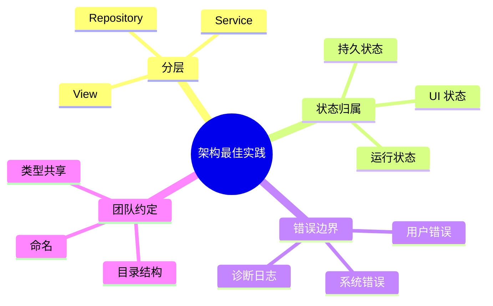
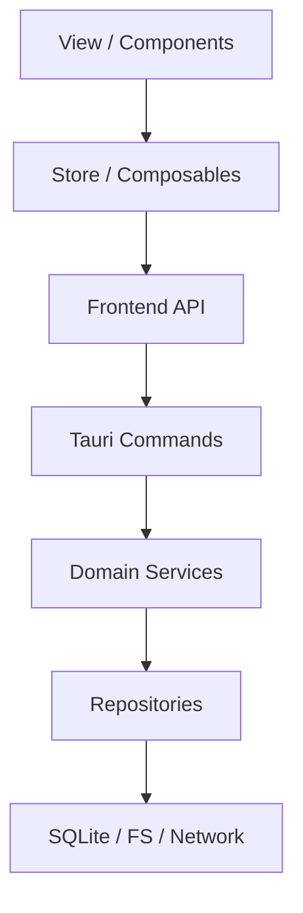
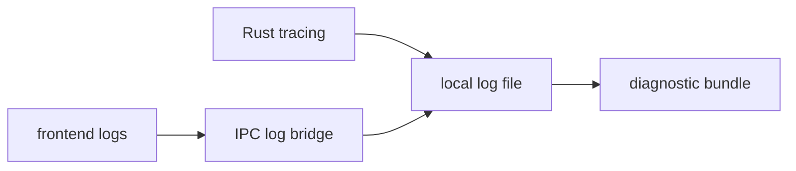

# 第二十二章 架构模式与最佳实践

> *"应用会变大，团队会变大，架构的任务是让变化仍然可控。"*

前面章节分别讨论语言、框架、存储、网络、安全和发布。本章把它们收束为一组可长期执行的架构模式。



---

## 22.1 分层架构



依赖方向必须向内：UI 可以依赖 API，Service 不应该依赖 UI。Rust command 是适配层，不是业务逻辑本身。

---

## 22.2 状态管理模式

Hive 把状态分为四类：

| 状态 | 所在位置 | 示例 |
|------|----------|------|
| 持久业务状态 | SQLite | 笔记、消息、同步队列 |
| 本地偏好 | 配置文件 / SQLite | 主题、窗口布局 |
| UI 临时状态 | 前端 store | 当前选中笔记、筛选条件 |
| 系统运行状态 | Rust managed state | 数据库池、API client、同步器 |

不要把所有状态都塞进前端 store，也不要把 UI 选择态写入数据库。

---

## 22.3 错误边界

错误应该有归属：用户错误给出可修复提示，系统错误进入日志和诊断，开发错误在测试阶段暴露。

```rust
#[derive(Debug, serde::Serialize)]
pub struct PublicError {
    pub code: String,
    pub message: String,
    pub retryable: bool,
}
```

前端只展示 `PublicError`，不要把 Rust backtrace 或数据库 SQL 原样暴露给用户。

---

## 22.4 日志与可观测性



桌面应用的可观测性要尊重隐私。默认本地记录，用户主动提交诊断包时再上传。日志中不要包含笔记正文、token、密钥和个人敏感信息。

---

## 22.5 配置与特性开关

配置分三层：

1. 构建时配置：应用 ID、后端环境、更新地址。
2. 运行时配置：用户偏好、代理、主题。
3. 远程配置：实验开关、灰度策略。

远程配置不应该绕过本地安全策略。即使远端打开某功能，本地 capability 不允许也不能执行。

---

## 22.6 代码组织约定

Rust 侧建议：

```text
src-tauri/src/
├── commands/
├── domain/
├── infra/
├── plugins/
├── state.rs
└── error.rs
```

前端侧建议：

```text
src/
├── api/
├── components/
├── composables/
├── stores/
├── views/
└── styles/
```

跨边界类型要有明确来源。命令名、错误码、事件名应被集中定义，避免散落字符串。

---

## 22.7 小结

最佳实践不是清单收藏，而是让团队每天少做一点重复决策。Hive 的架构约定围绕分层、状态归属、错误边界、可观测性和代码组织展开。

下一章是全书结语：Tauri 2.0、移动端、WASM、AI 与 Rust GUI 生态。
