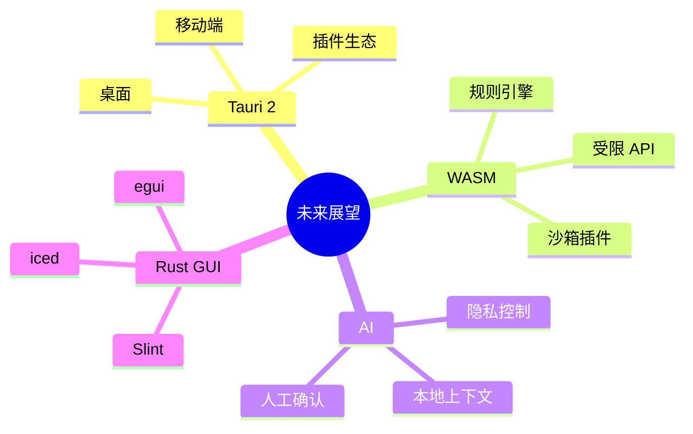
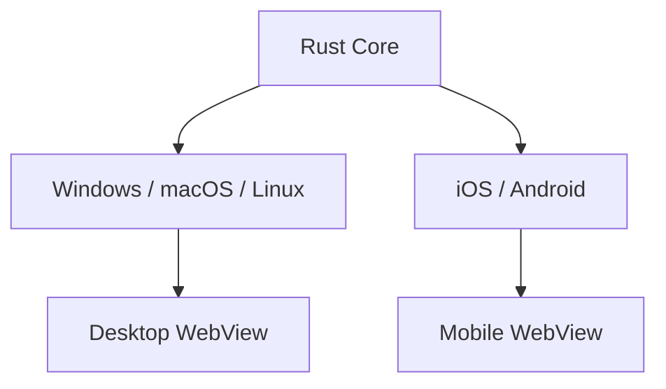
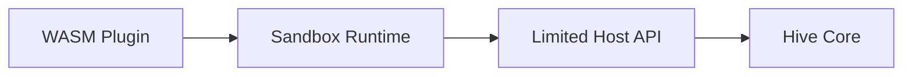

# 第二十三章 未来展望

> *"技术栈会变，但好客户端的基本问题不会变：可靠、快速、安全、可维护。"*

本书从桌面客户端历史讲到 Rust 与 Tauri，再讲到 Hive 的工程化实践。最后一章不做预测游戏，而是梳理几个值得持续关注的方向。

---

## 23.1 Tauri 2.0 与移动端

Tauri 2 把目标扩展到 iOS 和 Android，这意味着同一套 Rust Core 有机会服务桌面和移动端。

但移动端不是“顺手打包”。触摸交互、后台限制、权限模型、应用商店审核，都需要单独设计。

---

## 23.2 WASM 与客户端扩展

WASM 适合运行可沙箱化的插件、规则引擎或计算模块。未来 Hive 可以让团队编写受限插件，例如自动整理笔记、格式转换、轻量分析。

关键是限制 host API，不让插件绕过权限读取文件或网络。

---

## 23.3 AI 集成

AI 能力会进入客户端：总结会议、整理笔记、生成回复、搜索语义内容。桌面端的优势是能把本地上下文、隐私控制和离线缓存结合起来。

AI 集成要守住三条线：

1. 用户明确知道哪些内容会被发送。
2. 本地敏感数据默认不上传。
3. AI 输出不能直接执行高权限操作，必须经过用户确认或策略检查。

---

## 23.4 Rust GUI 生态

Tauri 不是 Rust 客户端的唯一方向。`egui`、`iced`、`Slint` 等原生 Rust GUI 框架也在成长。它们更适合工具、嵌入式、图形密集或不想引入 Web 技术的场景。

选择标准很朴素：

- 团队已有 Web UI 能力：优先 Tauri。
- 强实时绘图或自定义控件：评估原生 Rust GUI。
- 需要极小运行时和完全控制：评估非 WebView 方案。

---

## 23.5 给后端工程师的最后建议

你已经熟悉并发、存储、网络、可观测性和发布系统。这些能力在客户端同样重要，只是它们更贴近用户。客户端工程不是“把按钮摆好”，而是在不可靠网络、多平台差异和人机交互之间保持秩序。

Hive 只是一个练习项目，但它覆盖了真实桌面应用的骨架：本地优先、受控 IPC、可靠存储、实时通信、安全权限、工程化发布。

---

## 23.6 小结

Tauri + Rust 的吸引力在于它让客户端重新拥有轻量、安全和系统能力，同时保留 Web UI 的生产效率。未来会继续变化，但这条路径值得后端工程师认真掌握。
