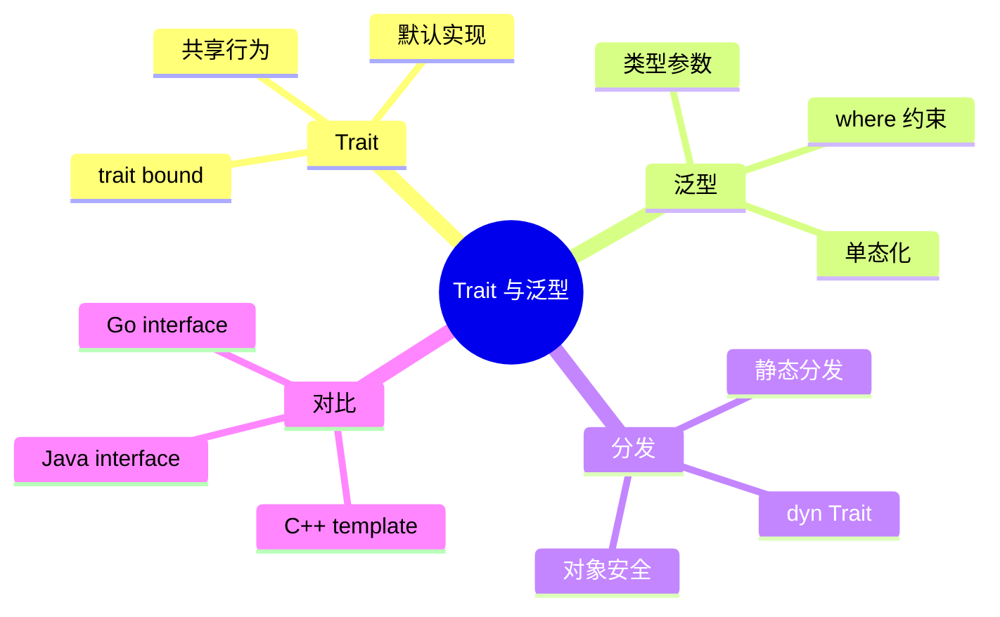
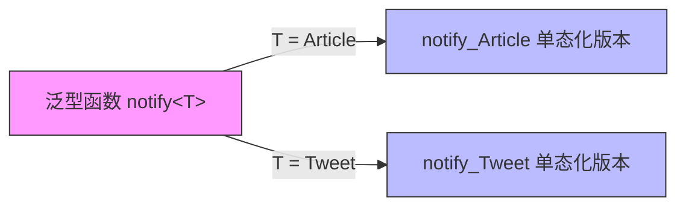
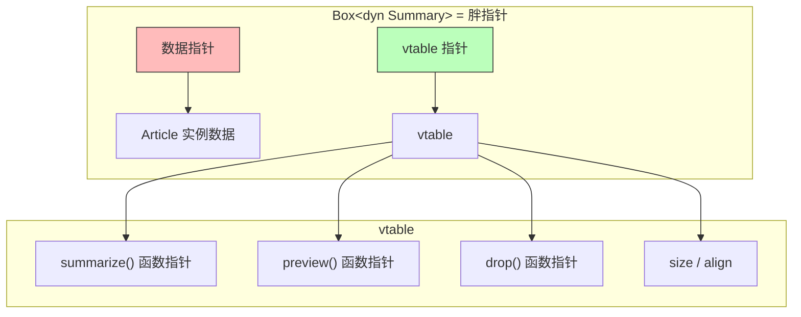
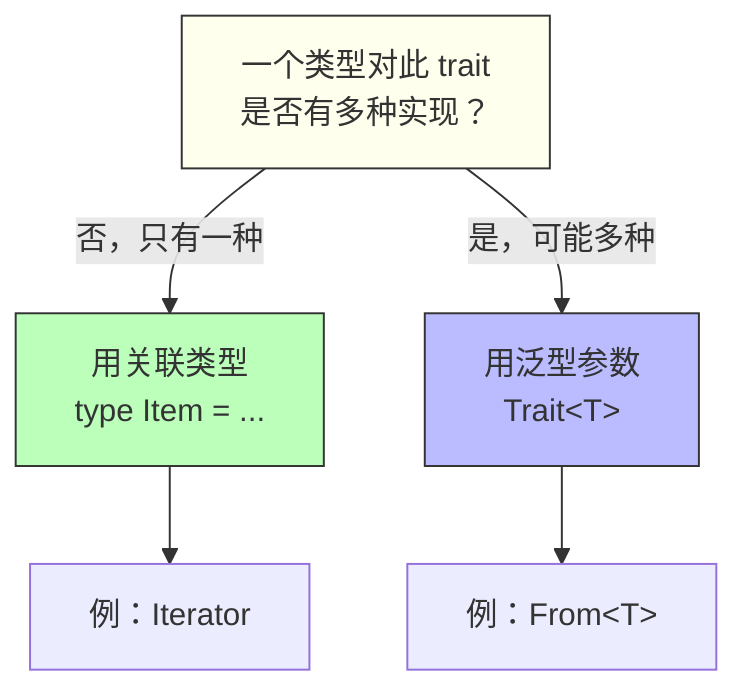
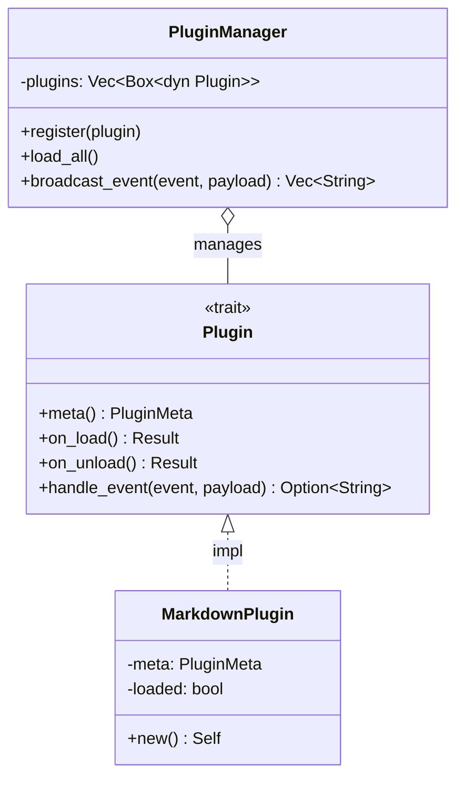

# 第六章 Trait 与泛型：Rust 的多态

> *"Program to an interface, not an implementation." — Gang of Four*

在 C++ 中我们用虚函数和模板实现多态，在 Java 中我们用 interface 和泛型。Rust 的答案是 **Trait + 泛型**——它既能做到零成本的静态分发，也支持灵活的动态分发，而且在编译期就能捕获大多数类型错误。

本章将带你全面掌握 Rust 的多态机制，并与你熟悉的 C++/Java 概念逐一对照。



---

## 6.1 什么是 Trait？

Trait 是 Rust 中定义**共享行为**的方式。你可以把它理解为：

- Java 的 `interface`（但可以有默认实现）
- C++ 的纯虚基类 + Concepts（C++20）
- Go 的 `interface`（但是显式实现，非鸭子类型）

### 6.1.1 定义一个 Trait

```rust
/// 任何可以被摘要展示的类型
trait Summary {
    fn summarize(&self) -> String;

    // 默认实现——实现者可以选择覆盖
    fn preview(&self) -> String {
        format!("{}...", &self.summarize()[..20.min(self.summarize().len())])
    }
}
```

### 6.1.2 为类型实现 Trait

```rust
struct Article {
    title: String,
    author: String,
    content: String,
}

impl Summary for Article {
    fn summarize(&self) -> String {
        format!("{} by {}", self.title, self.author)
    }
}

struct Tweet {
    username: String,
    text: String,
}

impl Summary for Tweet {
    fn summarize(&self) -> String {
        format!("@{}: {}", self.username, self.text)
    }
}
```

使用：

```rust
fn main() {
    let article = Article {
        title: String::from("Rust 2024"),
        author: String::from("Walter"),
        content: String::from("Rust is awesome..."),
    };
    let tweet = Tweet {
        username: String::from("rustlang"),
        text: String::from("Rust 1.80 is out!"),
    };

    println!("{}", article.summarize());
    println!("{}", tweet.summarize());
}
```

### 6.1.3 三语对比：定义与实现

| 特性 | Rust | C++ | Java |
|------|------|-----|------|
| 定义接口 | `trait Summary { ... }` | `class Summary { virtual ... = 0; }` | `interface Summary { ... }` |
| 实现接口 | `impl Summary for Article { ... }` | `class Article : public Summary { ... }` | `class Article implements Summary { ... }` |
| 默认实现 | ✅ trait 中直接写 | ✅ 虚函数提供默认实现 | ✅ `default` 方法（Java 8+） |
| 为外部类型实现 | ✅（孤儿规则限制下） | ❌ 需要继承或 adapter | ❌ 不可能 |
| 多重实现 | ✅ 一个类型可 impl 多个 trait | ✅ 多重继承（菱形问题） | ✅ 多个 interface |

---

## 6.2 Trait Bound 与泛型

### 6.2.1 泛型函数

```rust
// 接受任何实现了 Summary 的类型
fn notify(item: &impl Summary) {
    println!("Breaking: {}", item.summarize());
}
```

这是语法糖，完整写法是 **Trait Bound**：

```rust
fn notify<T: Summary>(item: &T) {
    println!("Breaking: {}", item.summarize());
}
```

### 6.2.2 多个 Trait Bound

```rust
use std::fmt::Display;

fn notify_and_display<T: Summary + Display>(item: &T) {
    println!("{}", item.summarize());
    println!("{}", item);  // 要求 T 同时实现 Display
}
```

当约束变多时，使用 `where` 子句更清晰：

```rust
fn complex_function<T, U>(t: &T, u: &U) -> String
where
    T: Summary + Clone,
    U: Display + Debug,
{
    format!("{} - {:?}", t.summarize(), u)
}
```

### 6.2.3 三语对比：泛型约束

| 特性 | Rust | C++ | Java |
|------|------|-----|------|
| 泛型语法 | `fn foo<T>(x: T)` | `template<typename T> void foo(T x)` | `<T> void foo(T x)` |
| 约束 | `T: Trait` | `concept` (C++20) 或 SFINAE | `T extends Interface` |
| 编译时检查 | ✅ 严格 | ✅ (concept) / ❌ (模板错误信息差) | ✅ 类型擦除后有限检查 |
| 单态化 | ✅ 每个具体类型生成一份代码 | ✅ 模板实例化 | ❌ 类型擦除，运行时一份代码 |



> **单态化（Monomorphization）**：Rust 编译器为每个具体类型生成专用代码，因此泛型调用的性能等同于手写具体类型的代码——这就是"零成本抽象"。

---

## 6.3 静态分发 vs 动态分发

这是 Rust 多态最核心的设计决策。

### 6.3.1 静态分发（impl Trait / 泛型）

```rust
fn print_summary(item: &impl Summary) {
    println!("{}", item.summarize());
}
```

- 编译时确定具体类型
- 生成专用代码（单态化）
- **零运行时开销**
- 代价：二进制体积可能增大

### 6.3.2 动态分发（dyn Trait）

```rust
fn print_summary_dyn(item: &dyn Summary) {
    println!("{}", item.summarize());
}
```

- 通过 **虚表（vtable）** 在运行时查找方法
- 只生成一份代码
- 有一次指针间接寻址的开销
- 适合需要**异构集合**的场景

```rust
fn main() {
    let article = Article {
        title: String::from("Rust Traits"),
        author: String::from("Walter"),
        content: String::from("..."),
    };
    let tweet = Tweet {
        username: String::from("rustlang"),
        text: String::from("Hello!"),
    };

    // 异构集合：不同类型放在同一个 Vec 中
    let items: Vec<Box<dyn Summary>> = vec![
        Box::new(article),
        Box::new(tweet),
    ];

    for item in &items {
        println!("{}", item.summarize());
    }
}
```

### 6.3.3 dyn Trait 的内存布局



### 6.3.4 三语对比：分发机制

| 分发方式 | Rust | C++ | Java |
|----------|------|-----|------|
| 静态分发 | `impl Trait` / 泛型 | 模板 | 不支持（泛型是类型擦除） |
| 动态分发 | `dyn Trait` | `virtual` 函数 | 接口方法调用（默认动态） |
| 选择权 | **程序员显式选择** | 是否加 `virtual` | 无选择（总是动态） |
| 性能 | 静态 ≈ 零开销；动态 ≈ 一次间接调用 | 同 Rust | 总是有虚调用开销 |

---

## 6.4 常用标准库 Trait

Rust 标准库定义了大量 trait，掌握它们是写出地道 Rust 代码的关键。

### 6.4.1 Display 与 Debug

```rust
use std::fmt;

struct Point {
    x: f64,
    y: f64,
}

// Display：面向用户的格式化
impl fmt::Display for Point {
    fn fmt(&self, f: &mut fmt::Formatter<'_>) -> fmt::Result {
        write!(f, "({}, {})", self.x, self.y)
    }
}

// Debug：面向开发者的格式化（通常用 derive 自动生成）
#[derive(Debug)]
struct Rect {
    top_left: Point,
    bottom_right: Point,
}
```

### 6.4.2 Clone 与 Copy

```rust
// Clone：显式深拷贝
#[derive(Clone)]
struct Config {
    name: String,
    values: Vec<i32>,
}

// Copy：隐式按位复制（仅适用于栈上的简单类型）
#[derive(Copy, Clone)]
struct Color {
    r: u8,
    g: u8,
    b: u8,
}
```

**规则**：实现 `Copy` 的类型必须同时实现 `Clone`；包含堆数据（如 `String`、`Vec`）的类型不能实现 `Copy`。

### 6.4.3 From 与 Into

```rust
struct Celsius(f64);
struct Fahrenheit(f64);

impl From<Celsius> for Fahrenheit {
    fn from(c: Celsius) -> Self {
        Fahrenheit(c.0 * 9.0 / 5.0 + 32.0)
    }
}

fn main() {
    let boiling = Celsius(100.0);
    let f: Fahrenheit = boiling.into();  // 自动获得 Into
    println!("Water boils at {}°F", f.0);
}
```

### 6.4.4 Iterator

```rust
struct Counter {
    count: u32,
    max: u32,
}

impl Counter {
    fn new(max: u32) -> Self {
        Counter { count: 0, max }
    }
}

impl Iterator for Counter {
    type Item = u32;  // 关联类型

    fn next(&mut self) -> Option<Self::Item> {
        if self.count < self.max {
            self.count += 1;
            Some(self.count)
        } else {
            None
        }
    }
}

fn main() {
    let sum: u32 = Counter::new(5)
        .filter(|x| x % 2 == 0)
        .sum();
    println!("Sum of even numbers: {}", sum); // 2 + 4 = 6
}
```

### 6.4.5 常用 Trait 速查表

| Trait | 用途 | 常见 derive |
|-------|------|-------------|
| `Debug` | 调试输出 `{:?}` | ✅ `#[derive(Debug)]` |
| `Display` | 用户友好输出 `{}` | ❌ 需手动实现 |
| `Clone` | 显式深拷贝 `.clone()` | ✅ `#[derive(Clone)]` |
| `Copy` | 隐式按位复制 | ✅ `#[derive(Copy)]` |
| `PartialEq` / `Eq` | 相等比较 `==` | ✅ `#[derive(PartialEq, Eq)]` |
| `PartialOrd` / `Ord` | 排序比较 `<` `>` | ✅ `#[derive(PartialOrd, Ord)]` |
| `Hash` | 哈希（用于 HashMap 的 key） | ✅ `#[derive(Hash)]` |
| `Default` | 默认值 | ✅ `#[derive(Default)]` |
| `From` / `Into` | 类型转换 | ❌ 需手动实现 |
| `Iterator` | 迭代器 | ❌ 需手动实现 |
| `Drop` | 析构逻辑（类似 C++ 析构函数） | ❌ 需手动实现 |

---

## 6.5 关联类型 vs 泛型参数

### 6.5.1 关联类型

```rust
trait Graph {
    type Node;      // 关联类型
    type Edge;

    fn edges(&self, node: &Self::Node) -> Vec<Self::Edge>;
}
```

### 6.5.2 泛型参数

```rust
trait Converter<From, To> {
    fn convert(&self, input: From) -> To;
}
```

### 6.5.3 何时用哪个？

| 场景 | 选择 | 理由 |
|------|------|------|
| 一个类型只有一种实现 | 关联类型 | `Iterator` 的 `Item` 对每个类型只有一种 |
| 一个类型可能有多种实现 | 泛型参数 | `From<T>` 可以从多种类型转换 |



---

## 6.6 Trait 对象的限制：对象安全

并非所有 trait 都能用作 `dyn Trait`。能用作 trait 对象的 trait 必须是**对象安全的（object safe）**。

### 规则

一个 trait 是对象安全的，当且仅当：

1. **所有方法的接收者是 `&self`、`&mut self` 或 `self: Box<Self>`**
2. **方法没有泛型参数**
3. **方法的返回类型不是 `Self`**（`Clone` 的 `fn clone(&self) -> Self` 就不行）

```rust
// ✅ 对象安全
trait Drawable {
    fn draw(&self);
    fn area(&self) -> f64;
}

// ❌ 不是对象安全的——返回 Self
trait Cloneable {
    fn clone_self(&self) -> Self;
}

// ❌ 不是对象安全的——方法有泛型参数
trait Serializer {
    fn serialize<W: std::io::Write>(&self, writer: &mut W);
}
```

### 解决方案

如果你需要在 trait 对象中使用类似 `Clone` 的功能：

```rust
trait CloneBox {
    fn clone_box(&self) -> Box<dyn CloneBox>;
}

impl<T: Clone + 'static> CloneBox for T {
    fn clone_box(&self) -> Box<dyn CloneBox> {
        Box::new(self.clone())
    }
}
```

---

## 6.7 实战：为 Hive 项目设计插件 Trait

让我们用本章知识为贯穿全书的 Hive 项目设计一个插件系统的 trait：

```rust
use std::any::Any;

/// 插件元数据
#[derive(Debug, Clone)]
struct PluginMeta {
    name: String,
    version: String,
    description: String,
}

/// Hive 插件 trait
trait Plugin: Any + Send + Sync {
    /// 返回插件元数据
    fn meta(&self) -> PluginMeta;

    /// 插件初始化
    fn on_load(&mut self) -> Result<(), Box<dyn std::error::Error>>;

    /// 插件卸载
    fn on_unload(&mut self) -> Result<(), Box<dyn std::error::Error>>;

    /// 处理事件
    fn handle_event(&self, event: &str, payload: &str) -> Option<String>;
}

/// 一个示例插件：Markdown 预览
struct MarkdownPlugin {
    meta: PluginMeta,
    loaded: bool,
}

impl MarkdownPlugin {
    fn new() -> Self {
        Self {
            meta: PluginMeta {
                name: "markdown-preview".into(),
                version: "0.1.0".into(),
                description: "Render Markdown to HTML".into(),
            },
            loaded: false,
        }
    }
}

impl Plugin for MarkdownPlugin {
    fn meta(&self) -> PluginMeta {
        self.meta.clone()
    }

    fn on_load(&mut self) -> Result<(), Box<dyn std::error::Error>> {
        println!("[{}] Plugin loaded", self.meta.name);
        self.loaded = true;
        Ok(())
    }

    fn on_unload(&mut self) -> Result<(), Box<dyn std::error::Error>> {
        println!("[{}] Plugin unloaded", self.meta.name);
        self.loaded = false;
        Ok(())
    }

    fn handle_event(&self, event: &str, payload: &str) -> Option<String> {
        match event {
            "render" => {
                // 简化的 Markdown → HTML 转换
                let html = payload
                    .lines()
                    .map(|line| {
                        if line.starts_with("# ") {
                            format!("<h1>{}</h1>", &line[2..])
                        } else if line.starts_with("## ") {
                            format!("<h2>{}</h2>", &line[3..])
                        } else {
                            format!("<p>{}</p>", line)
                        }
                    })
                    .collect::<Vec<_>>()
                    .join("\n");
                Some(html)
            }
            _ => None,
        }
    }
}

/// 插件管理器——使用 trait 对象存储异构插件
struct PluginManager {
    plugins: Vec<Box<dyn Plugin>>,
}

impl PluginManager {
    fn new() -> Self {
        Self { plugins: Vec::new() }
    }

    fn register(&mut self, plugin: Box<dyn Plugin>) {
        println!("Registered plugin: {}", plugin.meta().name);
        self.plugins.push(plugin);
    }

    fn load_all(&mut self) {
        for plugin in &mut self.plugins {
            if let Err(e) = plugin.on_load() {
                eprintln!("Failed to load {}: {}", plugin.meta().name, e);
            }
        }
    }

    fn broadcast_event(&self, event: &str, payload: &str) -> Vec<String> {
        self.plugins
            .iter()
            .filter_map(|p| p.handle_event(event, payload))
            .collect()
    }
}

fn main() {
    let mut manager = PluginManager::new();
    manager.register(Box::new(MarkdownPlugin::new()));
    manager.load_all();

    let results = manager.broadcast_event("render", "# Hello\n## World\nThis is Hive.");
    for html in results {
        println!("{}", html);
    }
}
```



---

## 6.8 本章小结

| 概念 | 关键点 |
|------|--------|
| **Trait** | 定义共享行为，类似 Java interface，但可为外部类型实现 |
| **泛型 + Trait Bound** | 静态分发，零成本抽象，编译时单态化 |
| **dyn Trait** | 动态分发，通过 vtable 实现，支持异构集合 |
| **关联类型** | 一个类型对 trait 只有一种实现时使用 |
| **对象安全** | 使用 `dyn Trait` 时，trait 的方法不能有泛型参数或返回 `Self` |
| **标准库 Trait** | `Debug`、`Display`、`Clone`、`From`、`Iterator` 等是 Rust 生态的基石 |

### 思考题

1. 为什么 `Clone` trait 不是对象安全的？如果你需要克隆一个 `Box<dyn MyTrait>`，该怎么设计？
2. 在什么场景下你会选择 `dyn Trait`（动态分发）而不是泛型（静态分发）？
3. 尝试为 Hive 项目添加一个 `WordCountPlugin`，统计给定文本的字数。

---

> **下一章预告**：第七章我们将深入 Rust 的错误处理哲学——为什么 Rust 没有异常？`Result` 和 `?` 操作符如何让错误处理既安全又优雅？
